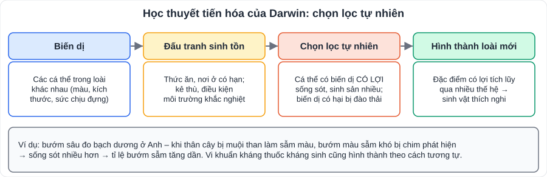

# KHTN 10: Tiến hóa (Sinh học – Chương XII)

> [Danh mục kiến thức](../README.md) · Học ở **tháng 4** · Ôn lại trước thi cuối năm · **Phần lí thuyết ngắn, chủ yếu câu hỏi hiểu – giải thích ví dụ**

## Mục tiêu

- Nêu khái niệm **tiến hóa**, **chọn lọc nhân tạo**, **chọn lọc tự nhiên**.
- Trình bày quan điểm của **Darwin**; giải thích sự hình thành **đặc điểm thích nghi**.
- Nêu sơ lược **sự phát sinh sự sống** và **quá trình phát sinh loài người**.

---

## 1. Kiến thức cần nhớ

### 1.1. Khái niệm

- **Tiến hóa**: sự thay đổi **đặc tính di truyền** của quần thể sinh vật qua các thế hệ.
- **Chọn lọc nhân tạo**: **con người** giữ lại những biến dị **có lợi cho con người**, loại bỏ biến dị không mong muốn → tạo **giống vật nuôi, cây trồng** mới (nhiều giống gà, chó, bắp cải, súp lơ từ cải dại…).
- **Chọn lọc tự nhiên**: **môi trường** giữ lại những cá thể mang **biến dị có lợi cho sinh vật**, đào thải biến dị có hại → hình thành **đặc điểm thích nghi** và **loài mới**.

### 1.2. Học thuyết Darwin (tóm tắt)

1. Các cá thể trong loài luôn có **biến dị** (khác nhau), nhiều biến dị **di truyền** được.
2. Sinh vật sinh sản nhiều nhưng nguồn sống có hạn → **đấu tranh sinh tồn**.
3. Cá thể mang biến dị **thích nghi** sống sót, sinh sản nhiều hơn → **chọn lọc tự nhiên**.
4. Qua nhiều thế hệ, đặc điểm có lợi được tích lũy → **loài mới**; mọi loài đều có **chung nguồn gốc**.

### 1.3. Một số ví dụ giải thích theo chọn lọc tự nhiên

| Hiện tượng | Giải thích |
|---|---|
| Bướm sâu đo màu sẫm tăng ở vùng công nghiệp (Anh) | Thân cây sẫm do muội than → bướm sẫm khó bị chim phát hiện → sống sót nhiều hơn |
| Vi khuẩn **kháng kháng sinh** | Dùng kháng sinh không đủ liều → vi khuẩn mang biến dị kháng thuốc sống sót, sinh sản → quần thể kháng thuốc |
| Sâu hại **kháng thuốc trừ sâu** | Tương tự: phun thuốc chọn lọc cá thể kháng thuốc |
| Hươu cao cổ cổ dài | Cá thể cổ dài với tới lá trên cao → sống sót, sinh sản nhiều hơn (theo quan điểm Darwin) |

> **Liên hệ:** dùng kháng sinh **đúng chỉ định, đủ liều** để tránh tạo vi khuẩn kháng thuốc.

### 1.4. Sự phát sinh sự sống và loài người (sơ lược)

- Sự sống phát sinh từ các chất **vô cơ → hữu cơ đơn giản → đại phân tử (protein, acid nucleic) → tế bào sơ khai**, trải qua thời gian rất dài.
- Sinh giới tiến hóa từ **đơn giản đến phức tạp**, từ **dưới nước lên cạn**.
- Loài người (**Homo sapiens**) tiến hóa từ một nhánh **linh trưởng**; các dạng người: người vượn → **người khéo léo (Homo habilis)** → **người đứng thẳng (Homo erectus)** → **người hiện đại (Homo sapiens)**. Đặc điểm: đi thẳng, bộ não phát triển, biết chế tạo công cụ, có tiếng nói, chữ viết.

---

## 2. Lỗi hay gặp

- Nhầm **chọn lọc nhân tạo** (con người chọn, có lợi cho người) với **chọn lọc tự nhiên** (môi trường chọn, có lợi cho sinh vật).
- Giải thích theo kiểu "vi khuẩn **cố gắng** thích nghi với thuốc" → sai; biến dị kháng thuốc **có sẵn** trong quần thể, thuốc chỉ **chọn lọc**.

---

## 3. Bài tập tự luyện

1. Phân biệt chọn lọc nhân tạo và chọn lọc tự nhiên (đối tượng chọn lọc, kết quả).
2. Giải thích vì sao ngày càng có nhiều loài sâu hại kháng thuốc trừ sâu.
3. Vì sao nói biến dị là nguyên liệu của tiến hóa?
4. ★ Bác sĩ khuyên "không tự ý mua kháng sinh, uống đủ liều". Giải thích lời khuyên này dưới góc độ tiến hóa.

👉 Bấm để xem đáp án

1. Nhân tạo: **con người** chọn, giữ biến dị **có lợi cho con người** → giống vật nuôi, cây trồng. Tự nhiên: **môi trường** chọn, giữ biến dị **có lợi cho sinh vật** → đặc điểm thích nghi, loài mới.
2. Trong quần thể sâu có sẵn một số cá thể mang biến dị kháng thuốc; khi phun thuốc, cá thể không kháng bị chết, cá thể kháng sống sót và sinh sản → tỉ lệ sâu kháng thuốc tăng dần.
3. Nếu các cá thể không khác nhau thì chọn lọc tự nhiên **không có gì để chọn**; biến dị di truyền cung cấp các đặc điểm để chọn lọc giữ lại hoặc đào thải.
4. Dùng kháng sinh sai cách, không đủ liều → chỉ tiêu diệt vi khuẩn yếu, **giữ lại vi khuẩn kháng thuốc** → chúng sinh sản tạo quần thể kháng thuốc, khiến kháng sinh mất tác dụng.

