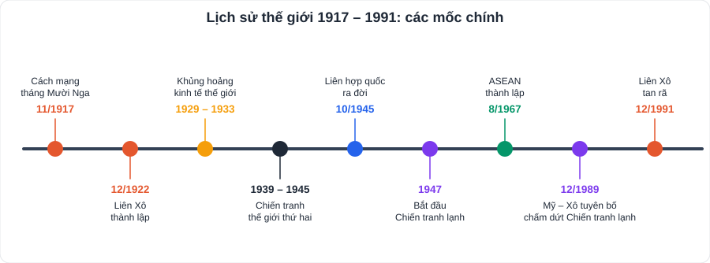
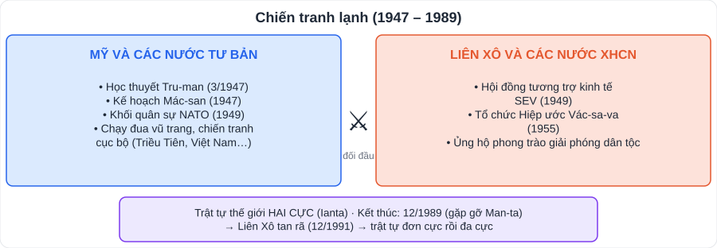

# Lịch sử 1: Lịch sử thế giới từ năm 1918 đến nay

> [Danh mục kiến thức](../README.md) · Học rải rác cả năm (Chương 1: tháng 9; Chương 3: tháng 12 – 1; Chương 5 và chủ đề chung: tháng 3 – 4) · Ôn trước mỗi kì kiểm tra

## Mục tiêu

- Nắm các sự kiện chính của thế giới **1918 – 1945**, **1945 – 1991**, **từ 1991 đến nay**.
- Giải thích nguyên nhân, nêu hệ quả của **Chiến tranh thế giới thứ hai**, **Chiến tranh lạnh**.
- Nêu đặc điểm của **cách mạng khoa học – kĩ thuật** và **toàn cầu hóa**; liên hệ Việt Nam.

---

## 1. Thế giới 1918 – 1945

### 1.1. Nước Nga và Liên Xô

- **Cách mạng tháng Mười Nga (11/1917)** do Lênin và Đảng Bôn-sê-vích lãnh đạo → nhà nước công nông đầu tiên.
- 1921: **Chính sách kinh tế mới (NEP)**; **12/1922: Liên bang Cộng hòa xã hội chủ nghĩa Xô viết (Liên Xô)** thành lập.
- 1925 – 1941: công nghiệp hóa, tập thể hóa nông nghiệp → Liên Xô trở thành cường quốc công nghiệp.

### 1.2. Châu Âu và nước Mỹ

- 1918 – 1923: cao trào cách mạng ở châu Âu; **3/1919 Quốc tế Cộng sản** thành lập.
- **Khủng hoảng kinh tế 1929 – 1933** (bắt đầu từ Mỹ) → các nước tìm lối thoát:
  - **Mỹ**: Tổng thống **Ru-dơ-ven** thực hiện **Chính sách mới** (cải cách kinh tế – xã hội).
  - **Đức, Ý, Nhật**: **phát xít hóa** bộ máy nhà nước, chuẩn bị chiến tranh. Đức: Hít-le lên cầm quyền (1933).

### 1.3. Châu Á

- Nhật Bản: quân phiệt hóa, xâm lược Trung Quốc.
- Trung Quốc: Đảng Cộng sản Trung Quốc thành lập (1921); phong trào Ngũ Tứ (1919).
- Đông Nam Á: phong trào độc lập dân tộc phát triển; xuất hiện các đảng cộng sản.

### 1.4. Chiến tranh thế giới thứ hai (1939 – 1945)

- **Nguyên nhân**: mâu thuẫn giữa các nước đế quốc về thuộc địa; khủng hoảng kinh tế 1929 – 1933; chủ nghĩa phát xít lên cầm quyền; chính sách nhân nhượng của Anh, Pháp.
- Diễn biến chính: **1/9/1939** Đức tấn công Ba Lan → chiến tranh bùng nổ; **6/1941** Đức tấn công Liên Xô; **12/1941** Nhật tấn công Trân Châu Cảng (Mỹ tham chiến); **1943** Liên Xô thắng ở Xta-lin-grát (bước ngoặt); **9/5/1945** Đức đầu hàng; **8/1945** Mỹ ném bom nguyên tử Hi-rô-si-ma, Na-ga-xa-ki; **15/8/1945** Nhật đầu hàng.
- **Kết quả, hệ quả**: chủ nghĩa phát xít bị tiêu diệt; khoảng **60 triệu người chết**; Liên Xô, Mỹ trở thành hai cường quốc; mở ra thời cơ giải phóng dân tộc (Việt Nam: Cách mạng tháng Tám).

---

## 2. Thế giới 1945 – 1991

- **Liên hợp quốc** thành lập (**24/10/1945**) – mục tiêu duy trì hòa bình, an ninh thế giới.
- **Chiến tranh lạnh (1947 – 1989)**: đối đầu giữa **Mỹ** (và đồng minh tư bản) với **Liên Xô** (và các nước XHCN) trên mọi lĩnh vực trừ xung đột quân sự trực tiếp giữa hai siêu cường. Kết thúc 12/1989.
- **Liên Xô và Đông Âu**: khôi phục kinh tế, đạt nhiều thành tựu (phóng vệ tinh nhân tạo 1957, đưa người bay vào vũ trụ 1961 – Ga-ga-rin). Khủng hoảng từ thập niên 1970 → chế độ XHCN ở Đông Âu sụp đổ (1989 – 1991), **Liên Xô tan rã (12/1991)**.
- **Mỹ, Tây Âu**: Mỹ trở thành nước tư bản giàu mạnh nhất; Tây Âu liên kết → **Cộng đồng châu Âu (EC)**, sau là **Liên minh châu Âu (EU, 1993)**.
- **Mỹ La-tinh**: cách mạng **Cu-ba** thành công (1959).
- **Châu Á**: **Nước Cộng hòa Nhân dân Trung Hoa** thành lập (**1/10/1949**), cải cách mở cửa từ 1978; Ấn Độ độc lập (1947); Đông Nam Á giành độc lập; **ASEAN thành lập 8/8/1967** (5 nước).

## 3. Thế giới từ 1991 đến nay

- Trật tự thế giới **đa cực** đang hình thành; Mỹ muốn xác lập trật tự "đơn cực".
- **Liên bang Nga** kế tục Liên Xô; **Trung Quốc** vươn lên mạnh mẽ; **ASEAN** mở rộng thành **10 nước** (Việt Nam gia nhập **28/7/1995**), hình thành **Cộng đồng ASEAN (2015)**.
- Xu thế **hòa bình, hợp tác, phát triển**, nhưng còn xung đột khu vực, khủng bố, biến đổi khí hậu, dịch bệnh.

## 4. Cách mạng khoa học – kĩ thuật và toàn cầu hóa

- **Cách mạng khoa học – kĩ thuật** (từ những năm 40 thế kỉ XX): khoa học trở thành **lực lượng sản xuất trực tiếp**; thành tựu: máy tính, Internet, công nghệ sinh học, vật liệu mới, năng lượng mới, chinh phục vũ trụ; nay là **Cách mạng công nghiệp lần thứ tư** (trí tuệ nhân tạo, dữ liệu lớn, Internet vạn vật).
- **Toàn cầu hóa**: tăng cường **liên kết, phụ thuộc lẫn nhau** giữa các nước (thương mại quốc tế, công ty xuyên quốc gia, tổ chức WTO, APEC…).
  - **Cơ hội** cho Việt Nam: thu hút vốn, công nghệ, mở rộng thị trường. **Thách thức**: cạnh tranh gay gắt, nguy cơ tụt hậu, giữ gìn bản sắc văn hóa.

---

## 5. Lỗi hay gặp

- Nhầm năm **Cách mạng tháng Mười (1917)** với năm thành lập **Liên Xô (1922)**.
- Nhầm Chiến tranh lạnh là "chiến tranh trực tiếp giữa Mỹ và Liên Xô".
- Học thuộc sự kiện mà không nêu được **ý nghĩa, tác động**.

---

## 6. Câu hỏi tự luyện

1. Trình bày nguyên nhân bùng nổ Chiến tranh thế giới thứ hai.
2. Vì sao chiến thắng Xta-lin-grát (1943) là bước ngoặt của chiến tranh?
3. Chiến tranh lạnh là gì? Nêu hai biểu hiện.
4. Nêu tác động tích cực và tiêu cực của cách mạng khoa học – kĩ thuật.
5. ★ Toàn cầu hóa tạo ra cơ hội và thách thức gì cho học sinh Việt Nam hôm nay? Em cần chuẩn bị gì?

👉 Bấm để xem gợi ý

1. Mâu thuẫn về thị trường, thuộc địa; hậu quả khủng hoảng 1929 – 1933; phát xít Đức, Ý, Nhật lên cầm quyền, gây chiến; Anh, Pháp, Mỹ nhân nhượng phát xít.
2. Tiêu diệt lực lượng lớn quân Đức, Liên Xô chuyển sang **phản công**, phe Đồng minh giành thế chủ động trên các mặt trận.
3. Sự đối đầu căng thẳng giữa hai phe do Mỹ và Liên Xô đứng đầu, không trực tiếp đánh nhau. Biểu hiện: chạy đua vũ trang (vũ khí hạt nhân); thành lập NATO – Vác-sa-va; chiến tranh cục bộ (Triều Tiên, Việt Nam).
4. Tích cực: năng suất lao động tăng, đời sống cải thiện, giao lưu toàn cầu. Tiêu cực: ô nhiễm môi trường, vũ khí hủy diệt, tai nạn công nghệ, mặt trái của mạng xã hội.
5. Cơ hội: tiếp cận tri thức, du học, việc làm quốc tế. Thách thức: cạnh tranh nguồn nhân lực. Chuẩn bị: ngoại ngữ, kĩ năng số, kĩ năng mềm, giữ bản sắc dân tộc.

