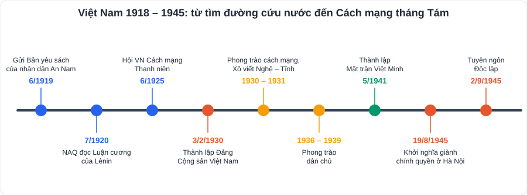

# Lịch sử 2: Việt Nam từ năm 1918 đến năm 1945

> [Danh mục kiến thức](../README.md) · Học ở **tháng 10 – 11** · Ôn lại trước giữa HK1, cuối HK1 · **Trọng tâm: vai trò của Nguyễn Ái Quốc, sự ra đời của Đảng, Cách mạng tháng Tám**

## Mục tiêu

- Nêu những hoạt động chính của **Nguyễn Ái Quốc** (1918 – 1930) và ý nghĩa.
- Trình bày hoàn cảnh, ý nghĩa sự ra đời của **Đảng Cộng sản Việt Nam (3/2/1930)**.
- Nêu các phong trào cách mạng **1930 – 1931**, **1936 – 1939**, **1939 – 1945**.
- Trình bày diễn biến, nguyên nhân thắng lợi, ý nghĩa của **Cách mạng tháng Tám năm 1945**.

---

## 1. Việt Nam 1918 – 1930

- Pháp tiến hành **khai thác thuộc địa lần thứ hai** (1919 – 1929) → xã hội phân hóa sâu sắc: xuất hiện **tư sản, tiểu tư sản**, giai cấp **công nhân** phát triển.
- Phong trào yêu nước theo khuynh hướng **dân chủ tư sản**: **Việt Nam Quốc dân đảng** (1927), **khởi nghĩa Yên Bái (2/1930)** thất bại.
- **Hoạt động của Nguyễn Ái Quốc**:

| Thời gian | Hoạt động |
|---|---|
| 5/6/1911 | Rời bến Nhà Rồng ra đi tìm đường cứu nước |
| 6/1919 | Gửi **Bản yêu sách của nhân dân An Nam** tới Hội nghị Véc-xai |
| 7/1920 | Đọc **Luận cương của Lênin** về vấn đề dân tộc và thuộc địa → tìm thấy con đường cứu nước: **cách mạng vô sản** |
| 12/1920 | Tham gia Đại hội Tua, sáng lập **Đảng Cộng sản Pháp** |
| 1921 – 1925 | Hội Liên hiệp thuộc địa, báo *Người cùng khổ*; *Bản án chế độ thực dân Pháp* |
| 6/1925 | Thành lập **Hội Việt Nam Cách mạng Thanh niên** (Quảng Châu); xuất bản *Đường Kách mệnh* (1927) |
| 3/2/1930 | Chủ trì **Hội nghị hợp nhất** ba tổ chức cộng sản → **Đảng Cộng sản Việt Nam** |

- **Ý nghĩa sự ra đời của Đảng**: chấm dứt **khủng hoảng về đường lối** cứu nước; là bước ngoặt vĩ đại của cách mạng Việt Nam; cách mạng Việt Nam trở thành một bộ phận của cách mạng thế giới.

## 2. Phong trào cách mạng 1930 – 1945

| Giai đoạn | Nội dung chính |
|---|---|
| **1930 – 1931** | Phong trào cách mạng dâng cao, đỉnh cao là **Xô viết Nghệ – Tĩnh**; 10/1930 Luận cương chính trị (Trần Phú), Đảng đổi tên thành **Đảng Cộng sản Đông Dương** |
| **1936 – 1939** | **Phong trào dân chủ**: đòi tự do, dân sinh, dân chủ, cơm áo, hòa bình; Mặt trận Dân chủ Đông Dương; đấu tranh công khai, hợp pháp |
| **1939 – 1945** | Đặt nhiệm vụ **giải phóng dân tộc** lên hàng đầu; **5/1941** Hội nghị Trung ương 8 (Pác Bó) – thành lập **Mặt trận Việt Minh**; **22/12/1944** Đội Việt Nam Tuyên truyền Giải phóng quân; **9/3/1945** Nhật đảo chính Pháp → cao trào kháng Nhật cứu nước |

## 3. Cách mạng tháng Tám năm 1945

- **Thời cơ**: **15/8/1945 Nhật đầu hàng Đồng minh**, quân Nhật ở Đông Dương tan rã, chính quyền tay sai hoang mang; quân Đồng minh chưa vào.
- **Diễn biến**: Hội nghị toàn quốc của Đảng và **Quốc dân Đại hội Tân Trào** (13 – 17/8) quyết định **Tổng khởi nghĩa**.
  - **19/8** Hà Nội · **23/8** Huế · **25/8** Sài Gòn → trong khoảng 15 ngày, giành chính quyền trong cả nước. **30/8** vua Bảo Đại thoái vị.
  - **2/9/1945**: Chủ tịch Hồ Chí Minh đọc **Tuyên ngôn Độc lập** tại Quảng trường Ba Đình → **nước Việt Nam Dân chủ Cộng hòa** ra đời.
- **Nguyên nhân thắng lợi**: truyền thống yêu nước; sự **lãnh đạo đúng đắn của Đảng**, đứng đầu là Hồ Chí Minh; quá trình chuẩn bị 15 năm (các cuộc diễn tập 1930 – 1931, 1936 – 1939); **chớp đúng thời cơ**; khối đoàn kết toàn dân trong Mặt trận Việt Minh.
- **Ý nghĩa**: đập tan ách thống trị của thực dân, phát xít và chế độ phong kiến; mở ra **kỉ nguyên độc lập, tự do**; cổ vũ phong trào giải phóng dân tộc thế giới.

---

## 4. Lỗi hay gặp

- Nhầm **Hội VN Cách mạng Thanh niên (1925)** với **Đảng Cộng sản Việt Nam (1930)**.
- Nhầm ngày khởi nghĩa ở **Hà Nội (19/8)** – **Huế (23/8)** – **Sài Gòn (25/8)**.
- Nêu "nguyên nhân thắng lợi" mà thiếu yếu tố **thời cơ** (Nhật đầu hàng).

---

## 5. Câu hỏi tự luyện

1. Vì sao năm 1920 đánh dấu bước ngoặt trong cuộc đời hoạt động của Nguyễn Ái Quốc?
2. Nêu ý nghĩa sự ra đời của Đảng Cộng sản Việt Nam.
3. Vì sao Hội nghị Trung ương 8 (5/1941) có ý nghĩa quan trọng?
4. Phân tích thời cơ "ngàn năm có một" của Cách mạng tháng Tám.
5. ★ Bài học kinh nghiệm nào từ Cách mạng tháng Tám còn nguyên giá trị hôm nay?

👉 Bấm để xem gợi ý

1. Đọc Luận cương của Lênin, tán thành Quốc tế Cộng sản, tham gia sáng lập Đảng Cộng sản Pháp → từ người yêu nước trở thành **người cộng sản**, tìm ra con đường cứu nước: **cách mạng vô sản**.
2. Chấm dứt khủng hoảng đường lối; bước ngoặt vĩ đại; chuẩn bị điều kiện tiên quyết cho những thắng lợi về sau.
3. Hoàn chỉnh chủ trương **đặt nhiệm vụ giải phóng dân tộc lên hàng đầu**; thành lập **Mặt trận Việt Minh** tập hợp toàn dân; chuẩn bị lực lượng cho khởi nghĩa.
4. Nhật đầu hàng, quân Nhật mất tinh thần, chính quyền tay sai tê liệt; quân Đồng minh chưa vào; lực lượng cách mạng đã sẵn sàng → nếu chậm trễ sẽ mất thời cơ.
5. Gợi ý: đoàn kết toàn dân; nắm bắt thời cơ; sự lãnh đạo đúng đắn; dựa vào sức mình là chính.

