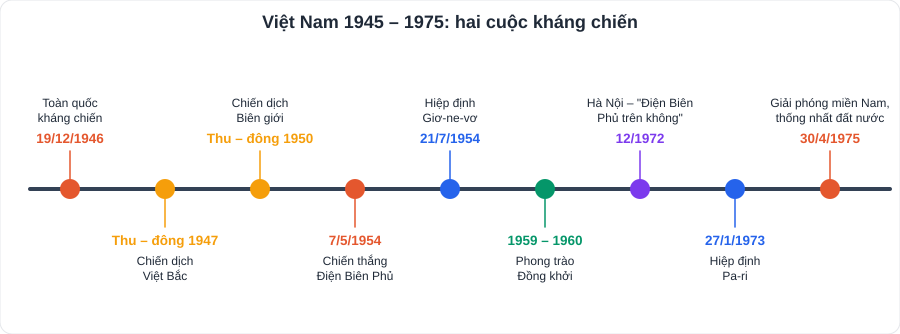
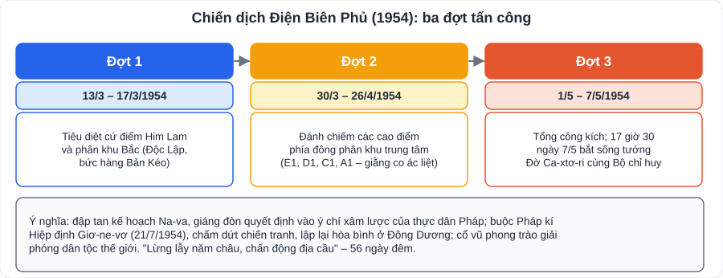

# Lịch sử 3: Việt Nam từ năm 1945 đến năm 1975

> [Danh mục kiến thức](../README.md) · Học ở **tháng 1 – 3** · Ôn lại trước giữa HK2 và thi cuối năm · **Chương dài nhất; học theo trục thời gian, mỗi giai đoạn nhớ 2 – 3 sự kiện lớn**

## Mục tiêu

- Nêu những khó khăn và biện pháp **xây dựng, bảo vệ chính quyền** (1945 – 1946).
- Trình bày các chiến dịch lớn trong **kháng chiến chống Pháp (1946 – 1954)**; ý nghĩa **Điện Biên Phủ**.
- Nêu các chiến lược chiến tranh của Mỹ và thắng lợi của nhân dân Việt Nam (**1954 – 1975**); ý nghĩa **Đại thắng mùa Xuân 1975**.

---

## 1. Năm đầu sau Cách mạng tháng Tám (1945 – 1946)

- Tình thế **"ngàn cân treo sợi tóc"**: giặc **đói**, giặc **dốt**, **ngoại xâm** (quân Tưởng ở phía Bắc, Pháp trở lại xâm lược Nam Bộ 23/9/1945) và **nội phản**; ngân khố trống rỗng.
- Biện pháp:
  - Diệt giặc đói: "Hũ gạo cứu đói", tăng gia sản xuất.
  - Diệt giặc dốt: **Nha Bình dân học vụ**, xóa nạn mù chữ.
  - Xây dựng chính quyền: **Tổng tuyển cử 6/1/1946** bầu Quốc hội; Hiến pháp 1946.
  - Ngoại giao mềm dẻo: hòa với Tưởng để đánh Pháp; **Hiệp định Sơ bộ 6/3/1946**, **Tạm ước 14/9/1946** để có thời gian chuẩn bị.

## 2. Kháng chiến chống thực dân Pháp (1946 – 1954)

- **19/12/1946**: Chủ tịch Hồ Chí Minh ra **Lời kêu gọi toàn quốc kháng chiến**. Đường lối: **toàn dân, toàn diện, trường kì, tự lực cánh sinh**.

| Chiến dịch | Kết quả, ý nghĩa |
|---|---|
| **Việt Bắc thu – đông 1947** | Đánh bại kế hoạch "đánh nhanh thắng nhanh" của Pháp, bảo vệ cơ quan đầu não kháng chiến |
| **Biên giới thu – đông 1950** | Ta **giành thế chủ động** trên chiến trường chính Bắc Bộ; khai thông biên giới Việt – Trung |
| **Đông – Xuân 1953 – 1954** | Phá tan bước đầu kế hoạch Na-va |
| **Điện Biên Phủ (13/3 – 7/5/1954)** | **"Lừng lẫy năm châu, chấn động địa cầu"**; đập tan kế hoạch Na-va |

- **Hiệp định Giơ-ne-vơ (21/7/1954)**: các nước công nhận độc lập, chủ quyền, thống nhất, toàn vẹn lãnh thổ của Việt Nam, Lào, Cam-pu-chia; lấy **vĩ tuyến 17** làm giới tuyến quân sự tạm thời; tổng tuyển cử thống nhất đất nước dự kiến 7/1956.

## 3. Kháng chiến chống Mỹ, cứu nước (1954 – 1975)

- Đất nước bị chia cắt: **miền Bắc** tiến lên xây dựng CNXH, làm **hậu phương lớn**; **miền Nam** tiếp tục cách mạng dân tộc dân chủ, là **tiền tuyến lớn**.

| Giai đoạn | Chiến lược của Mỹ | Thắng lợi tiêu biểu của ta |
|---|---|---|
| 1954 – 1960 | Chính quyền Ngô Đình Diệm, "tố cộng, diệt cộng" | **Phong trào Đồng khởi (1959 – 1960)**; 20/12/1960 Mặt trận Dân tộc Giải phóng miền Nam Việt Nam |
| 1961 – 1965 | **"Chiến tranh đặc biệt"** (quân đội Sài Gòn + cố vấn Mỹ, "ấp chiến lược") | Ấp Bắc (1/1963), Bình Giã (1964 – 1965) |
| 1965 – 1968 | **"Chiến tranh cục bộ"** (quân Mỹ trực tiếp tham chiến) + chiến tranh phá hoại miền Bắc | Vạn Tường (8/1965); **Tổng tiến công và nổi dậy Tết Mậu Thân 1968** |
| 1969 – 1973 | **"Việt Nam hóa chiến tranh"** | Tiến công chiến lược 1972; **"Hà Nội – Điện Biên Phủ trên không" (12/1972)** → **Hiệp định Pa-ri (27/1/1973)**: Mỹ rút quân |
| 1973 – 1975 | | **Tổng tiến công và nổi dậy mùa Xuân 1975**: Tây Nguyên (3/1975) → Huế – Đà Nẵng (3/1975) → **Chiến dịch Hồ Chí Minh (26 – 30/4/1975)** |

- **Ý nghĩa thắng lợi 1975**: kết thúc 21 năm kháng chiến chống Mỹ và 30 năm chiến tranh giải phóng dân tộc; **thống nhất đất nước**, mở ra kỉ nguyên độc lập, thống nhất, đi lên CNXH; cổ vũ phong trào cách mạng thế giới.
- **Nguyên nhân thắng lợi**: sự lãnh đạo đúng đắn của Đảng; truyền thống yêu nước; hậu phương miền Bắc vững mạnh; đoàn kết ba nước Đông Dương; sự ủng hộ của nhân dân thế giới.

---

## 4. Lỗi hay gặp

- Nhầm thứ tự các chiến lược: **Đặc biệt (1961) → Cục bộ (1965) → Việt Nam hóa (1969)**.
- Nhầm **Hiệp định Giơ-ne-vơ (1954, Pháp)** với **Hiệp định Pa-ri (1973, Mỹ)**.
- Nhầm Điện Biên Phủ (1954, đánh Pháp) với "Điện Biên Phủ trên không" (1972, đánh B-52 của Mỹ).

---

## 5. Câu hỏi tự luyện

1. Vì sao nói nước Việt Nam Dân chủ Cộng hòa sau Cách mạng tháng Tám ở thế "ngàn cân treo sợi tóc"?
2. Nêu ý nghĩa chiến thắng Biên giới thu – đông 1950.
3. Lập bảng so sánh "Chiến tranh đặc biệt" và "Chiến tranh cục bộ" (lực lượng, thời gian, thắng lợi của ta).
4. Nội dung cơ bản của Hiệp định Pa-ri 1973?
5. ★ Từ chiến thắng Điện Biên Phủ, em rút ra bài học gì cho thế hệ trẻ hôm nay?

👉 Bấm để xem gợi ý

1. Phải đối phó cùng lúc giặc đói, giặc dốt, ngoại xâm, nội phản; chính quyền non trẻ, ngân khố trống rỗng.
2. Ta giành **quyền chủ động chiến lược** trên chiến trường chính; khai thông đường liên lạc với các nước XHCN; cuộc kháng chiến chuyển sang giai đoạn mới.
3. Đặc biệt (1961 – 1965): quân đội Sài Gòn là chủ yếu, cố vấn Mỹ chỉ huy; ta thắng Ấp Bắc, Bình Giã. Cục bộ (1965 – 1968): quân Mỹ, đồng minh và quân đội Sài Gòn, quân Mỹ là chủ yếu; ta thắng Vạn Tường, Tết Mậu Thân 1968.
4. Mỹ cam kết tôn trọng độc lập, chủ quyền, thống nhất, toàn vẹn lãnh thổ của Việt Nam; rút hết quân Mỹ và đồng minh; ngừng bắn; nhân dân miền Nam tự quyết định tương lai chính trị.
5. Gợi ý: tinh thần quyết tâm, sáng tạo vượt khó (kéo pháo), đoàn kết; học tập tốt để xây dựng đất nước.

