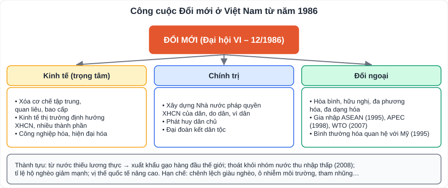

# Lịch sử 4: Việt Nam từ năm 1976 đến nay – công cuộc Đổi mới

> [Danh mục kiến thức](../README.md) · Học ở **tháng 3 – 4** · Ôn lại trước thi cuối năm · **Câu hỏi thường gặp: nội dung và thành tựu Đổi mới, liên hệ địa phương**

## Mục tiêu

- Nêu quá trình **thống nhất đất nước về mặt nhà nước** và cuộc đấu tranh **bảo vệ Tổ quốc** sau 1975.
- Trình bày hoàn cảnh, nội dung đường lối **Đổi mới (12/1986)**.
- Nêu những **thành tựu, hạn chế** của Việt Nam từ 1991 đến nay; vai trò hội nhập quốc tế.

---

## 1. Việt Nam 1976 – 1985

- **25/4/1976**: Tổng tuyển cử bầu Quốc hội chung cả nước. **2/7/1976**: Quốc hội quyết định đặt tên nước **Cộng hòa xã hội chủ nghĩa Việt Nam**; thủ đô Hà Nội; Thành phố Sài Gòn – Gia Định đổi tên thành **Thành phố Hồ Chí Minh**.
- **20/9/1977**: Việt Nam trở thành thành viên **Liên hợp quốc**.
- **Bảo vệ Tổ quốc**: chiến tranh bảo vệ **biên giới Tây Nam** (chống Khơ-me Đỏ, 7/1/1979 giải phóng Phnôm Pênh); chiến tranh bảo vệ **biên giới phía Bắc** (2/1979).
- Khó khăn: nền kinh tế **khủng hoảng** (lạm phát cao, thiếu lương thực), cơ chế **tập trung quan liêu, bao cấp** bộc lộ hạn chế → yêu cầu **đổi mới**.

## 2. Đường lối Đổi mới (Đại hội VI – 12/1986)

- **Đổi mới toàn diện**, trọng tâm là **đổi mới kinh tế**; đổi mới không phải thay đổi mục tiêu XHCN.
- Kinh tế: xóa bỏ cơ chế tập trung bao cấp; phát triển **kinh tế hàng hóa nhiều thành phần**, vận hành theo **cơ chế thị trường có sự quản lí của Nhà nước, định hướng XHCN**; mở rộng quan hệ kinh tế đối ngoại.
- Chính trị: xây dựng **Nhà nước pháp quyền XHCN** của dân, do dân, vì dân; phát huy dân chủ.
- Đối ngoại: **hòa bình, hữu nghị, đa phương hóa, đa dạng hóa**; "Việt Nam muốn là bạn, là đối tác tin cậy của các nước".

## 3. Thành tựu và hội nhập (từ 1991 đến nay)

| Lĩnh vực | Thành tựu tiêu biểu |
|---|---|
| Kinh tế | Tăng trưởng khá cao, ổn định; từ nước thiếu lương thực trở thành nước **xuất khẩu gạo hàng đầu**; thoát khỏi nhóm nước thu nhập thấp (2008) |
| Xã hội | Tỉ lệ hộ nghèo giảm mạnh; giáo dục, y tế phát triển; tuổi thọ tăng |
| Đối ngoại | Bình thường hóa quan hệ với Mỹ (7/1995); gia nhập **ASEAN (7/1995)**, **APEC (1998)**, **WTO (2007)**; Ủy viên không thường trực Hội đồng Bảo an LHQ; tham gia lực lượng gìn giữ hòa bình |
| Chủ quyền | Kiên quyết bảo vệ chủ quyền biển đảo (Hoàng Sa, Trường Sa) bằng biện pháp hòa bình, phù hợp luật pháp quốc tế |

- **Hạn chế**: chênh lệch giàu nghèo, ô nhiễm môi trường, tham nhũng, chất lượng tăng trưởng chưa cao.

---

## 4. Câu hỏi tự luyện

1. Vì sao Việt Nam phải tiến hành Đổi mới?
2. Nội dung chính của đường lối Đổi mới về kinh tế là gì?
3. Kể 3 sự kiện đánh dấu Việt Nam hội nhập quốc tế.
4. ★ Tìm hiểu và nêu một thay đổi ở địa phương em (đường sá, trường học, đời sống) nhờ công cuộc Đổi mới.

👉 Bấm để xem gợi ý

1. Sau 1975 đất nước gặp khủng hoảng kinh tế – xã hội; cơ chế bao cấp kìm hãm sản xuất; tác động của tình hình thế giới (khủng hoảng ở Liên Xô, Đông Âu) và xu thế đổi mới, hội nhập.
2. Xóa cơ chế bao cấp; kinh tế nhiều thành phần; cơ chế thị trường có sự quản lí của Nhà nước, định hướng XHCN; mở rộng kinh tế đối ngoại.
3. Gia nhập ASEAN (1995), bình thường hóa quan hệ với Mỹ (1995), gia nhập WTO (2007).
4. Tự liên hệ, có ví dụ cụ thể (năm, địa điểm, so sánh trước – sau).

