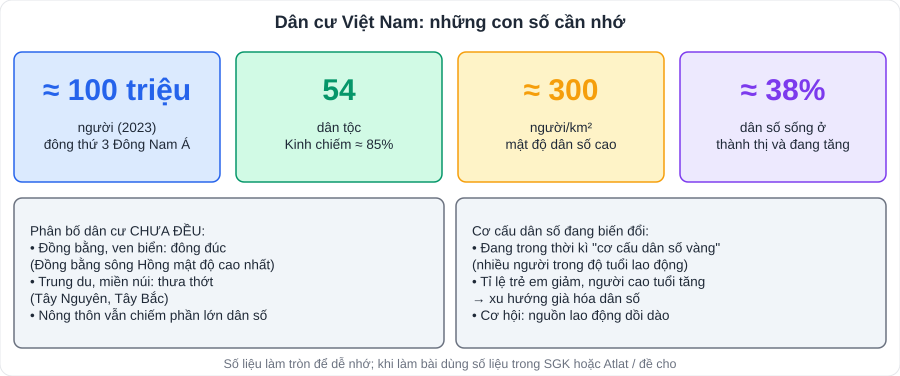

# Địa lí 1: Dân cư và các ngành kinh tế Việt Nam

> [Danh mục kiến thức](../README.md) · Học ở **HK1** · Ôn lại trước giữa HK1, cuối HK1 · **Kĩ năng đọc bảng số liệu, vẽ và nhận xét biểu đồ là nơi lấy điểm**

> ⚠️ **Lưu ý về đơn vị hành chính**: từ năm 2025, Việt Nam sắp xếp lại đơn vị hành chính cấp tỉnh (còn 34 tỉnh, thành phố). SGK được biên soạn trước đó nên tên tỉnh, số liệu theo tỉnh có thể khác thực tế. **Học theo SGK và hướng dẫn của giáo viên**; khi làm bài dùng số liệu đề cho.

## Mục tiêu

- Trình bày đặc điểm **dân tộc, dân số, phân bố dân cư, quần cư**, **lao động – việc làm**.
- Nêu điều kiện phát triển và phân bố của **nông, lâm, thủy sản**, **công nghiệp**, **dịch vụ**.
- Đọc bảng số liệu, **vẽ biểu đồ** (tròn, cột, đường, miền) và **nhận xét**.

---

## 1. Dân cư

| Nội dung | Kiến thức cần nhớ |
|---|---|
| Dân tộc | **54 dân tộc**; người Kinh khoảng 85%; các dân tộc thiểu số phân bố chủ yếu ở trung du, miền núi |
| Dân số | Khoảng **100 triệu người** (2023), thuộc nhóm nước đông dân; gia tăng tự nhiên đã giảm |
| Cơ cấu | Đang ở thời kì **"cơ cấu dân số vàng"**; có xu hướng **già hóa** |
| Phân bố | **Không đều**: tập trung ở **đồng bằng, ven biển** (Đồng bằng sông Hồng mật độ cao nhất), thưa ở **miền núi** (Tây Nguyên, Tây Bắc); phần lớn dân số sống ở **nông thôn**, tỉ lệ dân thành thị tăng |
| Quần cư | **Nông thôn** (làng, bản, ấp, buôn, sóc – hoạt động nông nghiệp là chính) và **thành thị** (mật độ cao, công nghiệp – dịch vụ) |
| Lao động | Dồi dào, cần cù, tiếp thu khoa học kĩ thuật nhanh; hạn chế: tỉ lệ qua đào tạo chưa cao |

## 2. Nông nghiệp, lâm nghiệp, thủy sản

- **Điều kiện**: đất (feralit ở đồi núi – trồng cây công nghiệp; phù sa ở đồng bằng – trồng lúa), khí hậu **nhiệt đới ẩm gió mùa**, nguồn nước dồi dào; lao động nhiều kinh nghiệm; thị trường mở rộng.
- **Trồng trọt**: **lúa** (hai vựa lúa: ĐBSCL lớn nhất, ĐBSH), **cây công nghiệp** (cà phê, cao su, hồ tiêu ở Tây Nguyên, Đông Nam Bộ; chè ở Trung du và miền núi Bắc Bộ), cây ăn quả.
- **Chăn nuôi**: trâu, bò (miền núi), lợn, gia cầm (đồng bằng).
- **Lâm nghiệp**: rừng sản xuất, phòng hộ, đặc dụng; trồng rừng, bảo vệ rừng.
- **Thủy sản**: khai thác (ngư trường lớn ven các vùng biển) và **nuôi trồng** (ĐBSCL: cá tra, tôm).
- Xu hướng: **nông nghiệp xanh, nông nghiệp công nghệ cao**, liên kết chuỗi giá trị.

## 3. Công nghiệp

- Cơ cấu đa dạng; các ngành chủ chốt: **khai thác nhiên liệu** (than – Quảng Ninh; dầu khí – thềm lục địa phía Nam), **sản xuất điện** (thủy điện, nhiệt điện, điện gió, điện mặt trời), **điện tử – máy tính**, **dệt may, da giày**, **chế biến lương thực – thực phẩm**.
- Phân bố tập trung ở **Đông Nam Bộ**, **Đồng bằng sông Hồng** và vùng phụ cận.
- Xu hướng: công nghiệp xanh, sử dụng năng lượng tái tạo, chuyển đổi số.

## 4. Dịch vụ

- **Giao thông vận tải**: đường bộ (quốc lộ 1, đường cao tốc Bắc – Nam), đường sắt Thống Nhất, đường biển (cảng Hải Phòng, Đà Nẵng, Cái Mép – Thị Vải), đường hàng không (Nội Bài, Tân Sơn Nhất…).
- **Bưu chính viễn thông**: phát triển nhanh, Internet, chuyển đổi số.
- **Thương mại**: nội thương phát triển; xuất khẩu điện tử, dệt may, nông sản, thủy sản.
- **Du lịch**: tài nguyên phong phú (tự nhiên: vịnh Hạ Long, Phong Nha – Kẻ Bàng; văn hóa: Hội An, Huế, Mỹ Sơn…).
- Hai trung tâm dịch vụ lớn nhất: **Hà Nội** và **Thành phố Hồ Chí Minh**.

---

## 5. Kĩ năng biểu đồ

| Đề yêu cầu / dữ liệu | Biểu đồ phù hợp |
|---|---|
| **Cơ cấu** (%) của 1 – 2 năm | **Tròn** |
| **Cơ cấu** qua nhiều năm (≥ 4 năm) | **Miền** |
| **Tốc độ tăng trưởng**, động thái qua nhiều năm | **Đường** |
| **So sánh** số lượng giữa các đối tượng / các năm | **Cột** |
| Hai đại lượng khác đơn vị | **Kết hợp cột – đường** |

**Nhận xét**: xu hướng chung (tăng/giảm) → **số liệu dẫn chứng** (tăng từ … lên …, gấp … lần) → ngoại lệ (nếu có) → giải thích (khi đề yêu cầu).

---

## 6. Câu hỏi tự luyện

1. Vì sao dân cư nước ta tập trung đông ở đồng bằng, ven biển?
2. Nêu thuận lợi và khó khăn của nguồn lao động nước ta.
3. Vì sao ĐBSCL là vùng sản xuất lúa lớn nhất cả nước?
4. Kể tên 3 nhà máy thủy điện và cho biết chúng nằm trên sông nào.
5. ★ Cho bảng: Sản lượng thủy sản (nghìn tấn) năm 2010: khai thác 2 414, nuôi trồng 2 728; năm 2020: khai thác 3 863, nuôi trồng 4 556 (số liệu làm tròn, dùng để luyện kĩ năng). Nên vẽ biểu đồ gì để thể hiện **cơ cấu** sản lượng thủy sản hai năm? Tính tỉ lệ và nhận xét.

👉 Bấm để xem gợi ý

1. Địa hình bằng phẳng, đất phù sa màu mỡ, nguồn nước dồi dào, giao thông thuận lợi, lịch sử khai thác lâu đời, kinh tế phát triển.
2. Thuận lợi: dồi dào, cần cù, sáng tạo, giá nhân công cạnh tranh. Khó khăn: tỉ lệ qua đào tạo chưa cao, phân bố chưa hợp lí, thiếu lao động trình độ cao.
3. Diện tích đồng bằng lớn nhất, đất phù sa màu mỡ, khí hậu cận xích đạo nóng quanh năm, nguồn nước sông Cửu Long dồi dào, nông dân nhiều kinh nghiệm, thị trường tiêu thụ rộng.
4. Hòa Bình, Sơn La, Lai Châu (sông Đà); Trị An (sông Đồng Nai); Yaly (sông Xê Xan).
5. **Biểu đồ tròn** (2 hình tròn). 2010: tổng 5 142 → khai thác ≈ 46,9%, nuôi trồng ≈ 53,1%. 2020: tổng 8 419 → khai thác ≈ 45,9%, nuôi trồng ≈ 54,1%. Nhận xét: nuôi trồng chiếm tỉ trọng lớn hơn và đang tăng nhẹ; khai thác giảm nhẹ.

