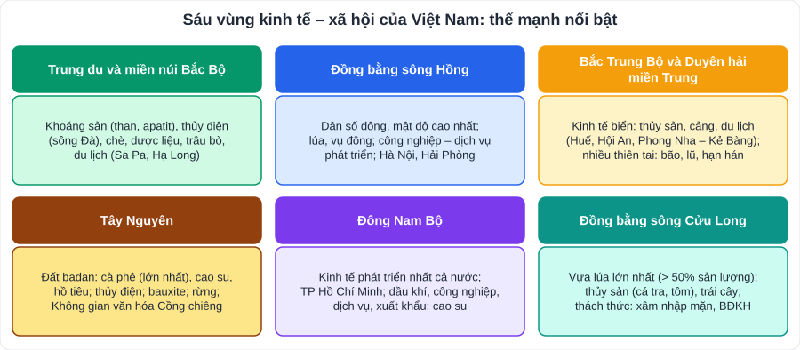
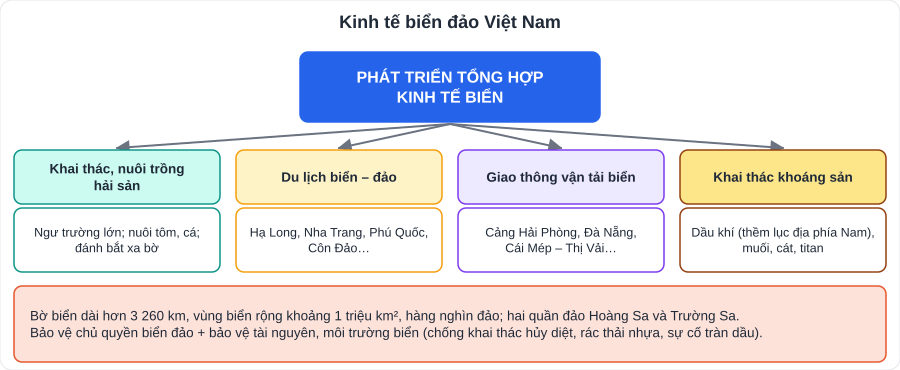

# Địa lí 2: Sự phân hóa lãnh thổ – các vùng kinh tế và kinh tế biển đảo

> [Danh mục kiến thức](../README.md) · Học ở **cuối HK1 – HK2** · Ôn lại trước giữa HK2 và thi cuối năm · **Mỗi vùng nhớ: vị trí – thế mạnh – ngành nổi bật – khó khăn**

> ⚠️ SGK có thể trình bày **Bắc Trung Bộ** và **Duyên hải Nam Trung Bộ** thành hai bài riêng. Tên tỉnh trong SGK theo địa giới trước khi sắp xếp năm 2025; học theo SGK và hướng dẫn của giáo viên.

## Mục tiêu

- Trình bày **vị trí, điều kiện tự nhiên, dân cư** và **thế mạnh kinh tế** của từng vùng.
- Giải thích sự phân bố các ngành kinh tế chính của vùng.
- Nêu tiềm năng và các ngành **kinh tế biển**; ý thức **bảo vệ chủ quyền biển đảo**.

---

## 1. Bảng tổng hợp các vùng

| Vùng | Điều kiện nổi bật | Ngành kinh tế thế mạnh | Khó khăn |
|---|---|---|---|
| **Trung du và miền núi Bắc Bộ** | Địa hình cao, khí hậu có mùa đông lạnh; giàu khoáng sản, thủy năng | Khai khoáng (**than** Quảng Ninh, **apatit** Lào Cai), **thủy điện** (sông Đà), **chè**, dược liệu, chăn nuôi trâu bò, du lịch | Địa hình hiểm trở, thiên tai (lũ quét, sạt lở), đời sống một bộ phận dân cư còn khó khăn |
| **Đồng bằng sông Hồng** | Đất phù sa sông Hồng; dân đông, **mật độ cao nhất** | Lúa, **cây vụ đông**; công nghiệp, dịch vụ phát triển (Hà Nội, Hải Phòng); cảng Hải Phòng | Đất nông nghiệp bình quân thấp; sức ép dân số |
| **Bắc Trung Bộ và Duyên hải miền Trung** | Dải đất hẹp ngang, giáp biển dài; nhiều đầm phá, vịnh biển | **Kinh tế biển**: thủy sản, **du lịch** (Huế, Hội An, Mỹ Sơn, Phong Nha – Kẻ Bàng), cảng biển, khu kinh tế ven biển | **Bão, lũ, hạn hán, cát bay**; đất nghèo dinh dưỡng |
| **Tây Nguyên** | Cao nguyên **đất badan**, khí hậu cận xích đạo có mùa khô sâu sắc | **Cà phê** (lớn nhất cả nước), cao su, hồ tiêu, chè; thủy điện; **bauxite**; rừng; du lịch văn hóa (Cồng chiêng) | Thiếu nước mùa khô, suy giảm rừng |
| **Đông Nam Bộ** | Vị trí thuận lợi, cơ sở hạ tầng tốt, lao động chất lượng | **Kinh tế phát triển nhất**: công nghiệp (dầu khí, điện tử), dịch vụ, xuất khẩu; **TP Hồ Chí Minh**; cao su | Ô nhiễm môi trường, ùn tắc giao thông, áp lực dân số đô thị |
| **Đồng bằng sông Cửu Long** | Đồng bằng rộng nhất, phù sa sông Cửu Long, mạng lưới kênh rạch | **Lúa** (> 50% sản lượng cả nước), **thủy sản** (cá tra, tôm), trái cây | **Xâm nhập mặn, sạt lở, biến đổi khí hậu**; đất phèn, đất mặn |

---

## 2. Phát triển tổng hợp kinh tế biển đảo

- Việt Nam có **bờ biển dài hơn 3 260 km**, vùng biển rộng khoảng **1 triệu km²**, hàng nghìn đảo lớn nhỏ; hai quần đảo **Hoàng Sa** và **Trường Sa**.
- Các bộ phận vùng biển (theo Công ước Liên hợp quốc về Luật biển 1982): **nội thủy**, **lãnh hải** (12 hải lí), **vùng tiếp giáp lãnh hải**, **vùng đặc quyền kinh tế** (200 hải lí tính từ đường cơ sở), **thềm lục địa**.
- **Bốn ngành kinh tế biển**: khai thác, nuôi trồng và chế biến hải sản; du lịch biển – đảo; giao thông vận tải biển; khai thác khoáng sản biển (dầu khí, muối, cát, titan).
- **Phát triển tổng hợp**: kết hợp nhiều ngành, hỗ trợ nhau, gắn với **bảo vệ môi trường** và **an ninh quốc phòng**.
- **Bảo vệ tài nguyên, môi trường biển**: chống khai thác hủy diệt (chất nổ, xung điện), giảm rác thải nhựa, phòng chống sự cố tràn dầu, bảo vệ rừng ngập mặn, rạn san hô.

---

## 3. Lỗi hay gặp

- Nhầm vùng trồng **cà phê** lớn nhất (Tây Nguyên) với **chè** lớn nhất (Trung du và miền núi Bắc Bộ).
- Nói "Đồng bằng sông Hồng có diện tích lớn nhất" (ĐBSCL mới lớn nhất; ĐBSH có **mật độ dân số** cao nhất).
- Khi trình bày một vùng chỉ liệt kê, **không giải thích** vì sao vùng có thế mạnh đó.

---

## 4. Câu hỏi tự luyện

1. Vì sao Trung du và miền núi Bắc Bộ có thế mạnh về thủy điện?
2. Vì sao Tây Nguyên trồng được nhiều cà phê? Khó khăn lớn nhất về tự nhiên là gì?
3. Nêu các thế mạnh giúp Đông Nam Bộ có kinh tế phát triển nhất cả nước.
4. ĐBSCL cần làm gì để thích ứng với biến đổi khí hậu?
5. ★ Vì sao phải phát triển **tổng hợp** kinh tế biển? Học sinh có thể làm gì để góp phần bảo vệ biển đảo?

👉 Bấm để xem gợi ý

1. Địa hình dốc, nhiều sông lớn (sông Đà, sông Lô, sông Chảy) có lưu lượng nước lớn → tiềm năng thủy điện lớn.
2. Đất badan màu mỡ, khí hậu cận xích đạo, diện tích cao nguyên rộng; khó khăn: **thiếu nước** vào mùa khô.
3. Vị trí thuận lợi (gần TP Hồ Chí Minh, cảng biển), cơ sở hạ tầng hiện đại, lao động chất lượng cao, thu hút vốn đầu tư nước ngoài nhiều, có dầu khí.
4. Chuyển đổi cơ cấu cây trồng – vật nuôi phù hợp (lúa – tôm), xây dựng công trình trữ nước ngọt, kiểm soát mặn, trồng rừng ngập mặn, sống chung với lũ.
5. Các ngành biển hỗ trợ nhau, khai thác hiệu quả tài nguyên, tránh xung đột, bảo vệ môi trường và chủ quyền. Học sinh: tìm hiểu, tuyên truyền về chủ quyền; không xả rác ra biển; tham gia hoạt động làm sạch bãi biển; ủng hộ "Vì Trường Sa thân yêu".

