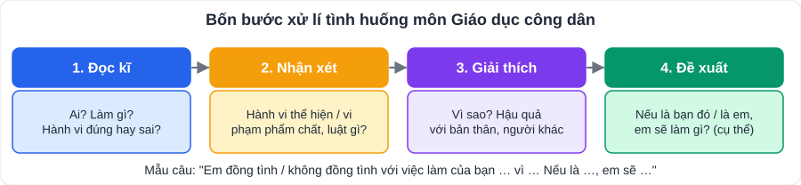

# Giáo dục công dân 9: tổng hợp các chủ đề

> [Danh mục kiến thức](../README.md) · Học theo tiến độ SGK (mỗi chủ đề 2 – 3 tuần) · Ôn trước mỗi kì kiểm tra · ⚠️ Tên và thứ tự bài có thể khác SGK của con một chút; **đối chiếu mục lục SGK** và đề cương của trường

## Mục tiêu

- Nêu được **khái niệm, biểu hiện, ý nghĩa** của từng phẩm chất, kĩ năng.
- **Xử lí tình huống** theo 4 bước; đánh giá hành vi đúng/sai.
- Hiểu một số quy định cơ bản của **pháp luật** (vi phạm pháp luật, quyền và nghĩa vụ lao động).

---

## 1. Bảng tổng hợp các chủ đề

| # | Chủ đề | Ý chính cần nhớ | Ví dụ hành động |
|---|---|---|---|
| 1 | **Sống có lí tưởng** | Lí tưởng sống là mục đích cao đẹp mà con người phấn đấu; lí tưởng của thanh niên VN: xây dựng đất nước "dân giàu, nước mạnh, dân chủ, công bằng, văn minh" | Đặt mục tiêu học tập, rèn luyện; tham gia hoạt động Đoàn, Đội |
| 2 | **Khoan dung** | Rộng lòng tha thứ, tôn trọng sự khác biệt, không chấp nhặt, định kiến | Bỏ qua lỗi vô ý của bạn; tôn trọng phong tục khác |
| 3 | **Tích cực tham gia hoạt động cộng đồng** | Tự giác tham gia các hoạt động vì lợi ích chung | Tình nguyện, giữ vệ sinh khu phố, ủng hộ người khó khăn |
| 4 | **Khách quan và công bằng** | Tôn trọng sự thật, đối xử đúng mực, không thiên vị | Chấm điểm nhóm theo đóng góp thực tế |
| 5 | **Bảo vệ hòa bình** | Giữ gìn cuộc sống bình yên, không chiến tranh, xung đột; giải quyết mâu thuẫn bằng đối thoại | Không bạo lực học đường; hòa giải mâu thuẫn |
| 6 | **Quản lí thời gian hiệu quả** | Sắp xếp, ưu tiên công việc hợp lí (ma trận **quan trọng – khẩn cấp**) | Lập thời gian biểu; làm việc quan trọng trước |
| 7 | **Thích ứng với thay đổi** | Chủ động điều chỉnh suy nghĩ, hành động trước thay đổi của cuộc sống | Chuyển trường, chuyển cấp, học trực tuyến… |
| 8 | **Tiêu dùng thông minh** | Mua sắm có kế hoạch, đúng nhu cầu, chọn sản phẩm an toàn, chất lượng; tỉnh táo trước quảng cáo | Lập danh sách trước khi mua, đọc nhãn mác, so sánh giá |
| 9 | **Vi phạm pháp luật và trách nhiệm pháp lí** | Vi phạm pháp luật: hành vi **trái pháp luật**, **có lỗi**, do người có **năng lực trách nhiệm pháp lí** thực hiện. 4 loại: **hình sự, hành chính, dân sự, kỉ luật** | Chấp hành luật giao thông (không đi xe máy khi chưa đủ tuổi) |
| 10 | **Quyền và nghĩa vụ lao động của công dân** | Công dân có quyền làm việc, tự do lựa chọn việc làm, nghề nghiệp; nghĩa vụ lao động để nuôi sống bản thân, gia đình, xã hội. Cấm lạm dụng sức lao động của người chưa thành niên | Giúp việc nhà phù hợp sức khỏe; tìm hiểu nghề nghiệp tương lai |

---

## 2. Một số điểm pháp luật cần nhớ

- **Tuổi chịu trách nhiệm hình sự**: từ **đủ 16 tuổi** chịu trách nhiệm về mọi tội phạm (trừ trường hợp luật quy định khác); từ **đủ 14 đến dưới 16 tuổi** chịu trách nhiệm về tội phạm **rất nghiêm trọng, đặc biệt nghiêm trọng** (một số tội cụ thể).
- **Giao thông**: người dưới 16 tuổi **không được** điều khiển xe mô tô, xe gắn máy; đủ **16 tuổi** được lái xe gắn máy dưới 50 cm³; **đủ 18 tuổi** mới được lái xe mô tô từ 50 cm³ trở lên (có giấy phép lái xe).
- **Lao động**: người lao động chưa thành niên được làm công việc nhẹ, phù hợp; cấm sử dụng vào công việc nặng nhọc, độc hại, nguy hiểm.

---

## 3. Lỗi hay gặp

- Trả lời tình huống chỉ "đúng/sai" mà **không giải thích**.
- Lời khuyên chung chung ("bạn nên ngoan") → cần **cụ thể** (nên làm gì, nói gì, với ai).
- Nhầm **khoan dung** với **dung túng** cái sai (khoan dung không có nghĩa là bỏ qua hành vi vi phạm).

---

## 4. Tình huống luyện tập

1. Bạn A thường xuyên thức khuya chơi game, sáng đi học muộn, bài tập không làm. A nói: "Mình còn nhỏ, thời gian còn nhiều." Em nhận xét gì và khuyên A thế nào?
2. Trong lớp, tổ trưởng B luôn chấm điểm thi đua cao cho bạn thân và thấp cho bạn không chơi cùng. Hành vi của B vi phạm phẩm chất gì?
3. C (15 tuổi) mượn xe máy của anh trai đi chơi và bị cảnh sát giao thông dừng xe. C có vi phạm pháp luật không? Thuộc loại vi phạm gì?
4. D thấy quảng cáo "giảm giá 70% chỉ hôm nay" liền mua 3 đôi giày dù chưa cần. Em có nhận xét gì về cách tiêu dùng của D?
5. ★ Gia đình E chuyển vào TP Hồ Chí Minh, E buồn vì xa bạn bè, chưa quen trường mới. Hãy đề xuất 3 cách giúp E thích ứng.

👉 Bấm để xem gợi ý

1. A **quản lí thời gian chưa hiệu quả**, chưa có lí tưởng, mục tiêu. Khuyên: lập thời gian biểu, giới hạn thời gian chơi game (ví dụ cuối tuần 1 giờ), ngủ trước 22:30, ưu tiên bài tập.
2. Vi phạm **khách quan, công bằng** (thiên vị). B cần chấm theo tiêu chí chung, công khai.
3. **Có** – C chưa đủ tuổi điều khiển xe máy; đây là **vi phạm hành chính**. Anh trai giao xe cho người không đủ điều kiện cũng bị xử phạt.
4. D **tiêu dùng chưa thông minh**: mua theo cảm hứng, bị quảng cáo tác động, không theo nhu cầu, lãng phí.
5. Gợi ý: giữ liên lạc với bạn cũ; chủ động làm quen, tham gia câu lạc bộ ở trường mới; khám phá thành phố cùng gia đình; chia sẻ cảm xúc với bố mẹ, thầy cô.

