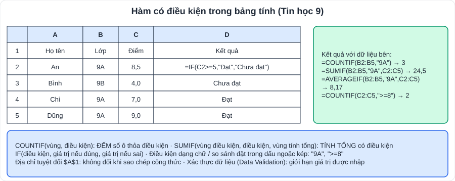

# Tin học 9 và Công nghệ 9: trọng tâm ôn thi

> [Danh mục kiến thức](../README.md) · Học theo tiến độ SGK · Ôn trước mỗi kì kiểm tra · ⚠️ Công nghệ 9 có **nhiều mô-đun tự chọn** (lắp đặt mạng điện trong nhà, trồng cây ăn quả, chế biến thực phẩm, cắt may…); hỏi giáo viên trường con học mô-đun nào

---

## Phần A: Tin học 9

### 1. Máy tính và cộng đồng

- Máy tính có mặt trong mọi lĩnh vực: giáo dục, y tế, giao thông, ngân hàng, sản xuất; các thiết bị có **gắn bộ xử lí** (điện thoại, máy giặt thông minh, đồng hồ thông minh).
- **Trí tuệ nhân tạo (AI)**: hỗ trợ học tập, dịch thuật, nhận diện hình ảnh; cần dùng **có trách nhiệm**, kiểm chứng thông tin, không lạm dụng làm bài hộ.

### 2. Khai thác thông tin số

- **Đánh giá chất lượng thông tin**: tính **mới**, **chính xác**, **đầy đủ**, **sử dụng được**; nguồn tin **đáng tin cậy** (cơ quan chính thống, có tác giả, có trích dẫn).
- Cảnh giác **tin giả**, lừa đảo trực tuyến; kiểm tra chéo từ nhiều nguồn.

### 3. Đạo đức, pháp luật, văn hóa trong môi trường số

- Tôn trọng **bản quyền**, trích dẫn nguồn; không chia sẻ thông tin cá nhân của người khác; không bắt nạt trên mạng.
- Một số hành vi vi phạm: phát tán tin sai sự thật, xúc phạm người khác, đánh cắp tài khoản, sao chép phần mềm trái phép.

### 4. Bảng tính nâng cao

| Nội dung | Ghi nhớ |
|---|---|
| **Xác thực dữ liệu** (Data Validation) | Giới hạn kiểu, phạm vi dữ liệu được nhập (ví dụ điểm từ 0 đến 10) |
| **COUNTIF**(vùng, điều kiện) | Đếm số ô thỏa điều kiện |
| **SUMIF**(vùng điều kiện, điều kiện, vùng tính tổng) | Tính tổng có điều kiện |
| **AVERAGEIF** | Trung bình có điều kiện |
| **IF**(điều kiện, đúng, sai) | Trả về giá trị theo điều kiện; có thể lồng IF |
| Địa chỉ **tuyệt đối** $A$1 | Không thay đổi khi sao chép công thức |

**Ví dụ IF lồng**: xếp loại theo điểm ở ô C2: `=IF(C2>=8,"Giỏi",IF(C2>=6.5,"Khá",IF(C2>=5,"Đạt","Chưa đạt")))`.

### 5. Phần mềm làm video, trình chiếu

- Quy trình làm video: **chuẩn bị kịch bản → thu thập tư liệu → dựng (ghép, cắt, chèn chữ, âm thanh, hiệu ứng chuyển cảnh) → xuất video**.
- Tôn trọng bản quyền hình ảnh, âm nhạc.

### 6. Giải quyết vấn đề với sự trợ giúp của máy tính

- Các bước: **xác định vấn đề → tìm thuật toán → viết chương trình → kiểm thử, sửa lỗi**.
- **Cấu trúc điều khiển**: tuần tự, rẽ nhánh (if), lặp (for, while).
- **Mô phỏng** trên máy tính: thí nghiệm ảo, dự báo thời tiết, mô phỏng giao thông.

**Bài tập Tin học:**
1. Với bảng ở hình trên, viết công thức đếm số học sinh lớp 9B; tính tổng điểm của lớp 9A.
2. Viết công thức IF: nếu điểm (ô C2) từ 5 trở lên ghi "Đạt", ngược lại ghi "Chưa đạt".
3. Nêu 3 tiêu chí đánh giá một trang web cung cấp thông tin đáng tin cậy.

👉 Bấm để xem đáp án

1. `=COUNTIF(B2:B5,"9B")` → 1; `=SUMIF(B2:B5,"9A",C2:C5)` → 24,5.
2. `=IF(C2>=5,"Đạt","Chưa đạt")`.
3. Nguồn chính thống/có tác giả rõ ràng; thông tin được cập nhật (có ngày đăng); có trích dẫn, kiểm chứng được từ nhiều nguồn.

---

## Phần B: Công nghệ 9

### 1. Định hướng nghề nghiệp (mô-đun bắt buộc)

- **Nghề nghiệp**: công việc ổn định, có chuyên môn, mang lại thu nhập. Vai trò: nuôi sống bản thân, đóng góp xã hội.
- **Lĩnh vực kĩ thuật, công nghệ**: cơ khí, điện – điện tử, xây dựng, công nghệ thông tin, nông nghiệp công nghệ cao…
- **Hệ thống giáo dục quốc dân** và **phân luồng sau THCS**: học **THPT**; học **giáo dục nghề nghiệp** (trung cấp, cao đẳng); vừa học nghề vừa học văn hóa (giáo dục thường xuyên).
- **Lí thuyết cây nghề nghiệp / mô hình chọn nghề**: chọn nghề dựa trên **sở thích (thích gì)** – **năng lực (giỏi gì)** – **nhu cầu xã hội (xã hội cần gì)**, kèm điều kiện gia đình, sức khỏe.
- **Thị trường lao động**: nhu cầu tăng ở công nghệ thông tin, kĩ thuật, chăm sóc sức khỏe, dịch vụ; kĩ năng cần thiết: ngoại ngữ, tin học, giao tiếp, làm việc nhóm.

### 2. Mô-đun tự chọn (ví dụ: Lắp đặt mạng điện trong nhà)

- **Thiết bị, vật liệu**: dây dẫn, ống luồn dây, công tắc, ổ cắm, cầu chì, **aptomat (CB)**, bóng đèn.
- **Dụng cụ**: kìm, tua vít, bút thử điện, đồng hồ vạn năng.
- **Sơ đồ**: sơ đồ nguyên lí (mối liên hệ điện) và sơ đồ lắp đặt (vị trí, cách lắp).
- **Quy trình lắp mạch đèn**: vẽ sơ đồ → chuẩn bị → lắp thiết bị lên bảng điện → nối dây → kiểm tra → **cấp điện thử**. Công tắc mắc **nối tiếp** với đèn, trên **dây pha**; cầu chì/aptomat mắc trên dây pha trước các thiết bị.
- **An toàn điện**: ngắt nguồn trước khi lắp đặt; dùng dụng cụ cách điện; kiểm tra bằng bút thử điện.

**Câu hỏi Công nghệ:**
1. Sau khi tốt nghiệp THCS, học sinh có những hướng đi nào?
2. Khi chọn nghề cần dựa vào những yếu tố nào?
3. ★ Vì sao công tắc phải mắc trên dây pha chứ không mắc trên dây trung tính?

👉 Bấm để xem gợi ý

1. Học THPT; học trung cấp/cao đẳng nghề; học giáo dục thường xuyên kết hợp học nghề; tham gia lao động (khi đủ tuổi, phù hợp pháp luật).
2. Sở thích, năng lực bản thân, nhu cầu thị trường lao động, điều kiện gia đình, sức khỏe.
3. Khi tắt công tắc, thiết bị được **ngắt khỏi dây pha** (dây có điện) → an toàn khi thay bóng, sửa chữa.

