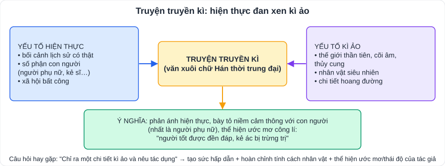

# Ngữ văn 1: Đọc hiểu truyện (truyện truyền kì, truyện trinh thám, truyện hiện đại)

> [Danh mục kiến thức](../README.md) · Dùng cho các bài **truyện** trong SGK Ngữ văn 9 (thường gặp: **truyền kì** ở đầu HK1, **trinh thám**, **truyện hiện đại** ở các bài sau) · Ôn trước mỗi kì kiểm tra và khi luyện đề vào 10 (phần Đọc hiểu)

## Mục tiêu

- Nhận biết đặc trưng **truyện truyền kì** và **truyện trinh thám**; phân tích **yếu tố kì ảo**, **manh mối – suy luận**.
- Xác định **ngôi kể, điểm nhìn, cốt truyện, tình huống truyện**, phân biệt **lời người kể chuyện** và **lời nhân vật**.
- Nêu **chủ đề, thông điệp**; viết đoạn văn **phân tích nhân vật / chi tiết** có dẫn chứng.

---

## 1. Kiến thức cần nhớ

### 1.1. Các yếu tố của truyện (ôn tập + mở rộng lớp 9)

| Yếu tố | Cần nắm | Câu hỏi thường gặp |
|---|---|---|
| **Ngôi kể** | Thứ nhất (xưng "tôi") / thứ ba (giấu mình) | "Xác định ngôi kể và nêu tác dụng" |
| **Điểm nhìn** | Câu chuyện được nhìn qua **con mắt của ai** (người kể, một nhân vật) | "Truyện được kể theo điểm nhìn của nhân vật nào?" |
| **Cốt truyện** | Chuỗi sự việc; **tuyến tính** (theo thời gian) hoặc **phi tuyến tính** (đảo trình tự, hồi tưởng) | "Nhận xét cách sắp xếp sự việc" |
| **Tình huống truyện** | Hoàn cảnh đặc biệt làm bộc lộ tính cách, chủ đề | "Truyện xây dựng tình huống gì? Ý nghĩa?" |
| **Nhân vật** | Ngoại hình, hành động, lời nói, **nội tâm**, quan hệ | "Đặc điểm nhân vật? Dựa vào đâu?" |
| **Lời người kể chuyện / lời nhân vật** | Lời kể (dẫn dắt, miêu tả) ≠ lời thoại, lời độc thoại của nhân vật | "Câu văn … là lời của ai?" |
| **Chủ đề – thông điệp** | Vấn đề chính – bài học tác giả gửi gắm | "Nêu chủ đề / thông điệp có ý nghĩa nhất với em" |

### 1.2. Truyện truyền kì

- Thể loại văn xuôi tự sự **thời trung đại**, viết bằng **chữ Hán**, kết hợp **yếu tố hiện thực** với **yếu tố kì ảo** (thần tiên, ma quỷ, cõi âm, thủy cung, chuyện hoang đường).
- Tác phẩm tiêu biểu ở Việt Nam: ***Truyền kì mạn lục*** (Nguyễn Dữ, thế kỉ XVI), trong đó nổi tiếng nhất là ***Chuyện người con gái Nam Xương***.
- *Chuyện người con gái Nam Xương* (nắm ý chính):
  - Nhân vật **Vũ Nương**: đẹp người đẹp nết, thủy chung, hiếu thảo; bị chồng (Trương Sinh) nghi oan vì **lời nói ngây thơ của đứa con** về "cái bóng", phải tự vẫn ở sông Hoàng Giang.
  - **Yếu tố kì ảo**: Vũ Nương sống dưới **thủy cung**; gặp Phan Lang; hiện về **giữa dòng sông** rồi biến mất.
  - **Ý nghĩa**: tố cáo **chế độ nam quyền, chiến tranh phong kiến** gây bất hạnh cho người phụ nữ; ca ngợi phẩm chất người phụ nữ; thể hiện ước mơ công lí; kết thúc kì ảo vừa có hậu vừa **bi kịch** (nàng không thể trở về).
- **Tác dụng của yếu tố kì ảo**: tạo sự hấp dẫn; hoàn chỉnh vẻ đẹp nhân vật; thể hiện ước mơ, thái độ của tác giả; đồng thời tăng tính bi kịch.

### 1.3. Truyện trinh thám

- Xoay quanh **một vụ án / bí ẩn**, quá trình **điều tra, phá án** của thám tử.
- Đặc điểm: **nhân vật thám tử** thông minh, quan sát tinh; **manh mối, chi tiết** rải rác; **suy luận logic**; cốt truyện nhiều **nút thắt**, kết thúc **bất ngờ nhưng hợp lí**; thường có nhân vật **người kể là trợ lí** (bác sĩ Watson trong truyện Sherlock Holmes).
- Tác giả tiêu biểu: **Arthur Conan Doyle** (Sherlock Holmes), **Agatha Christie**.
- Câu hỏi hay gặp: "Chi tiết nào là manh mối quan trọng?", "Nhận xét năng lực suy luận của thám tử", "Vì sao truyện được kể từ điểm nhìn của nhân vật phụ?" → giữ bí mật đến cuối, tạo **tò mò, hồi hộp**.

### 1.4. Truyện hiện đại (truyện ngắn)

- Phản ánh **hiện thực đời sống**, số phận con người; chú trọng **tâm lí nhân vật**.
- Phân tích: tình huống truyện → diễn biến tâm lí → chi tiết đặc sắc → chủ đề, thông điệp.

---

## 2. Cách trả lời các dạng câu hỏi

| Dạng câu hỏi | Mẫu trả lời |
|---|---|
| Ngôi kể + tác dụng | "Ngôi thứ ba → người kể **khách quan**, linh hoạt, có thể kể về nhiều nhân vật / Ngôi thứ nhất → **chân thực**, bộc lộ trực tiếp cảm xúc của 'tôi'." |
| Điểm nhìn | "Câu chuyện được kể chủ yếu từ điểm nhìn của nhân vật … giúp người đọc **thấu hiểu nội tâm** / **giữ bí ẩn** …" |
| Tác dụng chi tiết kì ảo | "Chi tiết … (1) tạo sức hấp dẫn, (2) hoàn chỉnh nét đẹp … của nhân vật, (3) thể hiện ước mơ … của nhân dân / thái độ … của tác giả." |
| Phân tích manh mối | "Chi tiết … là manh mối vì … Từ đó thám tử suy ra …" |
| Thông điệp | Nêu **1 thông điệp + lí do** + liên hệ bản thân |

**Đoạn văn phân tích nhân vật (khoảng 200 chữ):**
1. Câu chủ đề: nhân vật – tác phẩm – nhận xét khái quát.
2. Đặc điểm 1 + dẫn chứng + phân tích. Đặc điểm 2 + dẫn chứng + phân tích.
3. Nghệ thuật xây dựng nhân vật (tình huống, ngôi kể, chi tiết kì ảo / manh mối…).
4. Câu kết: ý nghĩa, tình cảm của tác giả, cảm nhận của em.

---

## 3. Lỗi hay gặp

- Nhầm **ngôi kể** (ai kể) với **điểm nhìn** (nhìn qua mắt ai).
- Kể lại truyện thay vì **phân tích** (chỉ tóm tắt, không nêu ý nghĩa).
- Nêu "yếu tố kì ảo" nhưng chỉ kể chi tiết, **không nêu tác dụng**.
- Chủ đề / thông điệp chung chung ("phải sống tốt").
- Dẫn chứng không đặt trong ngoặc kép, không chính xác.

---

## 4. Luyện tập

**Đọc đoạn truyện sau và trả lời câu hỏi** (văn bản tự soạn để luyện tập):

> *Bà tôi không biết dùng điện thoại thông minh. Mỗi lần tôi về quê, bà lại đưa chiếc máy cũ, nhờ tôi "xem giúp sao nó cứ im re". Năm nay tôi lên lớp 9, bận học thêm, ít về hẳn. Một tối, điện thoại tôi rung: cuộc gọi video từ bà. Màn hình chỉ thấy một nửa khuôn mặt bà, vầng trán nhăn và mái tóc bạc, phía sau là ánh đèn vàng của gian bếp. "Bà tự học đấy, cháu thấy bà giỏi không?" – bà cười, giọng run run. Tôi bỗng không nói được gì. Hóa ra suốt mấy tháng, bà đã nhờ cô hàng xóm chỉ cho từng nút bấm, chỉ để được nhìn thấy tôi.*

1. Đoạn truyện được kể theo ngôi thứ mấy? Điểm nhìn của ai?
2. Chỉ ra lời người kể chuyện và lời nhân vật trong đoạn.
3. Chi tiết "Màn hình chỉ thấy một nửa khuôn mặt bà" gợi cho em suy nghĩ gì?
4. Vì sao nhân vật "tôi" "bỗng không nói được gì"?
5. Viết đoạn văn (khoảng 150 chữ) nêu thông điệp em rút ra từ câu chuyện.

👉 Bấm để xem gợi ý đáp án

1. **Ngôi thứ nhất** (người kể xưng "tôi"); điểm nhìn của nhân vật **"tôi"** – người cháu.
2. Lời người kể chuyện: các câu kể, tả ("Bà tôi không biết…", "Tôi bỗng không nói được gì"…). Lời nhân vật: "xem giúp sao nó cứ im re"; **"Bà tự học đấy, cháu thấy bà giỏi không?"**.
3. Bà chưa quen công nghệ (cầm máy chưa đúng) nhưng vẫn cố gắng → sự **vụng về đáng thương mà đáng trân trọng**, tình yêu thương lớn hơn mọi khó khăn.
4. Vì xúc động, bất ngờ, và **áy náy** khi nhận ra mình ít về thăm trong khi bà âm thầm cố gắng vì mình.
5. Gợi ý: tình yêu thương của ông bà luôn bền bỉ, lặng lẽ; công nghệ chỉ là phương tiện, điều quan trọng là **sự quan tâm**; em cần dành thời gian gọi điện, về thăm, trò chuyện với ông bà.

---

## 5. Ghi văn bản trong SGK của con

> Con **tự điền** theo mục lục SGK Ngữ văn 9 (Kết nối tri thức) để có "bản đồ ôn tập".

| Bài SGK | Thể loại | Văn bản 1 | Văn bản 2 | Văn bản 3 | Nhân vật chính – chủ đề (1 dòng) |
|---|---|---|---|---|---|
| Bài … | Truyện truyền kì | | | | |
| Bài … | Truyện trinh thám | | | | |
| Bài … | Truyện hiện đại | | | | |
