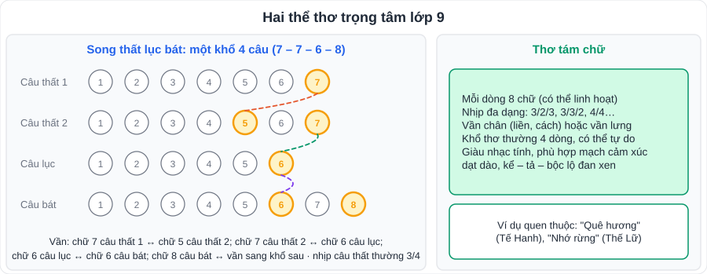
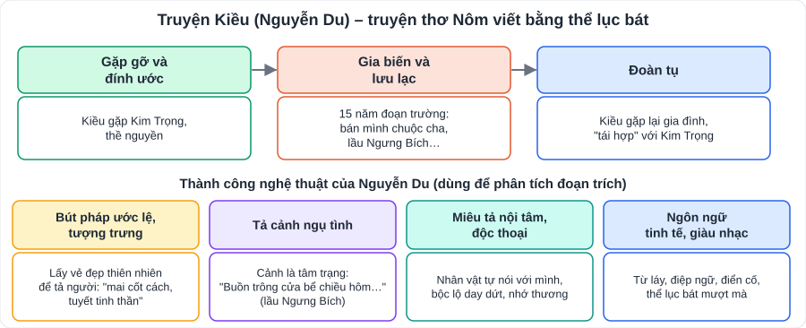

# Ngữ văn 2: Đọc hiểu thơ và truyện thơ (song thất lục bát, thơ tám chữ, truyện thơ Nôm)

> [Danh mục kiến thức](../README.md) · Dùng cho các bài **thơ** và **truyện thơ Nôm (Truyện Kiều)** trong SGK Ngữ văn 9 · Ôn trước mỗi kì kiểm tra; phần thơ hay xuất hiện trong đề Đọc hiểu và bài **nghị luận văn học** thi vào 10

## Mục tiêu

- Nhận biết thể **song thất lục bát**, **thơ tám chữ**, **lục bát** qua số chữ, vần, nhịp.
- Hiểu đặc trưng **truyện thơ Nôm**, nắm **Truyện Kiều** và các thành công nghệ thuật của Nguyễn Du.
- Phân tích được **hình ảnh, biện pháp tu từ, vần nhịp** và **cảm xúc của chủ thể trữ tình**.

---

## 1. Kiến thức cần nhớ

### 1.1. Các thể thơ

| Thể thơ | Nhận biết | Ví dụ |
|---|---|---|
| **Lục bát** | Cặp câu 6 – 8; chữ 6 câu lục vần chữ 6 câu bát; chữ 8 câu bát vần chữ 6 câu lục tiếp theo | Ca dao, *Truyện Kiều* |
| **Song thất lục bát** | Khổ 4 câu: 7 – 7 – 6 – 8; câu thất nhịp 3/4; vần lưng và vần chân đan xen | *Chinh phụ ngâm* (bản dịch, tương truyền của Đoàn Thị Điểm), *Cung oán ngâm khúc* |
| **Thơ tám chữ** | Phần lớn các dòng 8 chữ; nhịp linh hoạt (3/2/3, 3/3/2, 4/4); vần chân liền hoặc cách | *Nhớ rừng* (Thế Lữ), *Quê hương* (Tế Hanh) |
| **Thơ tự do** | Số chữ, số dòng không cố định; nhịp theo cảm xúc | Nhiều bài thơ hiện đại |

> Thể **song thất lục bát** có âm điệu **trầm buồn, triền miên** → hợp diễn tả nỗi sầu muộn, nhớ thương (nỗi buồn người chinh phụ, cung nữ).

### 1.2. Truyện thơ Nôm

- Tác phẩm **tự sự bằng thơ** (thường **lục bát**), viết bằng **chữ Nôm**; có cốt truyện, nhân vật, kết hợp **kể – tả – biểu cảm**.
- Hai loại: **bình dân** (khuyết danh, như *Tống Trân – Cúc Hoa*) và **bác học** (có tác giả: *Truyện Kiều* – Nguyễn Du, *Truyện Lục Vân Tiên* – Nguyễn Đình Chiểu).

### 1.3. Truyện Kiều (Nguyễn Du)

- **Nguyễn Du** (1765 – 1820), hiệu Tố Như, người Nghi Xuân, Hà Tĩnh; **Danh nhân văn hóa thế giới**.
- *Truyện Kiều* (*Đoạn trường tân thanh*): **3 254 câu lục bát**, dựa theo cốt truyện *Kim Vân Kiều truyện* (Thanh Tâm Tài Nhân, Trung Quốc) nhưng **sáng tạo lớn** về nghệ thuật.
- **Bố cục**: Gặp gỡ và đính ước → Gia biến và lưu lạc (15 năm) → Đoàn tụ.
- **Giá trị nội dung**:
  - **Hiện thực**: bức tranh xã hội bất công, thế lực đồng tiền và cường quyền chà đạp con người.
  - **Nhân đạo**: cảm thương số phận con người (nhất là người phụ nữ tài hoa bạc mệnh); trân trọng vẻ đẹp, khát vọng tình yêu, tự do, công lí.
- **Giá trị nghệ thuật**: bút pháp **ước lệ tượng trưng** (tả nhân vật chính diện), **tả cảnh ngụ tình**, **miêu tả nội tâm** sâu sắc, ngôn ngữ trong sáng, giàu hình ảnh, thể lục bát đạt đến đỉnh cao.
- Các đoạn trích thường học / thường ra đề: *Chị em Thúy Kiều*, *Cảnh ngày xuân*, *Kiều ở lầu Ngưng Bích*, *Thúy Kiều báo ân báo oán*… (đối chiếu SGK).

### 1.4. Biện pháp tu từ và cách nêu tác dụng

| Biện pháp | Dấu hiệu | Công thức nêu tác dụng |
|---|---|---|
| So sánh, ẩn dụ, hoán dụ, nhân hóa | như, là / gọi tên sự vật bằng tên khác / bộ phận thay toàn thể / vật có hành động như người | "**Làm cho** hình ảnh … sinh động, gợi hình, gợi cảm; **nhấn mạnh** …; **thể hiện** tình cảm … của tác giả" |
| Điệp ngữ, điệp cấu trúc | lặp từ, lặp kiểu câu | "Tạo nhịp điệu, **nhấn mạnh** …, tăng sức biểu cảm" |
| Liệt kê | chuỗi từ cùng loại | "Diễn tả **đầy đủ, phong phú** …" |
| Đảo ngữ | vị ngữ đứng trước chủ ngữ | "**Nhấn mạnh**, làm nổi bật …" |
| Câu hỏi tu từ | hỏi mà không cần trả lời | "Bộc lộ cảm xúc (băn khoăn, day dứt…)" |
| Từ láy | gợi hình, gợi âm | "Gợi tả … cụ thể, tinh tế" |

---

## 2. Cách đọc hiểu một bài thơ (5 bước)

1. **Thể thơ** (đếm chữ, xem vần nhịp).
2. **Nhân vật trữ tình / chủ thể trữ tình** là ai? Cảm xúc chính?
3. **Mạch cảm xúc**: cảm xúc thay đổi thế nào qua các khổ?
4. **Hình ảnh, từ ngữ đặc sắc + biện pháp tu từ** → tác dụng.
5. **Chủ đề, thông điệp**; liên hệ bản thân.

---

## 3. Lỗi hay gặp

- Gọi tên biện pháp tu từ mà **không nêu tác dụng** (chỉ được ¼ số điểm).
- Nêu tác dụng chung chung "làm câu thơ hay hơn" → phải gắn với **nội dung cụ thể** của câu thơ.
- Nhầm **lục bát** với **song thất lục bát** (đếm số chữ từng dòng!).
- Phân tích thơ mà **không trích dẫn** câu thơ.

---

## 4. Luyện tập

**Đọc đoạn thơ sau** (*Truyện Kiều* – Nguyễn Du, đoạn kết *Kiều ở lầu Ngưng Bích*):

> *Buồn trông cửa bể chiều hôm,*
> *Thuyền ai thấp thoáng cánh buồm xa xa?*
> *Buồn trông ngọn nước mới sa,*
> *Hoa trôi man mác biết là về đâu?*
> *Buồn trông nội cỏ rầu rầu,*
> *Chân mây mặt đất một màu xanh xanh.*
> *Buồn trông gió cuốn mặt duềnh,*
> *Ầm ầm tiếng sóng kêu quanh ghế ngồi.*

1. Đoạn thơ viết theo thể thơ nào?
2. Chỉ ra và nêu tác dụng của biện pháp điệp ngữ.
3. Nghệ thuật "tả cảnh ngụ tình" được thể hiện thế nào? Cảnh vật thay đổi theo trình tự nào?
4. Tìm các từ láy và nêu tác dụng.
5. Viết đoạn văn (khoảng 200 chữ) phân tích tâm trạng của Thúy Kiều trong đoạn thơ.

👉 Bấm để xem gợi ý đáp án

1. **Lục bát.**
2. Điệp ngữ **"Buồn trông"** (4 lần, đầu các câu lục): tạo nhịp điệu như điệp khúc, **nhấn mạnh nỗi buồn** dâng lên lớp lớp, triền miên của Kiều.
3. Mỗi cảnh là một nỗi lòng: thuyền xa – **nỗi nhớ nhà, khao khát trở về**; hoa trôi – **thân phận lênh đênh, vô định**; nội cỏ rầu rầu – **cuộc sống tẻ nhạt, vô vọng**; gió cuốn, sóng ầm ầm – **nỗi sợ hãi, lo âu** trước tai họa. Cảnh được tả **từ xa đến gần, màu sắc từ nhạt đến đậm, âm thanh từ tĩnh đến động** → nỗi buồn tăng dần đến cao trào.
4. Thấp thoáng, xa xa, man mác, rầu rầu, xanh xanh, ầm ầm → gợi hình ảnh, âm thanh **cụ thể**, diễn tả tâm trạng **buồn, cô đơn, lo sợ** thấm vào cảnh vật.
5. Đoạn văn cần: câu chủ đề (tâm trạng buồn lo, cô đơn của Kiều qua nghệ thuật tả cảnh ngụ tình); phân tích lần lượt 4 cặp câu có trích dẫn; nêu nghệ thuật (điệp ngữ, từ láy, câu hỏi tu từ, ẩn dụ); khẳng định tài năng và tấm lòng nhân đạo của Nguyễn Du.

---

## 5. Ghi văn bản trong SGK của con

| Bài SGK | Thể loại | Văn bản 1 | Văn bản 2 | Văn bản 3 | Cảm xúc chủ đạo – nghệ thuật nổi bật |
|---|---|---|---|---|---|
| Bài … | Thơ song thất lục bát | | | | |
| Bài … | Truyện thơ Nôm | | | | |
| Bài … | Thơ tám chữ / thơ hiện đại | | | | |
