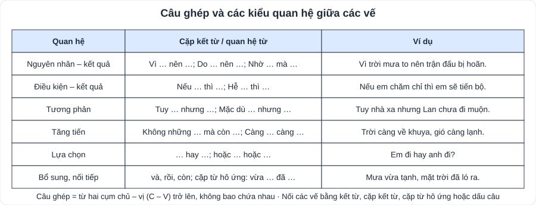
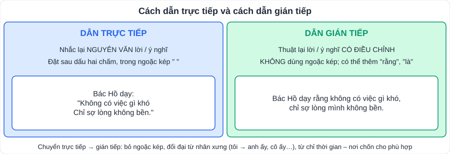

# Ngữ văn 5: Tiếng Việt lớp 9

> [Danh mục kiến thức](../README.md) · Dùng cho mục **Thực hành tiếng Việt** của các bài SGK · Ôn trước mỗi kì kiểm tra · Câu hỏi tiếng Việt chiếm **1 – 2 câu Đọc hiểu** trong đề

## Mục tiêu

- Hiểu và dùng đúng **điển tích, điển cố**, **từ Hán Việt**.
- Nhận biết **biện pháp chơi chữ** và các biện pháp tu từ đã học; nêu tác dụng.
- Phân biệt **câu đơn – câu ghép**, các **quan hệ giữa các vế câu ghép**; chuyển đổi **cách dẫn trực tiếp ↔ gián tiếp**.
- Ôn **thành phần biệt lập** và **phép liên kết** (hay gặp trong đề đọc hiểu).

---

## 1. Điển tích, điển cố

- **Điển tích**: câu chuyện trong sách xưa được dẫn lại ngắn gọn. **Điển cố**: sự việc, câu chữ trong sách xưa được dùng lại để nói điều tương tự.
- Tác dụng: lời văn **hàm súc, trang trọng**, gợi nhiều liên tưởng (đặc biệt trong văn học trung đại, *Truyện Kiều*).

| Điển tích / điển cố | Nghĩa |
|---|---|
| **Nàng Tô Thị (hòn Vọng Phu)** | Người vợ thủy chung chờ chồng đến hóa đá |
| **Tái ông thất mã** | Trong rủi có may, trong may có rủi |
| **Ôm cây đợi thỏ** | Chờ may mắn, không chịu cố gắng |
| **Mai cốt cách, tuyết tinh thần** | Cốt cách thanh cao như mai, tâm hồn trong trắng như tuyết |
| **Nghiêng nước nghiêng thành** | Vẻ đẹp tuyệt sắc |
| **Sân Lai, gốc tử** | Lòng hiếu thảo với cha mẹ (Kiều nhớ cha mẹ ở lầu Ngưng Bích) |

## 2. Từ Hán Việt

- Yếu tố Hán Việt đồng âm khác nghĩa: **thiên** (trời: thiên nhiên; nghìn: thiên niên kỉ; dời: thiên đô); **gia** (nhà: gia đình; thêm: gia vị, gia tăng).
- Từ Hán Việt tạo sắc thái **trang trọng** (phụ nữ / đàn bà), **tao nhã** (từ trần / chết), **cổ kính**. Không lạm dụng khi giao tiếp thường ngày.
- Một số từ dễ dùng sai: **bàng quan** (thờ ơ) ≠ bàng quang; **yếu điểm** (điểm quan trọng) ≠ **điểm yếu**; **tham quan** ≠ "thăm quan"; **trau dồi** (không phải "trao dồi"); **chuẩn đoán** sai → **chẩn đoán**.

## 3. Biện pháp tu từ

- **Chơi chữ**: lợi dụng đặc sắc về âm, nghĩa của từ để tạo **sắc thái dí dỏm, hài hước** hoặc **hàm ý**. Cách chơi chữ: **từ đồng âm**, **từ gần âm**, **nói lái**, **điệp âm**, **từ trái nghĩa, đồng nghĩa**.
  - *"Bà già đi chợ Cầu Đông / Bói xem một quẻ lấy chồng **lợi** chăng / Thầy bói xem quẻ nói rằng / **Lợi** thì có lợi nhưng răng không còn"* → "lợi" (lợi ích / nướu răng).
- **Ôn tập**: so sánh, ẩn dụ, hoán dụ, nhân hóa, điệp ngữ, liệt kê, nói quá, nói giảm nói tránh, đảo ngữ, câu hỏi tu từ (xem bảng tác dụng ở [V02](V02-Doc-Hieu-Tho-Truyen-Tho.md#14-biện-pháp-tu-từ-và-cách-nêu-tác-dụng)).

## 4. Câu đơn, câu ghép

- **Câu đơn**: một cụm chủ – vị (C – V) nòng cốt. **Câu ghép**: **từ hai cụm C – V trở lên**, không bao chứa nhau; mỗi cụm là một **vế câu**.
- Cách nối các vế: **kết từ** (và, nhưng, hay…), **cặp kết từ** (vì … nên, nếu … thì, tuy … nhưng, không những … mà còn), **cặp từ hô ứng** (vừa … đã, càng … càng, đâu … đấy), **dấu câu** (phẩy, chấm phẩy, hai chấm).
- **Lựa chọn câu đơn hay câu ghép**: câu đơn ngắn gọn, nhấn mạnh; câu ghép thể hiện **quan hệ logic** giữa các sự việc.

## 5. Cách dẫn trực tiếp, gián tiếp

- **Trực tiếp**: giữ nguyên văn, đặt trong **ngoặc kép**, sau **dấu hai chấm**.
- **Gián tiếp**: thuật lại có điều chỉnh, **không** ngoặc kép, có thể thêm **rằng / là**; đổi ngôi nhân xưng, từ chỉ thời gian – nơi chốn.

## 6. Ôn tập: thành phần biệt lập, liên kết câu (hay gặp trong đề đọc hiểu)

| Thành phần biệt lập | Dấu hiệu | Ví dụ |
|---|---|---|
| Tình thái | Thể hiện cách nhìn của người nói: *chắc chắn, có lẽ, hình như, dường như* | ***Có lẽ*** trời sắp mưa. |
| Cảm thán | Bộc lộ cảm xúc: *ôi, chao ôi, trời ơi* | ***Chao ôi***, cảnh đẹp quá! |
| Gọi – đáp | Tạo lập, duy trì giao tiếp: *này, thưa, vâng, dạ* | ***Thưa cô***, em xin phép vào lớp. |
| Phụ chú | Giải thích, bổ sung, đặt giữa dấu phẩy / gạch ngang / ngoặc đơn | Nguyễn Du ***(1765 – 1820)*** là đại thi hào. |

| Phép liên kết | Cách làm | Ví dụ |
|---|---|---|
| **Phép lặp** | Lặp lại từ ngữ ở câu trước | *…tre. **Tre** giữ làng…* |
| **Phép thế** | Dùng đại từ / từ đồng nghĩa thay thế | *Bác Hồ … **Người*** |
| **Phép nối** | Dùng từ nối: *nhưng, vì vậy, tuy nhiên, ngoài ra* | ***Tuy nhiên***, … |
| **Phép liên tưởng** | Từ cùng trường nghĩa | *trường – lớp – thầy cô* |

---

## 7. Lỗi hay gặp

- Câu có hai **động từ** nhưng một chủ ngữ ("Lan học bài và làm bài") → vẫn là **câu đơn** (một cụm C – V với vị ngữ ghép).
- Chuyển sang dẫn gián tiếp mà **giữ ngoặc kép** hoặc **không đổi đại từ**.
- Nhầm **chơi chữ** với **ẩn dụ** (chơi chữ dựa vào **âm / nghĩa đặc biệt của từ**, thường gây cười).

---

## 8. Bài tập tự luyện

1. Giải thích nghĩa của điển cố "Tái ông thất mã" và đặt một câu có dùng điển cố này.
2. Chỉ ra cách chơi chữ trong câu: *"Con cá đối bỏ trong cối đá, con mèo cái nằm trên mái kèo."*
3. Xác định câu đơn, câu ghép; nếu là câu ghép, chỉ ra quan hệ giữa các vế:
   a) *Vì trời mưa to nên đường ngập nước.* b) *Mẹ tôi vừa nấu cơm vừa nghe đài.* c) *Trời càng lạnh, hoa đào càng thắm.*
4. Chuyển câu sau sang lời dẫn gián tiếp: *Cô giáo nói: "Tuần sau lớp mình sẽ kiểm tra giữa kì."*
5. Chỉ ra thành phần biệt lập và phép liên kết trong đoạn: *"Có lẽ không ai quên được tuổi học trò. Đó là quãng thời gian đẹp nhất của đời người."*
6. Sửa lỗi dùng từ: *"Chúng em đi thăm quan bảo tàng để trao dồi kiến thức."*

👉 Bấm để xem đáp án

1. Ông lão ở biên ải mất ngựa, sau ngựa quay về dẫn theo ngựa tốt; con trai cưỡi ngựa bị ngã què nhưng nhờ đó thoát cảnh đi lính → **trong rủi có may, trong may có rủi**. Ví dụ: *Trượt xe buýt nhưng nhờ đó em gặp lại bạn cũ, đúng là "tái ông thất mã".*
2. **Nói lái**: cá đối – cối đá; mèo cái – mái kèo.
3. a) **Câu ghép**, quan hệ **nguyên nhân – kết quả**. b) **Câu đơn** (một chủ ngữ "mẹ tôi", vị ngữ ghép). c) **Câu ghép**, quan hệ **tăng tiến** (cặp từ hô ứng càng … càng).
4. *Cô giáo nói **rằng** tuần sau lớp **chúng em** sẽ kiểm tra giữa kì.*
5. "Có lẽ": thành phần **tình thái**. "Đó" thay cho "tuổi học trò": **phép thế**.
6. *Chúng em đi **tham quan** bảo tàng để **trau dồi** kiến thức.*

