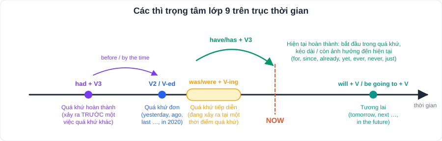
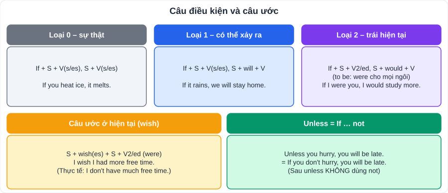
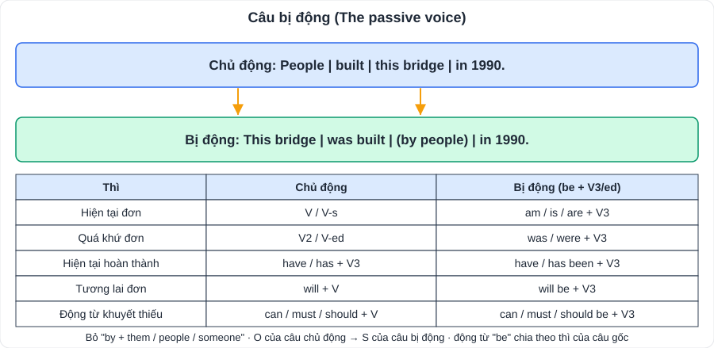
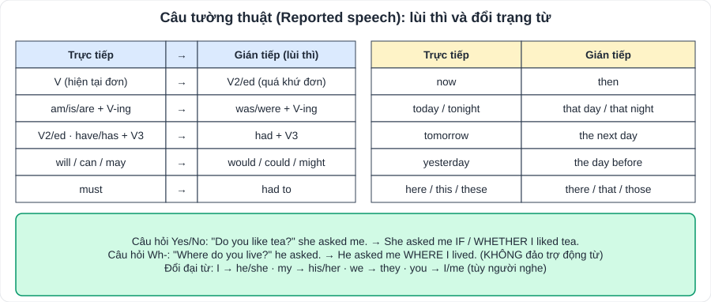
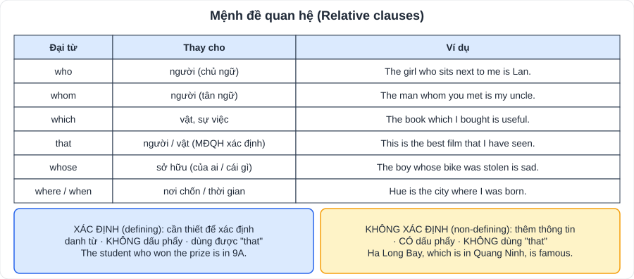

# Tiếng Anh 3: Ngữ pháp trọng tâm lớp 9

> [Danh mục kiến thức](../README.md) · Mỗi tuần học **1 chủ điểm** theo tiến độ SGK, ôn lại toàn bộ trước mỗi kì thi · Đây cũng là **khung ngữ pháp của đề thi vào 10** · Nâng cao: [Viết lại câu nâng cao (PlanLop9)](../../../PTNK/ChuyenDe/CD09-Anh-Viet-Lai-Cau-Nang-Cao.md)

| # | Chủ điểm | Mức độ trong đề |
|---|---|---|
| 1 | Các thì: hiện tại hoàn thành, quá khứ tiếp diễn, quá khứ hoàn thành | ⭐⭐⭐ |
| 2 | Used to / be used to / get used to | ⭐⭐ |
| 3 | Câu ước (wish) | ⭐⭐⭐ |
| 4 | Câu điều kiện loại 0, 1, 2 | ⭐⭐⭐ |
| 5 | Câu bị động | ⭐⭐⭐ |
| 6 | Câu tường thuật | ⭐⭐⭐ |
| 7 | Mệnh đề quan hệ | ⭐⭐⭐ |
| 8 | Từ để hỏi + to V; động từ + to V / V-ing | ⭐⭐ |
| 9 | So sánh (kép, càng … càng) | ⭐⭐ |
| 10 | Mệnh đề trạng ngữ, liên từ (although, because, so that…) | ⭐⭐⭐ |
| 11 | Cụm động từ (phrasal verbs) | ⭐⭐ |
| 12 | Câu hỏi đuôi, câu đề nghị | ⭐ |

> Thứ tự xuất hiện trong từng Unit có thể khác; mục *Grammar* của SGK con là chuẩn.

---

## 1. Các thì trọng tâm

| Thì | Công thức | Dùng khi | Dấu hiệu |
|---|---|---|---|
| **Hiện tại hoàn thành** | have/has + V3/ed | Việc đã xảy ra, **kết quả còn liên quan hiện tại**; kéo dài đến hiện tại; trải nghiệm | **for, since, already, yet, just, ever, never, so far, recently, up to now** |
| **Quá khứ đơn** | V2/ed | Việc **đã kết thúc**, có thời điểm xác định | yesterday, ago, last …, in 2020 |
| **Quá khứ tiếp diễn** | was/were + V-ing | Việc **đang xảy ra** tại một thời điểm / khi có việc khác xen vào | at 8 p.m. yesterday, **when, while** |
| **Quá khứ hoàn thành** | had + V3/ed | Việc xảy ra **trước** một việc khác trong quá khứ | **before, after, by the time, by + mốc quá khứ** |

- *I **have lived** here **since** 2015 / **for** ten years.* (since + mốc; for + khoảng)
- *I **was doing** homework **when** the phone **rang**.* (việc dài: tiếp diễn, việc chen ngang: quá khứ đơn)
- *While she **was cooking**, he **was watching** TV.* (hai việc song song)
- *When we **arrived**, the film **had started**.* (phim bắt đầu trước)

**Biến đổi hay gặp:**
- *I started learning English 5 years ago.* = *I **have learnt** English **for** 5 years.*
- *I have never seen such a beautiful place.* = *This is the most beautiful place I **have ever seen**.*
- *The last time I met him was in 2023.* = *I **haven't met** him **since** 2023.*

## 2. Used to

| Cấu trúc | Nghĩa | Ví dụ |
|---|---|---|
| **used to + V** | đã từng (thói quen quá khứ, nay không còn) | *I **used to** play marbles.* |
| didn't use to + V / Did … use to + V? | phủ định / nghi vấn | *Did you **use to** live here?* |
| **be used to + V-ing** | quen với | *I **am used to getting** up early.* |
| **get used to + V-ing** | dần quen với | *She is **getting used to living** in the city.* |

## 3. Câu ước (wish) ở hiện tại

- **S + wish(es) + S + V2/ed** (to be: **were** cho mọi ngôi) → ước điều **trái với hiện tại**.
- *I don't have a bike.* → *I **wish** I **had** a bike.*
- *I can't swim.* → *I **wish** I **could** swim.*
- *If only* = I wish (nhấn mạnh hơn).

## 4. Câu điều kiện

| Loại | Mệnh đề If | Mệnh đề chính | Dùng khi |
|---|---|---|---|
| 0 | hiện tại đơn | hiện tại đơn | sự thật hiển nhiên |
| 1 | hiện tại đơn | **will / can / may + V** | có thể xảy ra ở hiện tại / tương lai |
| 2 | **quá khứ đơn (were)** | **would / could + V** | trái với thực tế hiện tại |

- **Unless = If … not**: *Unless you study hard, you will fail.*
- Biến đổi: *I don't have time, so I can't help you.* → *If I **had** time, I **could** help you.*

## 5. Câu bị động

- **S + be (chia theo thì) + V3/ed (+ by O)**.
- Bị động với động từ khuyết thiếu: *can / must / should / will **be done***.
- Bị động với "people say": *People say that he is rich.* → ***It is said that** he is rich.* / *He **is said to be** rich.*

## 6. Câu tường thuật

- **Câu kể**: *He said, "I am tired."* → *He said (that) he **was** tired.*
- **Câu hỏi Yes/No**: asked + **if / whether** + S + V (lùi thì, không đảo).
- **Câu hỏi Wh-**: asked + **Wh-** + S + V.
- **Câu mệnh lệnh / yêu cầu**: *"Close the door, please."* → *She asked me **to close** the door.*; *"Don't be late."* → *He told us **not to be** late.*
- Nếu động từ tường thuật ở **hiện tại** (says, tells) → **không lùi thì**.

## 7. Mệnh đề quan hệ

- **who** (người, làm chủ ngữ), **whom** (người, làm tân ngữ), **which** (vật), **that** (người/vật – chỉ trong MĐ xác định), **whose** (sở hữu), **where** (nơi chốn), **when** (thời gian).
- Nối câu: *The man is my teacher. You met **him** yesterday.* → *The man **whom/who** you met yesterday is my teacher.*
- Dùng **that** bắt buộc sau: so sánh nhất, *the first/last/only*, *all, everything, nothing*, người + vật.

## 8. Từ để hỏi + to V; động từ + to V / V-ing

- **Question words + to-infinitive**: *I don't know **what to do** / **where to go** / **how to use** this app.*
- **+ to V**: want, decide, plan, hope, agree, refuse, promise, learn, manage, would like, **it's + adj + to V**.
- **+ V-ing**: enjoy, avoid, mind, finish, suggest, practise, keep, consider, **look forward to**, be interested in, be good at.
- **Cả hai, nghĩa khác**: *remember/forget/stop/try*: *stop **to buy*** (dừng lại để mua) ≠ *stop **buying*** (thôi mua).

## 9. So sánh

- So sánh hơn: *short adj-**er** than; **more** long adj than*. Nhất: ***the** -est; **the most***.
- Bất quy tắc: good/well – better – best; bad/badly – worse – worst; far – farther/further.
- **So sánh kép**: *The **more** you practise, **the better** you speak.* · *It's getting **hotter and hotter**.* · ***more and more** expensive*.
- Bằng: *as … as*; không bằng: *not as/so … as*.

## 10. Liên từ, mệnh đề trạng ngữ

| Ý nghĩa | + mệnh đề (S + V) | + cụm danh từ / V-ing |
|---|---|---|
| Nhượng bộ | **although, though, even though** | **despite, in spite of** |
| Nguyên nhân | **because, since, as** | **because of, due to** |
| Mục đích | **so that, in order that** + S + can/could | **to, in order to, so as to** + V |
| Kết quả | **so … that, such (a/an) … that** | |

- *Although it rained, we went out.* = *Despite **the rain**, we went out.* = *In spite of **raining** …* (khi cùng chủ ngữ ý nghĩa).
- *It was **so** hot **that** we stayed home.* = *It was **such a** hot day **that** …*

## 11. Cụm động từ thường gặp

look after (chăm sóc) · look for (tìm) · look up (tra cứu) · look forward to (mong đợi) · give up (từ bỏ) · turn on/off (bật/tắt) · put on (mặc vào) · take off (cởi; cất cánh) · get on with (hòa hợp) · come back (trở lại) · find out (tìm ra) · set up (thành lập) · pass down (truyền lại) · cut down on (cắt giảm) · run out of (hết) · carry out (tiến hành) · go on (tiếp tục) · deal with (giải quyết)

## 12. Câu hỏi đuôi, lời đề nghị

- Câu hỏi đuôi: khẳng định → đuôi phủ định và ngược lại; *I am …, **aren't I**?*; *Let's …, **shall we**?*
- Đề nghị: ***Let's** + V; **Why don't we** + V?; **What about / How about** + V-ing?; **suggest + V-ing / suggest that S (should) V**.*

---

## Bài tập tự luyện

**A. Chọn đáp án đúng**

1. I ______ English for five years. (A. learn B. learnt C. have learnt D. am learning)
2. When I came, they ______ dinner. (A. had B. have C. were having D. are having)
3. By the time we got there, the train ______. (A. left B. had left C. has left D. leaves)
4. I wish I ______ taller. (A. am B. were C. will be D. have been)
5. If it ______ tomorrow, we will cancel the trip. (A. rains B. rained C. will rain D. would rain)
6. The book ______ I borrowed is interesting. (A. who B. whom C. which D. whose)
7. She asked me where I ______. (A. live B. lived C. do live D. did I live)
8. I don't know what ______ next. (A. do B. doing C. to do D. done)
9. ______ the heavy rain, the match continued. (A. Although B. Because C. Despite D. Because of)
10. He is used to ______ up early. (A. get B. getting C. got D. gets)

**B. Viết lại câu không đổi nghĩa**

11. They built this school in 2010. → This school ______.
12. "I will call you tomorrow," Nam said to me. → Nam told me ______.
13. I don't have a computer, so I can't do the research. → If ______.
14. Although he was ill, he went to school. → Despite ______.
15. I last saw her three months ago. → I haven't ______.
16. The girl is my cousin. Her father is a doctor. → The girl ______.

👉 Bấm để xem đáp án

1. C · 2. C · 3. B · 4. B · 5. A · 6. C · 7. B · 8. C · 9. C · 10. B
11. This school **was built in 2010**.
12. Nam told me (that) **he would call me the next day / the following day**.
13. If **I had a computer, I could do the research**.
14. Despite **his illness / being ill, he went to school**.
15. I haven't **seen her for three months**.
16. The girl **whose father is a doctor is my cousin**.

