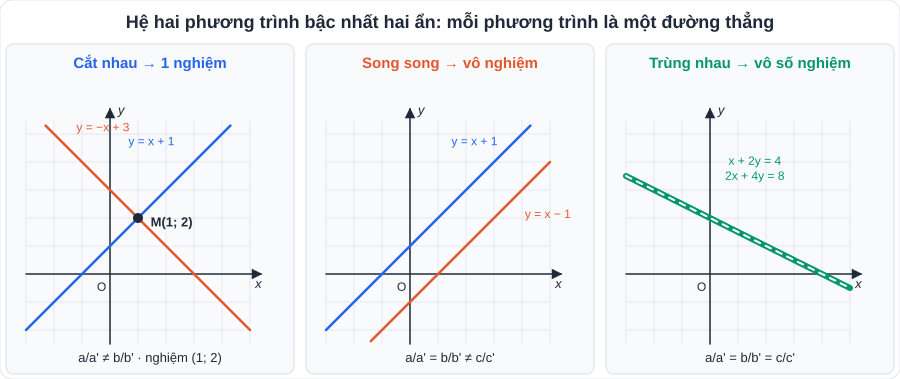
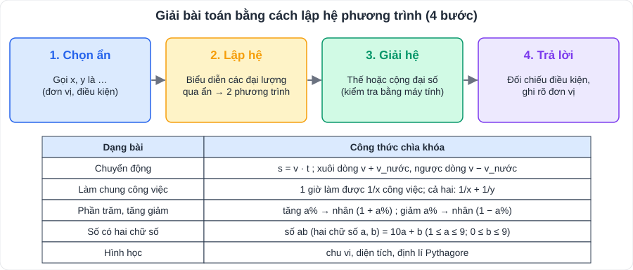

# Toán 1: Phương trình và hệ hai phương trình bậc nhất hai ẩn (Chương I – Tập 1)

> [Danh mục kiến thức](../README.md) · Học ở **tháng 9** (đầu HK1) · Ôn lại trước giữa HK1 và khi luyện đề vào 10 · **Câu "giải hệ" và "giải bài toán bằng cách lập hệ" gần như luôn có trong đề**



## Mục tiêu

- Giải thành thạo hệ hai phương trình bằng **phương pháp thế** và **phương pháp cộng đại số**; kiểm tra lại bằng **máy tính cầm tay**.
- Biết hệ có **1 nghiệm / vô nghiệm / vô số nghiệm** khi nào.
- Giải **bài toán thực tế bằng cách lập hệ** theo đúng 4 bước, có điều kiện và đơn vị.

---

## 1. Kiến thức cần nhớ

### 1.1. Phương trình bậc nhất hai ẩn

- Dạng **ax + by = c** (a, b không đồng thời bằng 0).
- Cặp số (x₀; y₀) là **nghiệm** nếu ax₀ + by₀ = c.
- Phương trình có **vô số nghiệm**; tập nghiệm biểu diễn bởi **một đường thẳng** trên mặt phẳng tọa độ.
  - b ≠ 0: đường thẳng y = −(a/b)x + c/b.
  - b = 0: đường thẳng x = c/a (song song hoặc trùng trục Oy).
  - a = 0: đường thẳng y = c/b (song song hoặc trùng trục Ox).

### 1.2. Hệ hai phương trình bậc nhất hai ẩn

```
{ ax + by = c
{ a'x + b'y = c'
```

| Vị trí hai đường thẳng | Số nghiệm của hệ | Dấu hiệu (a', b', c' khác 0) |
|---|---|---|
| Cắt nhau | **1 nghiệm duy nhất** | a/a' ≠ b/b' |
| Song song | **Vô nghiệm** | a/a' = b/b' ≠ c/c' |
| Trùng nhau | **Vô số nghiệm** | a/a' = b/b' = c/c' |

### 1.3. Hai phương pháp giải

| Phương pháp thế | Phương pháp cộng đại số |
|---|---|
| 1. Từ một phương trình, rút x theo y (hoặc y theo x) | 1. Nhân hai vế mỗi phương trình với số thích hợp để hệ số của **một ẩn bằng nhau hoặc đối nhau** |
| 2. Thế vào phương trình còn lại → phương trình một ẩn | 2. **Trừ** (nếu bằng nhau) hoặc **cộng** (nếu đối nhau) hai phương trình |
| 3. Giải, rồi tìm ẩn kia | 3. Giải phương trình một ẩn, thế lại tìm ẩn kia |
| Dùng khi có hệ số **1 hoặc −1** | Dùng khi các hệ số đều khác ±1 |

> **Kiểm tra bằng máy tính cầm tay** (Casio fx-580VN X và tương đương): vào chức năng **giải hệ phương trình (Simultaneous / Hệ phương trình) 2 ẩn**, nhập a, b, c của từng phương trình. Máy chỉ để **kiểm tra**, bài làm vẫn phải trình bày các bước.



---

## 2. Dạng bài và ví dụ có lời giải

### Dạng 1: Giải hệ bằng phương pháp thế

**Ví dụ 1.** Giải hệ { x + 2y = 5 ; 3x − y = 1 }.

> Từ phương trình đầu: x = 5 − 2y. Thế vào phương trình sau: 3(5 − 2y) − y = 1 ⇔ 15 − 7y = 1 ⇔ y = 2.
> Suy ra x = 5 − 2·2 = 1. **Hệ có nghiệm duy nhất (x; y) = (1; 2).**

### Dạng 2: Giải hệ bằng phương pháp cộng đại số

**Ví dụ 2.** Giải hệ { 2x + 3y = 13 ; 2x − y = 1 }.

> Trừ từng vế: (2x + 3y) − (2x − y) = 13 − 1 ⇔ 4y = 12 ⇔ y = 3. Thế vào 2x − y = 1: 2x = 4 ⇔ x = 2.
> **Nghiệm (2; 3).**

**Ví dụ 3.** Giải hệ { 3x + 2y = 7 ; 5x − 3y = −1 }.

> Nhân PT (1) với 3, PT (2) với 2: { 9x + 6y = 21 ; 10x − 6y = −2 }. Cộng từng vế: 19x = 19 ⇔ x = 1 ⇒ 2y = 7 − 3 = 4 ⇔ y = 2. **Nghiệm (1; 2).**

### Dạng 3: Tìm hệ số của đường thẳng đi qua hai điểm

**Ví dụ 4.** Tìm a, b để đường thẳng y = ax + b đi qua A(1; 3) và B(−1; −1).

> Thay tọa độ: { a + b = 3 ; −a + b = −1 }. Cộng: 2b = 2 ⇔ b = 1 ⇒ a = 2. **y = 2x + 1.**

### Dạng 4: Giải bài toán bằng cách lập hệ

**Ví dụ 5 (mua bán).** Mua 3 cây bút và 2 quyển vở hết 46 000 đồng; mua 2 cây bút và 5 quyển vở hết 82 000 đồng. Tính giá mỗi cây bút, mỗi quyển vở.

> Gọi giá một cây bút là x, một quyển vở là y (nghìn đồng; x, y > 0).
> Ta có hệ { 3x + 2y = 46 ; 2x + 5y = 82 }. Nhân PT (1) với 2, PT (2) với 3: { 6x + 4y = 92 ; 6x + 15y = 246 } ⇒ 11y = 154 ⇔ y = 14 ⇒ x = (46 − 28) : 3 = 6.
> **Bút 6 000 đồng, vở 14 000 đồng** (thỏa mãn điều kiện).

**Ví dụ 6 (làm chung công việc).** Hai người cùng làm một công việc thì 16 ngày xong. Nếu người thứ nhất làm 3 ngày và người thứ hai làm 6 ngày thì được 25% công việc. Hỏi mỗi người làm một mình thì bao lâu xong?

> Gọi thời gian làm một mình của người I, II lần lượt là x, y (ngày; x, y > 16).
> Một ngày: người I làm 1/x, người II làm 1/y công việc. Hệ: { 1/x + 1/y = 1/16 ; 3/x + 6/y = 1/4 }.
> Đặt u = 1/x, v = 1/y: { u + v = 1/16 ; 3u + 6v = 1/4 }. Nhân PT (1) với 3 rồi trừ: 3v = 1/4 − 3/16 = 1/16 ⇔ v = 1/48 ⇒ u = 1/16 − 1/48 = 1/24.
> **Người I: 24 ngày; người II: 48 ngày.**

> 💡 Dạng "làm chung": luôn quy về **phần công việc làm được trong 1 đơn vị thời gian**, rồi **đặt ẩn phụ** u = 1/x, v = 1/y.

---

## 3. Lỗi hay gặp

| Lỗi | Cách tránh |
|---|---|
| Nhân một vế mà quên nhân vế còn lại (hoặc quên nhân hệ số tự do) | Nhân **cả hai vế, mọi hạng tử** |
| Trừ hai phương trình bị sai dấu: −y − (+3y) | Đặt từng phương trình trong ngoặc trước khi trừ |
| Bài toán lập hệ thiếu **đơn vị, điều kiện** của ẩn | Câu "Gọi … là … (đơn vị, điều kiện)" là bắt buộc, chiếm điểm |
| Không đối chiếu điều kiện trước khi trả lời | Luôn có câu "(thỏa mãn điều kiện)" |
| Trộn đơn vị phút và giờ trong bài chuyển động | Đổi hết về giờ: 36 phút = 0,6 h; 20 phút = 1/3 h |

---

## 4. Bài tập tự luyện

### Nhóm A: Cơ bản

1. Cặp số (2; −1) có là nghiệm của phương trình 3x + 2y = 4 không?
2. Giải hệ { x − y = 3 ; 2x + y = 9 }.
3. Giải hệ { 3x + 2y = 7 ; 5x − 3y = −1 } bằng cách khác Ví dụ 3 (phương pháp thế).
4. Giải hệ { x/2 + y/3 = 3 ; x − y = 1 }.
5. Tìm a, b để đường thẳng y = ax + b đi qua M(2; 5) và N(−1; −4).
6. Với giá trị nào của m thì hệ { x + y = 2 ; 2x + 2y = m } vô số nghiệm? vô nghiệm?

### Nhóm B: Vận dụng (dạng bài lập hệ)

7. Lớp 9A có 40 học sinh, số học sinh nữ nhiều hơn số học sinh nam là 4 bạn. Tính số học sinh nam, nữ.
8. Tìm số tự nhiên có hai chữ số, biết tổng hai chữ số bằng 11 và nếu đổi chỗ hai chữ số thì được số mới lớn hơn số ban đầu 27 đơn vị.
9. Mua 2 kg táo và 3 kg cam hết 190 000 đồng; mua 3 kg táo và 2 kg cam hết 210 000 đồng. Tính giá 1 kg mỗi loại.
10. ★ Hai vòi nước cùng chảy vào một bể cạn thì sau 12 giờ đầy bể. Nếu mở vòi I trong 4 giờ và vòi II trong 6 giờ thì được 2/5 bể. Hỏi mỗi vòi chảy một mình thì bao lâu đầy bể?
11. ★ Tháng trước hai tổ sản xuất được 800 sản phẩm. Tháng này tổ I vượt mức 15%, tổ II vượt mức 20%, nên cả hai tổ làm được 945 sản phẩm. Tính số sản phẩm mỗi tổ làm tháng trước.

---

## 5. Đáp án

<details>
<summary>👉 Bấm để xem đáp án (tự làm xong rồi mới mở)</summary>

1. 3·2 + 2·(−1) = 4 ⇒ **có**.
2. Cộng hai phương trình: 3x = 12 ⇒ x = 4, y = 1. **(4; 1)**.
3. Từ PT (1): y = (7 − 3x)/2. Thế vào PT (2): 5x − 3(7 − 3x)/2 = −1 ⇔ 10x − 21 + 9x = −2 ⇔ x = 1 ⇒ y = 2. **(1; 2)**.
4. Nhân PT (1) với 6: 3x + 2y = 18; thế x = y + 1: 5y + 3 = 18 ⇒ y = 3, x = 4. **(4; 3)**.
5. { 2a + b = 5 ; −a + b = −4 } ⇒ 3a = 9 ⇒ a = 3, b = −1. **y = 3x − 1**.
6. PT (2) ⇔ x + y = m/2. Vô số nghiệm ⇔ m/2 = 2 ⇔ **m = 4**; vô nghiệm ⇔ **m ≠ 4**.
7. { x + y = 40 ; y − x = 4 } ⇒ **nam 18, nữ 22**.
8. Số ab: { a + b = 11 ; (10b + a) − (10a + b) = 27 ⇔ b − a = 3 } ⇒ b = 7, a = 4. **Số 47**.
9. { 2x + 3y = 190 ; 3x + 2y = 210 } ⇒ cộng: x + y = 80; trừ: x − y = 20 ⇒ **táo 50 000 đ/kg, cam 30 000 đ/kg**.
10. u = 1/x, v = 1/y: { u + v = 1/12 ; 4u + 6v = 2/5 } ⇒ 2v = 2/5 − 1/3 = 1/15 ⇒ v = 1/30, u = 1/20. **Vòi I: 20 giờ; vòi II: 30 giờ.**
11. { x + y = 800 ; 1,15x + 1,2y = 945 } ⇒ 0,05y = 945 − 920 = 25 ⇒ y = 500, x = 300. **Tổ I: 300; tổ II: 500 sản phẩm.**

</details>
