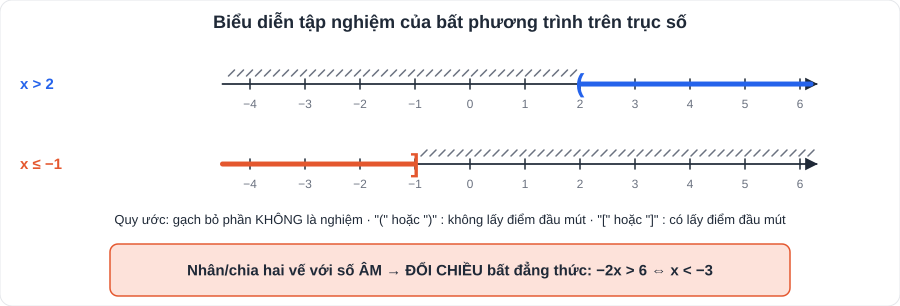

# Toán 2: Phương trình và bất phương trình bậc nhất một ẩn (Chương II – Tập 1)

> [Danh mục kiến thức](../README.md) · Học ở **tháng 10** · Ôn lại trước giữa HK1 · **Phương trình chứa ẩn ở mẫu: phải có bước điều kiện và đối chiếu, nếu thiếu sẽ mất điểm**

## Mục tiêu

- Giải **phương trình tích** và **phương trình chứa ẩn ở mẫu** (có điều kiện xác định, có đối chiếu).
- Dùng **tính chất của bất đẳng thức** để so sánh, chứng minh đơn giản.
- Giải **bất phương trình bậc nhất một ẩn**, biểu diễn nghiệm trên trục số, giải bài toán thực tế.

---

## 1. Kiến thức cần nhớ

### 1.1. Phương trình tích

> **A · B = 0 ⇔ A = 0 hoặc B = 0**

Muốn giải: chuyển hết sang vế trái → **phân tích thành nhân tử** (đặt nhân tử chung, hằng đẳng thức, nhóm hạng tử) → cho từng nhân tử bằng 0.

### 1.2. Phương trình chứa ẩn ở mẫu (4 bước)

1. Tìm **điều kiện xác định (ĐKXĐ)**: mọi mẫu khác 0.
2. **Quy đồng mẫu** hai vế rồi **khử mẫu**.
3. Giải phương trình vừa nhận được.
4. **Đối chiếu ĐKXĐ**, loại giá trị không thỏa mãn, kết luận.

### 1.3. Bất đẳng thức

- a > b, a < b, a ≥ b, a ≤ b là các bất đẳng thức.
- **Tính chất:**

| Phép biến đổi | Chiều bất đẳng thức |
|---|---|
| Cộng / trừ cùng một số ở hai vế | **Giữ nguyên** (a < b ⇒ a + c < b + c) |
| Nhân / chia hai vế với số **dương** | **Giữ nguyên** |
| Nhân / chia hai vế với số **âm** | **Đổi chiều** (a < b, c < 0 ⇒ ac > bc) |
| Bắc cầu | a < b và b < c ⇒ a < c |

### 1.4. Bất phương trình bậc nhất một ẩn

- Dạng **ax + b > 0** (hoặc <, ≥, ≤), a ≠ 0.
- Hai quy tắc: **chuyển vế đổi dấu**; **nhân (chia) với số âm thì đổi chiều**.
- Giải: ax + b > 0 ⇔ ax > −b ⇔ x > −b/a (nếu a > 0) hoặc x < −b/a (nếu a < 0).

---

## 2. Dạng bài và ví dụ có lời giải

**Ví dụ 1 (phương trình tích).** Giải (2x − 1)(x + 3) = 0.

> 2x − 1 = 0 ⇔ x = 1/2 hoặc x + 3 = 0 ⇔ x = −3. **S = {1/2; −3}.**

**Ví dụ 2 (đưa về phương trình tích).** Giải x² − 4x = 0 và x(x − 2) − 3(x − 2) = 0.

> x² − 4x = 0 ⇔ x(x − 4) = 0 ⇔ **x = 0 hoặc x = 4**.
> x(x − 2) − 3(x − 2) = 0 ⇔ (x − 2)(x − 3) = 0 ⇔ **x = 2 hoặc x = 3**.

**Ví dụ 3 (chứa ẩn ở mẫu, có nghiệm bị loại).** Giải (x + 2)/(x − 2) − 1/x = 2/(x(x − 2)).

> ĐKXĐ: x ≠ 0 và x ≠ 2.
> Quy đồng mẫu x(x − 2) và khử mẫu: x(x + 2) − (x − 2) = 2 ⇔ x² + 2x − x + 2 − 2 = 0 ⇔ x² + x = 0 ⇔ x(x + 1) = 0.
> ⇔ x = 0 (**loại**, không thỏa ĐKXĐ) hoặc x = −1 (thỏa mãn). **S = {−1}.**

**Ví dụ 4 (so sánh nhờ tính chất bất đẳng thức).** Cho a < b. So sánh −3a + 1 và −3b + 1.

> a < b ⇒ −3a > −3b (nhân với −3 < 0, đổi chiều) ⇒ **−3a + 1 > −3b + 1**.

**Ví dụ 5 (giải bất phương trình).**

> a) 3x − 5 < x + 7 ⇔ 2x < 12 ⇔ **x < 6**.
> b) 2(x − 1) − 3 ≥ 5x + 4 ⇔ 2x − 5 ≥ 5x + 4 ⇔ −3x ≥ 9 ⇔ **x ≤ −3** (chia cho −3, đổi chiều).

**Ví dụ 6 (bài toán thực tế).** Lan có 200 000 đồng. Lan đã mua một hộp bút giá 30 000 đồng, số tiền còn lại dùng mua vở giá 12 000 đồng/quyển. Lan mua được nhiều nhất bao nhiêu quyển vở?

> Gọi số vở là x (x ∈ ℕ). Ta có 30 000 + 12 000x ≤ 200 000 ⇔ x ≤ 170 000 : 12 000 ≈ 14,17.
> Vì x là số tự nhiên nên **Lan mua được nhiều nhất 14 quyển**.

---

## 3. Lỗi hay gặp

| Lỗi | Cách tránh |
|---|---|
| Chia hai vế cho x khi giải x² = 4x (mất nghiệm x = 0) | **Không chia cho biểu thức chứa ẩn**; chuyển vế rồi đặt nhân tử chung |
| Quên ĐKXĐ hoặc quên loại nghiệm | Viết ĐKXĐ **ngay dòng đầu**, kết luận phải có bước "đối chiếu" |
| Nhân với số âm mà **không đổi chiều** | Khoanh tròn dấu "−" của hệ số trước khi chia |
| Bài thực tế trả lời số lẻ (14,17 quyển) | Ẩn là số tự nhiên → lấy giá trị **nguyên lớn nhất / nhỏ nhất phù hợp** |
| Biểu diễn trục số nhầm ngoặc "(" và "[" | > , < dùng ngoặc tròn; ≥ , ≤ dùng ngoặc vuông |

---

## 4. Bài tập tự luyện

### Nhóm A: Cơ bản

1. Giải phương trình (3x − 6)(x + 5) = 0.
2. Giải phương trình x(x − 3) + 2(x − 3) = 0.
3. Giải phương trình 2/(x + 1) = 1/(x − 1).
4. Giải bất phương trình 5x − 2 > 3x + 6 và biểu diễn tập nghiệm trên trục số.
5. Giải bất phương trình (x − 1)/2 − (x + 2)/3 ≤ 1.
6. Cho a < b. So sánh: a) a − 5 và b − 5; b) −2a + 3 và −2b + 3.

### Nhóm B: Vận dụng

7. Giải phương trình x/(x − 3) − 3/(x + 3) = 18/(x² − 9).
8. ★ Một hãng taxi tính giá: km đầu tiên 12 000 đồng, mỗi km tiếp theo 15 000 đồng. Với 150 000 đồng, khách đi được tối đa bao nhiêu km (số nguyên)?
9. ★ Bạn Minh có điểm hai bài kiểm tra là 7 và 8. Minh cần ít nhất bao nhiêu điểm ở bài thứ ba để điểm trung bình ba bài không dưới 8?

---

## 5. Đáp án

👉 Bấm để xem đáp án (tự làm xong rồi mới mở)

1. **x = 2 hoặc x = −5**.
2. (x − 3)(x + 2) = 0 ⇒ **x = 3 hoặc x = −2**.
3. ĐKXĐ x ≠ ±1. 2(x − 1) = x + 1 ⇔ **x = 3** (thỏa mãn).
4. 2x > 8 ⇔ **x > 2**; trục số: gạch bỏ phần x ≤ 2, ngoặc "(" tại 2.
5. Nhân 6: 3(x − 1) − 2(x + 2) ≤ 6 ⇔ x − 7 ≤ 6 ⇔ **x ≤ 13**.
6. a) **a − 5 < b − 5**; b) −2a > −2b ⇒ **−2a + 3 > −2b + 3**.
7. ĐKXĐ x ≠ ±3. Khử mẫu (x² − 9): x(x + 3) − 3(x − 3) = 18 ⇔ x² + 9 = 18 ⇔ x² = 9 ⇔ x = ±3, **cả hai đều bị loại** ⇒ **phương trình vô nghiệm**.
8. 12 000 + 15 000(x − 1) ≤ 150 000 ⇔ x − 1 ≤ 9,2 ⇔ x ≤ 10,2 ⇒ **tối đa 10 km**.
9. (7 + 8 + x)/3 ≥ 8 ⇔ x ≥ 9 ⇒ **ít nhất 9 điểm**.

