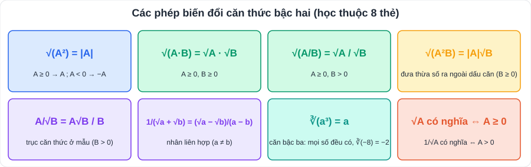

# Toán 3: Căn bậc hai và căn bậc ba (Chương III – Tập 1)

> [Danh mục kiến thức](../README.md) · Học ở **tháng 10 – 11** · Ôn lại trước giữa HK1, cuối HK1 · **Bài "rút gọn biểu thức chứa căn" là câu quen thuộc của đề thi vào 10**

## Mục tiêu

- Tìm **điều kiện xác định** của căn thức; dùng đúng **√(A²) = |A|**.
- Khai phương tích, thương; **đưa thừa số ra ngoài / vào trong** dấu căn; **trục căn thức ở mẫu**.
- **Rút gọn** biểu thức và làm các câu hỏi phụ: tính giá trị, tìm x, so sánh, tìm x nguyên.
- Tính căn bậc ba.

---

## 1. Kiến thức cần nhớ

### 1.1. Căn bậc hai

- Căn bậc hai của số a ≥ 0 là số x sao cho x² = a. Số dương a có **hai** căn bậc hai là **√a và −√a**; số 0 có một căn bậc hai là 0; số âm **không có** căn bậc hai.
- **√a** (a ≥ 0) gọi là **căn bậc hai số học** của a: √a ≥ 0 và (√a)² = a.
- So sánh: với a, b ≥ 0: **a < b ⇔ √a < √b**.

### 1.2. Căn thức bậc hai √A

- **√A xác định ⇔ A ≥ 0.** Nếu căn ở mẫu: 1/√A xác định ⇔ **A > 0**.
- **√(A²) = |A|** → phải xét dấu A khi bỏ căn.

### 1.3. Các phép biến đổi (xem 8 thẻ ở hình trên)

| Phép biến đổi | Công thức | Ví dụ |
|---|---|---|
| Khai phương tích | √(AB) = √A·√B (A, B ≥ 0) | √(9·16) = 3·4 = 12 |
| Khai phương thương | √(A/B) = √A/√B (A ≥ 0, B > 0) | √(25/49) = 5/7 |
| Đưa thừa số ra ngoài | √(A²B) = \|A\|√B (B ≥ 0) | √50 = √(25·2) = 5√2 |
| Đưa thừa số vào trong | A√B = √(A²B) (A ≥ 0); A√B = −√(A²B) (A < 0) | 3√2 = √18 |
| Trục căn thức ở mẫu | A/√B = A√B/B | 6/√3 = 6√3/3 = 2√3 |
| Nhân liên hợp | 1/(√a ± √b) = (√a ∓ √b)/(a − b) | 1/(√5 + 2) = √5 − 2 |

### 1.4. Căn bậc ba

- ∛a là số x sao cho **x³ = a**. **Mọi số thực** đều có đúng một căn bậc ba.
- ∛8 = 2; ∛(−27) = −3; ∛0 = 0; ∛(a³) = a.
- a < b ⇔ ∛a < ∛b.

---

## 2. Dạng bài và ví dụ có lời giải

### Dạng 1: Tính, rút gọn biểu thức số

**Ví dụ 1.** √50 − 3√8 + √18 = 5√2 − 6√2 + 3√2 = **2√2**.

**Ví dụ 2 (căn của bình phương).** √(3 − 2√2) = √((√2)² − 2√2 + 1) = √((√2 − 1)²) = |√2 − 1| = **√2 − 1** (vì √2 > 1).

**Ví dụ 3 (trục căn).** 2/(√3 − 1) = 2(√3 + 1)/((√3)² − 1) = 2(√3 + 1)/2 = **√3 + 1**.

### Dạng 2: Rút gọn biểu thức chứa ẩn và câu hỏi phụ (dạng đề thi)

**Ví dụ 4.** Cho P = √x/(√x − 2) − 4/(x − 2√x) với x > 0, x ≠ 4.
a) Rút gọn P. b) Tính P khi x = 9. c) Tìm x để P = 3. d) Tìm x để P = 2. e) So sánh P với 1.

> a) x − 2√x = √x(√x − 2). Quy đồng:
> P = (√x·√x − 4)/(√x(√x − 2)) = (x − 4)/(√x(√x − 2)) = (√x − 2)(√x + 2)/(√x(√x − 2)) = **(√x + 2)/√x**.
> b) x = 9 (thỏa ĐK) ⇒ √x = 3 ⇒ P = 5/3.
> c) (√x + 2)/√x = 3 ⇔ √x + 2 = 3√x ⇔ √x = 1 ⇔ **x = 1** (thỏa mãn).
> d) √x + 2 = 2√x ⇔ √x = 2 ⇔ x = 4 — **không thỏa ĐK** ⇒ **không có x**.
> e) P − 1 = 2/√x > 0 với mọi x > 0 ⇒ **P > 1**.

> 💡 Câu "so sánh P với 1": **xét hiệu P − 1** rồi xét dấu. Câu "tìm x": giải xong **phải đối chiếu điều kiện**.

### Dạng 3: Giải phương trình chứa căn đơn giản

**Ví dụ 5.** √(2x − 1) = 3 ⇔ 2x − 1 = 9 (điều kiện 2x − 1 ≥ 0) ⇔ **x = 5**.

### Dạng 4: Căn bậc ba

**Ví dụ 6.** ∛27 − ∛(−64) + ∛(1/8) = 3 + 4 + 1/2 = **7,5**.

---

## 3. Lỗi hay gặp

| Lỗi | Cách tránh |
|---|---|
| √(a + b) = √a + √b | **SAI**. Chỉ có √(ab) = √a·√b. Ví dụ √(9 + 16) = 5 ≠ 3 + 4 |
| √((2 − √5)²) = 2 − √5 | Phải là \|2 − √5\| = **√5 − 2** (vì 2 < √5) |
| Rút gọn xong quên "với x > 0, x ≠ 4" | Ghi điều kiện ở dòng đầu và đối chiếu ở câu tìm x |
| (√x − 2)(√x + 2) = x − 2 | Đúng là **x − 4** |
| Cho rằng số âm không có căn bậc ba | ∛(−8) = −2 |

---

## 4. Bài tập tự luyện

### Nhóm A: Cơ bản

1. Tìm x để √(2x − 6) xác định.
2. Tính: a) √0,36; b) √(144 · 25); c) √(1 9/16).
3. Rút gọn √((2 − √5)²).
4. Rút gọn √12 + √27 − √75.
5. Trục căn thức ở mẫu: a) 6/√3; b) 1/(√5 + 2).
6. Giải phương trình: a) √(x − 1) = 3; b) √(x²) = 5.
7. Tính ∛(−125) + ∛8.

### Nhóm B: Vận dụng

8. Rút gọn √(4 + 2√3) − √(4 − 2√3).
9. ★ Cho Q = (√x + 1)/(√x − 1) − (√x − 1)/(√x + 1) với x ≥ 0, x ≠ 1. a) Rút gọn Q. b) Tính Q khi x = 4.
10. ★ Tìm các số nguyên x để A = (√x + 3)/(√x − 1) nhận giá trị nguyên (x ≥ 0, x ≠ 1).

---

## 5. Đáp án

👉 Bấm để xem đáp án (tự làm xong rồi mới mở)

1. 2x − 6 ≥ 0 ⇔ **x ≥ 3**.
2. a) **0,6**; b) 12 · 5 = **60**; c) √(25/16) = **5/4**.
3. |2 − √5| = **√5 − 2**.
4. 2√3 + 3√3 − 5√3 = **0**.
5. a) **2√3**; b) (√5 − 2)/(5 − 4) = **√5 − 2**.
6. a) x − 1 = 9 ⇔ **x = 10**; b) |x| = 5 ⇔ **x = ±5**.
7. −5 + 2 = **−3**.
8. 4 + 2√3 = (√3 + 1)², 4 − 2√3 = (√3 − 1)² ⇒ (√3 + 1) − (√3 − 1) = **2**.
9. a) Quy đồng mẫu x − 1: Q = [(√x + 1)² − (√x − 1)²]/(x − 1) = **4√x/(x − 1)**. b) x = 4: Q = 8/3.
10. A = 1 + 4/(√x − 1). A nguyên ⇒ √x phải là số nguyên (x chính phương) và (√x − 1) là ước của 4: √x − 1 ∈ {±1; ±2; ±4} ⇒ √x ∈ {0; 2; 3; 5} (loại các giá trị âm) ⇒ **x ∈ {0; 4; 9; 25}**.

