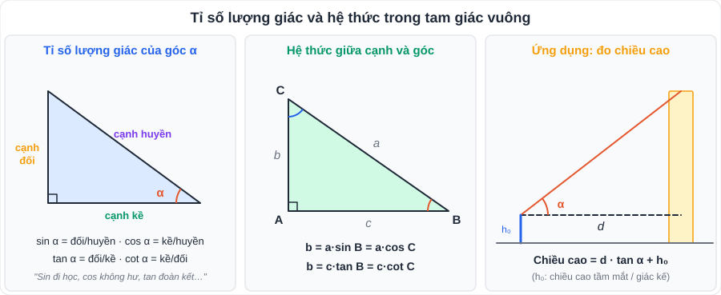
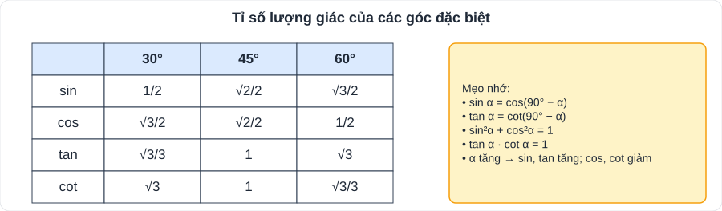

# Toán 4: Hệ thức lượng trong tam giác vuông (Chương IV – Tập 1)

> [Danh mục kiến thức](../README.md) · Học ở **tháng 11** · Ôn lại trước cuối HK1 · **Bài toán thực tế "đo chiều cao, khoảng cách" xuất hiện thường xuyên trong đề thi vào 10**

## Mục tiêu

- Viết đúng **sin, cos, tan, cot** của góc nhọn; thuộc bảng **góc đặc biệt** 30°, 45°, 60°.
- Dùng **hệ thức giữa cạnh và góc** để **giải tam giác vuông**.
- Giải bài toán thực tế (chiều cao, khoảng cách, góc nâng, góc hạ) và **làm tròn đúng yêu cầu**.

---

## 1. Kiến thức cần nhớ

### 1.1. Tỉ số lượng giác của góc nhọn α

| Tỉ số | Định nghĩa | Câu nhớ |
|---|---|---|
| **sin α** | cạnh đối / cạnh huyền | "Sin đi học" (đối/huyền) |
| **cos α** | cạnh kề / cạnh huyền | "Cos không hư" (kề/huyền) |
| **tan α** | cạnh đối / cạnh kề | "Tan đoàn kết" (đối/kề) |
| **cot α** | cạnh kề / cạnh đối | "Cot kết đoàn" (kề/đối) |

- 0 < sin α < 1; 0 < cos α < 1.
- **Hai góc phụ nhau** (α + β = 90°): sin α = cos β; cos α = sin β; tan α = cot β; cot α = tan β.
- Hệ thức cơ bản: sin²α + cos²α = 1; tan α = sin α / cos α; tan α · cot α = 1.

### 1.2. Hệ thức giữa cạnh và góc (△ABC vuông tại A; BC = a, CA = b, AB = c)

- **Cạnh góc vuông = cạnh huyền × sin góc đối = cạnh huyền × cos góc kề**: b = a·sin B = a·cos C.
- **Cạnh góc vuông = cạnh góc vuông kia × tan góc đối = × cot góc kề**: b = c·tan B = c·cot C.
- **Giải tam giác vuông**: biết 2 yếu tố (trong đó ít nhất 1 cạnh) → tìm các cạnh, góc còn lại.

### 1.3. Bổ sung: hệ thức về đường cao (chứng minh bằng tam giác đồng dạng – lớp 8)

△ABC vuông tại A, đường cao AH (BH = c', CH = b'):

| Hệ thức | Ghi nhớ |
|---|---|
| AB² = BH · BC; AC² = CH · BC | cạnh góc vuông² = hình chiếu × huyền |
| AH² = BH · CH | đường cao² = tích hai hình chiếu |
| AB · AC = BC · AH | (cùng bằng 2 lần diện tích) |
| 1/AH² = 1/AB² + 1/AC² | |

> Các hệ thức này rất hay dùng trong **bài hình tổng hợp** (ví dụ OH·OA = R² trong bài hai tiếp tuyến, xem [T05](T05-Duong-Tron.md)).

### 1.4. Máy tính cầm tay

- Để máy ở chế độ **độ (D / Deg)**.
- Tính sin 35°: `sin 35 =`. Tìm góc khi biết sin α = 0,6: `SHIFT sin 0.6 =` rồi đổi sang **độ – phút** bằng phím `°'''`.
- cot α = 1 / tan α (máy không có phím cot).

---

## 2. Dạng bài và ví dụ có lời giải

**Ví dụ 1 (tính tỉ số lượng giác).** △ABC vuông tại A, AB = 6 cm, AC = 8 cm. Tính các tỉ số lượng giác của góc B, suy ra góc B.

> BC = √(36 + 64) = 10 cm. sin B = AC/BC = **0,8**; cos B = AB/BC = **0,6**; tan B = AC/AB = **4/3**; cot B = **3/4**.
> B̂ ≈ **53°8'**.

**Ví dụ 2 (giải tam giác vuông).** △ABC vuông tại A, BC = 10 cm, B̂ = 35°. Giải tam giác (độ dài làm tròn đến hàng phần trăm).

> Ĉ = 90° − 35° = **55°**. AC = BC·sin B = 10·sin 35° ≈ **5,74 cm**. AB = BC·cos B = 10·cos 35° ≈ **8,19 cm**.

**Ví dụ 3 (chiều cao cây).** Bóng của một cái cây trên mặt đất dài 12 m, tia nắng mặt trời tạo với mặt đất góc 40°. Tính chiều cao cây.

> Chiều cao h = 12 · tan 40° ≈ 12 · 0,8391 ≈ **10,07 m**.

**Ví dụ 4 (thang an toàn).** Thang dài 4 m. Để an toàn, góc giữa thang và mặt đất phải từ 65° đến 70°. Chân thang phải cách tường trong khoảng nào?

> Khoảng cách d = 4·cos α. α = 65° ⇒ d ≈ 1,69 m; α = 70° ⇒ d ≈ 1,37 m.
> **Chân thang cách tường từ khoảng 1,37 m đến 1,69 m.**

**Ví dụ 5 (dùng góc đặc biệt, không dùng máy tính).** Tính A = sin 30° + cos 60° − tan 45°.

> A = 1/2 + 1/2 − 1 = **0**.

---

## 3. Lỗi hay gặp

| Lỗi | Cách tránh |
|---|---|
| Lấy nhầm cạnh **đối / kề** (đối với góc nào?) | Tô màu góc đang xét, cạnh **đối** là cạnh không chạm đỉnh góc đó |
| Máy để chế độ Rad → kết quả sai | Kiểm tra chữ **D** trên màn hình trước khi thi |
| Làm tròn ngay ở bước giữa → kết quả cuối lệch | Giữ nguyên trên máy, **chỉ làm tròn ở kết quả cuối** |
| Bài thực tế quên **chiều cao tầm mắt** | Đọc kỹ đề: "người cao 1,6 m" → cộng thêm |
| Nhầm **góc nâng** và **góc hạ** | Góc nâng: nhìn lên từ người; góc hạ: nhìn xuống từ trên cao; cả hai đều đo với **phương nằm ngang** |

---

## 4. Bài tập tự luyện

### Nhóm A: Cơ bản

1. △ABC vuông tại A có AB = 5 cm, BC = 13 cm. Tính AC và các tỉ số lượng giác của góc B.
2. Không dùng máy tính, sắp xếp theo thứ tự tăng dần: sin 70°, cos 50°, sin 25°, cos 10°.
3. Cho α nhọn, sin α = 3/5. Tính cos α và tan α.
4. Giải △ABC vuông tại A biết AB = 7 cm, B̂ = 50° (làm tròn đến hàng phần trăm).
5. △ABC vuông tại A, đường cao AH, BH = 4 cm, CH = 9 cm. Tính AH, AB, AC.

### Nhóm B: Vận dụng thực tế

6. Một máy bay cất cánh theo đường thẳng tạo với mặt đất góc 15°. Khi bay được 2 km theo đường bay thì máy bay ở độ cao bao nhiêu mét?
7. ★ Bạn An đứng cách một tòa nhà 30 m, nhìn đỉnh tòa nhà với góc nâng 52°. Mắt An cách mặt đất 1,5 m. Tính chiều cao tòa nhà (làm tròn đến hàng phần mười).
8. ★ Từ đỉnh một ngọn hải đăng cao 40 m so với mặt nước biển, người gác nhìn một chiếc thuyền với góc hạ 20°. Thuyền cách chân hải đăng bao xa?

---

## 5. Đáp án

👉 Bấm để xem đáp án (tự làm xong rồi mới mở)

1. AC = √(169 − 25) = **12 cm**; sin B = 12/13, cos B = 5/13, tan B = 12/5, cot B = 5/12.
2. cos 50° = sin 40°, cos 10° = sin 80° ⇒ **sin 25° < cos 50° < sin 70° < cos 10°**.
3. cos α = √(1 − 9/25) = **4/5**; tan α = (3/5) : (4/5) = **3/4**.
4. Ĉ = **40°**; AC = 7·tan 50° ≈ **8,34 cm**; BC = 7/cos 50° ≈ **10,89 cm**.
5. AH² = 4·9 = 36 ⇒ **AH = 6 cm**; BC = 13; AB² = 4·13 ⇒ **AB = 2√13 ≈ 7,21 cm**; AC² = 9·13 ⇒ **AC = 3√13 ≈ 10,82 cm**.
6. h = 2·sin 15° ≈ 0,518 km ≈ **518 m**.
7. h = 30·tan 52° + 1,5 ≈ 38,40 + 1,5 ≈ **39,9 m**.
8. Góc hạ 20° bằng góc nâng từ thuyền lên đỉnh (so le trong) ⇒ d = 40 / tan 20° ≈ **109,9 m**.

