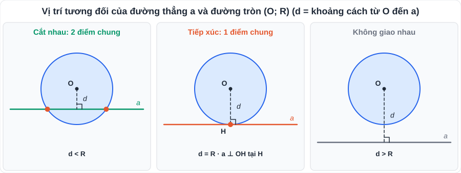
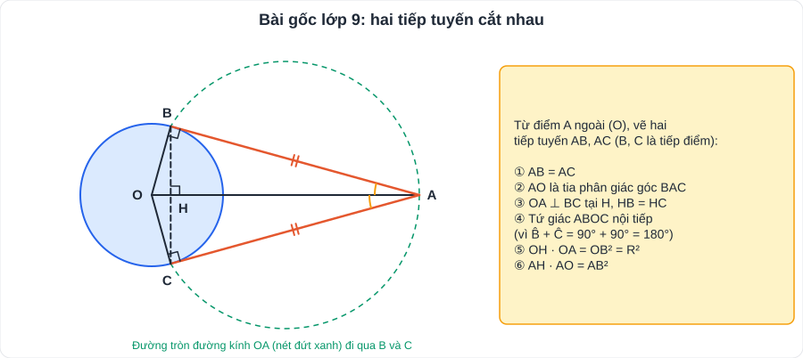
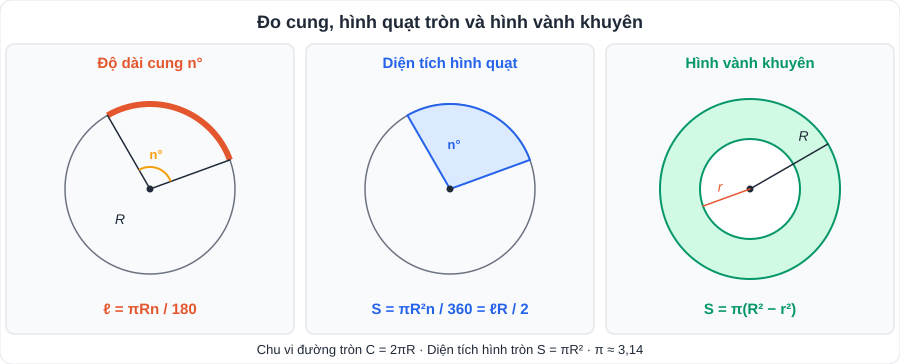

# Toán 5: Đường tròn (Chương V – Tập 1)

> [Danh mục kiến thức](../README.md) · Học ở **tháng 11 – 12** · Ôn lại trước cuối HK1 và cùng [T09](T09-Duong-Tron-Ngoai-Tiep-Noi-Tiep.md) khi luyện đề vào 10 · **Nền tảng của bài hình học cuối đề thi**

## Mục tiêu

- Nắm **dây và đường kính**, quan hệ vuông góc giữa đường kính và dây.
- Xác định **vị trí tương đối** của đường thẳng – đường tròn, hai đường tròn bằng d và R.
- Chứng minh một đường thẳng là **tiếp tuyến**; dùng thành thạo **tính chất hai tiếp tuyến cắt nhau**.
- Tính **độ dài cung, diện tích hình quạt, hình vành khuyên**.

---

## 1. Kiến thức cần nhớ

### 1.1. Đường tròn, dây và đường kính

- Đường tròn (O; R): tập hợp các điểm cách O một khoảng R. **Tâm O là tâm đối xứng**; **mỗi đường kính là trục đối xứng**.
- **Đường kính là dây lớn nhất.**
- Đường kính **vuông góc** với một dây thì **đi qua trung điểm** của dây đó. Đường kính đi qua trung điểm của một dây (không qua tâm) thì **vuông góc** với dây đó.
- Khoảng cách từ tâm đến dây: OH² = R² − (AB/2)² (định lí Pythagore).

### 1.2. Góc ở tâm, số đo cung

- **Góc ở tâm**: đỉnh trùng tâm. Số đo cung nhỏ = số đo góc ở tâm chắn cung đó; cung lớn = 360° − cung nhỏ; nửa đường tròn = 180°.
- Trong một đường tròn: hai cung bằng nhau ⇔ hai dây căng cung bằng nhau.

### 1.3. Đường thẳng và đường tròn (d = khoảng cách từ O đến đường thẳng)

| Vị trí | Số điểm chung | Hệ thức |
|---|---|---|
| Cắt nhau | 2 | **d < R** |
| Tiếp xúc | 1 (tiếp điểm) | **d = R** |
| Không giao nhau | 0 | **d > R** |

- **Tiếp tuyến vuông góc với bán kính tại tiếp điểm.**
- **Dấu hiệu nhận biết tiếp tuyến**: đường thẳng đi qua một điểm A của đường tròn và **vuông góc với bán kính OA** tại A.

### 1.4. Hai tiếp tuyến cắt nhau (bài gốc)

Từ điểm A nằm ngoài (O), vẽ hai tiếp tuyến AB, AC (B, C là tiếp điểm):
- **AB = AC**; AO là **tia phân giác** của góc BAC; OA là **tia phân giác** của góc BOC.
- **OA là đường trung trực của BC** ⇒ OA ⊥ BC tại H và HB = HC.
- Bốn điểm A, B, O, C **cùng thuộc đường tròn đường kính OA** (vì B̂ = Ĉ = 90°).

### 1.5. Vị trí tương đối của hai đường tròn (O; R) và (O'; r), R ≥ r, d = OO'

| Vị trí | Số điểm chung | Hệ thức |
|---|---|---|
| Cắt nhau | 2 | R − r < d < R + r |
| Tiếp xúc ngoài | 1 | d = R + r |
| Tiếp xúc trong | 1 | d = R − r |
| Ở ngoài nhau | 0 | d > R + r |
| Đựng nhau | 0 | d < R − r |

### 1.6. Độ dài cung, diện tích hình quạt, hình vành khuyên

| Đại lượng | Công thức |
|---|---|
| Chu vi đường tròn | C = 2πR = πd |
| Độ dài cung n° | **ℓ = πRn/180** |
| Diện tích hình tròn | S = πR² |
| Diện tích hình quạt n° | **S = πR²n/360 = ℓR/2** |
| Hình vành khuyên | **S = π(R² − r²)** |

---

## 2. Dạng bài và ví dụ có lời giải

**Ví dụ 1 (khoảng cách từ tâm đến dây).** (O; 5 cm) có dây AB = 8 cm. Tính khoảng cách từ O đến AB.

> Kẻ OH ⊥ AB ⇒ H là trung điểm AB, HB = 4 cm. OH = √(5² − 4²) = **3 cm**.

**Ví dụ 2 (độ dài tiếp tuyến).** Cho (O; R) và điểm A với OA = 2R. Vẽ tiếp tuyến AB. Tính AB và góc AOB.

> OB ⊥ AB ⇒ AB = √(OA² − OB²) = √(4R² − R²) = **R√3**. cos AOB = OB/OA = 1/2 ⇒ **AOB = 60°**.

**Ví dụ 3 (bài hình tổng hợp kiểu đề thi).** Từ điểm A ở ngoài (O; R), vẽ hai tiếp tuyến AB, AC. Gọi H là giao điểm của OA và BC.
a) Chứng minh bốn điểm A, B, O, C cùng thuộc một đường tròn.
b) Chứng minh OA ⊥ BC và OH · OA = R².
c) Vẽ đường kính CD của (O). Chứng minh BD // OA.

> a) ABO = ACO = 90° (tiếp tuyến ⊥ bán kính) ⇒ B, C cùng nhìn OA dưới góc vuông ⇒ B, C thuộc đường tròn đường kính OA. Vậy **A, B, O, C cùng thuộc đường tròn đường kính OA**.
> b) AB = AC (tính chất hai tiếp tuyến), OB = OC = R ⇒ OA là đường trung trực của BC ⇒ **OA ⊥ BC** tại H.
> △OBA vuông tại B, đường cao BH ⇒ **OH · OA = OB² = R²** (hệ thức lượng).
> c) △BCD có BO là trung tuyến và BO = CD/2 (= R) ⇒ △BCD vuông tại B ⇒ BD ⊥ BC. Mà OA ⊥ BC ⇒ **BD // OA**.

**Ví dụ 4 (cung, hình quạt).** (O; 6 cm), góc ở tâm 60°. Tính độ dài cung nhỏ và diện tích hình quạt tương ứng.

> ℓ = π·6·60/180 = **2π ≈ 6,28 cm**. S = π·36·60/360 = **6π ≈ 18,85 cm²**.

---

## 3. Lỗi hay gặp

| Lỗi | Cách tránh |
|---|---|
| Kết luận "a là tiếp tuyến" chỉ vì "a chạm đường tròn" | Phải chỉ ra **a ⊥ OA tại A** và A thuộc đường tròn |
| Nhầm ℓ = πRn/180 với S = πR²n/360 | Cung là **độ dài** (R mũ 1, chia 180); quạt là **diện tích** (R², chia 360) |
| Dùng d (đường kính) thay cho R trong công thức | Đọc kỹ đề "đường kính" hay "bán kính" |
| Quên làm tròn theo yêu cầu (π ≈ 3,14 hay giữ π) | Đề không nói → có thể để kết quả dạng **6π**, kèm giá trị gần đúng |

---

## 4. Bài tập tự luyện

### Nhóm A: Cơ bản

1. (O; 10 cm) có dây AB = 12 cm. Tính khoảng cách từ O đến AB.
2. Cho (O; 5 cm) và đường thẳng a cách O một khoảng d. Xác định vị trí của a và (O) khi d = 3 cm; d = 5 cm; d = 7 cm.
3. Hai đường tròn (O; 5 cm), (O'; 3 cm). Xác định vị trí tương đối khi OO' bằng: 8 cm; 2 cm; 6 cm; 10 cm; 1 cm.
4. Tính độ dài cung 90° của đường tròn bán kính 4 cm và diện tích hình quạt 120° của hình tròn bán kính 3 cm.
5. Tính diện tích hình vành khuyên giới hạn bởi hai đường tròn đồng tâm bán kính 5 cm và 3 cm.
6. Điểm A cách tâm (O; 3 cm) một khoảng 5 cm. Tính độ dài tiếp tuyến AB.

### Nhóm B: Vận dụng

7. Bánh xe đạp có đường kính 0,7 m. Khi bánh xe quay 1000 vòng thì xe đi được bao nhiêu mét?
8. ★ Kim phút của đồng hồ dài 10 cm. Trong 20 phút, đầu kim phút vạch nên cung tròn dài bao nhiêu?
9. ★ Cho (O; R) đường kính AB. Kẻ tiếp tuyến Ax. Trên Ax lấy C, BC cắt (O) tại D (D ≠ B). Chứng minh AD ⊥ BC và CA² = CD · CB.

---

## 5. Đáp án

👉 Bấm để xem đáp án (tự làm xong rồi mới mở)

1. √(100 − 36) = **8 cm**.
2. d = 3: **cắt nhau**; d = 5: **tiếp xúc**; d = 7: **không giao nhau**.
3. 8 = 5 + 3: **tiếp xúc ngoài**; 2 = 5 − 3: **tiếp xúc trong**; 2 < 6 < 8: **cắt nhau**; 10 > 8: **ở ngoài nhau**; 1 < 2: **đựng nhau**.
4. ℓ = π·4·90/180 = **2π ≈ 6,28 cm**; S = π·9·120/360 = **3π ≈ 9,42 cm²**.
5. π(25 − 9) = **16π ≈ 50,27 cm²**.
6. AB = √(25 − 9) = **4 cm**.
7. Mỗi vòng = π·0,7 ≈ 2,199 m ⇒ 1000 vòng ≈ **2199 m ≈ 2,2 km**.
8. 20 phút ↔ 1/3 vòng ↔ 120° ⇒ ℓ = π·10·120/180 = **20π/3 ≈ 20,94 cm**.
9. △ADB có DO là trung tuyến, DO = AB/2 ⇒ △ADB vuông tại D ⇒ **AD ⊥ BC**. Ax là tiếp tuyến ⇒ CA ⊥ AB ⇒ △CAB vuông tại A, đường cao AD ⇒ **CA² = CD · CB** (hệ thức lượng).

