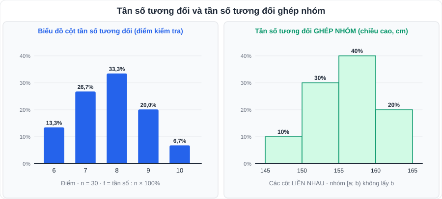

# Toán 7: Tần số và tần số tương đối (Chương VII – Tập 2)

> [Danh mục kiến thức](../README.md) · Học ở **tháng 2 – 3** · Ôn lại trước giữa HK2 · **Bài dễ lấy điểm nếu tính đúng phần trăm và vẽ biểu đồ cẩn thận**



## Mục tiêu

- Lập **bảng tần số**, **bảng tần số tương đối** từ dãy số liệu; vẽ biểu đồ cột, biểu đồ quạt tròn.
- Lập **bảng tần số (tương đối) ghép nhóm** và vẽ **biểu đồ cột liền (histogram)**.
- Đọc biểu đồ, rút ra nhận xét.

---

## 1. Kiến thức cần nhớ

### 1.1. Tần số, bảng tần số

- **Tần số** m của một giá trị: số lần giá trị đó xuất hiện trong mẫu số liệu.
- **Bảng tần số**: dòng giá trị (x) và dòng tần số (m); tổng tần số = **n** (cỡ mẫu).
- Biểu đồ tần số: **biểu đồ cột** hoặc **biểu đồ đoạn thẳng**.

### 1.2. Tần số tương đối

> **f = m / n · 100%**

- Tổng các tần số tương đối = **100%**.
- Biểu diễn bằng **biểu đồ cột** hoặc **biểu đồ hình quạt tròn**; góc ở tâm của hình quạt: **f · 360°** (ví dụ f = 25% ↔ 90°).

### 1.3. Ghép nhóm

- Khi số liệu có **nhiều giá trị khác nhau** (chiều cao, cân nặng, thời gian…), chia thành các nhóm dạng **[a; b)** (lấy a, không lấy b).
- Tần số của nhóm: số giá trị thuộc nhóm. Tần số tương đối của nhóm = m/n · 100%.
- **Biểu đồ tần số (tương đối) ghép nhóm**: các cột **liền nhau**, mỗi cột phủ đúng khoảng của nhóm.

---

## 2. Dạng bài và ví dụ có lời giải

**Ví dụ 1 (lập bảng).** Điểm kiểm tra Toán của 20 học sinh:

```
7  8  6  9  8  7  8  10  6  8
7  9  8  7  8  9  6   8  7  10
```

> | Điểm (x) | 6 | 7 | 8 | 9 | 10 | Cộng |
> |---|---|---|---|---|---|---|
> | Tần số (m) | 3 | 5 | 7 | 3 | 2 | 20 |
> | Tần số tương đối (f) | 15% | 25% | 35% | 15% | 10% | 100% |
> | Góc ở tâm | 54° | 90° | 126° | 54° | 36° | 360° |
>
> Nhận xét: điểm **8** có tần số lớn nhất (35%); 60% học sinh đạt từ 8 điểm trở lên.

> 💡 **Mẹo đếm không sót**: đếm bằng **gạch "chính"** (mỗi chữ "chính" 5 nét) hoặc gạch bỏ từng số đã đếm; cuối cùng **kiểm tra tổng tần số = n**.

**Ví dụ 2 (ghép nhóm).** Thời gian dùng điện thoại mỗi ngày (phút) của 40 học sinh:

> | Nhóm (phút) | [0; 30) | [30; 60) | [60; 90) | [90; 120) | Cộng |
> |---|---|---|---|---|---|
> | Tần số | 6 | 14 | 12 | 8 | 40 |
> | Tần số tương đối | 15% | 35% | 30% | 20% | 100% |
>
> Nhận xét: 50% học sinh dùng điện thoại **từ 60 phút trở lên** mỗi ngày; nhóm [30; 60) có nhiều học sinh nhất.

**Ví dụ 3 (tìm tần số khi biết tần số tương đối).** Khảo sát 40 bạn về môn thể thao yêu thích: bóng đá 35%, cầu lông 25%, bơi 30%, môn khác 10%. Có bao nhiêu bạn thích cầu lông?

> m = 25% · 40 = **10 bạn**.

---

## 3. Lỗi hay gặp

| Lỗi | Cách tránh |
|---|---|
| Tổng tần số ≠ n (đếm sót / đếm trùng) | Luôn có cột **"Cộng"** để kiểm tra |
| Làm tròn từng phần trăm làm tổng thành 99,9% hoặc 100,1% | Ghi chú "làm tròn"; có thể điều chỉnh nhóm lớn nhất |
| Vẽ biểu đồ ghép nhóm có khe hở giữa các cột | Histogram: cột **liền nhau** |
| Xếp giá trị b vào nhóm [a; b) | b thuộc nhóm **sau** [b; c) |
| Biểu đồ thiếu tên, đơn vị, chú thích | Đủ: **tên biểu đồ, tên trục, đơn vị, chú thích màu** |

---

## 4. Bài tập tự luyện

1. Số anh chị em ruột của 25 học sinh lớp 9B: có 1 con: 5 bạn; 2 con: 12 bạn; 3 con: 6 bạn; 4 con: 2 bạn (tính cả bạn). Lập bảng tần số tương đối.
2. Với dữ liệu bài 1, tính góc ở tâm của từng hình quạt nếu vẽ biểu đồ quạt tròn.
3. Một mẫu số liệu có n = 50, biết tần số tương đối của giá trị 5 là 18%. Tính tần số của giá trị 5.
4. Chiều cao (cm) của 30 học sinh được ghép nhóm: [145; 150): 3; [150; 155): 9; [155; 160): 12; [160; 165): 6. a) Lập bảng tần số tương đối ghép nhóm. b) Có bao nhiêu phần trăm học sinh cao từ 155 cm trở lên?
5. ★ Kết quả khảo sát thời gian tự học mỗi tối của một lớp có 40 học sinh: [0; 1) giờ: 4 bạn; [1; 2): 18 bạn; [2; 3): 14 bạn; [3; 4): 4 bạn. Hãy vẽ biểu đồ tần số tương đối ghép nhóm và viết 2 nhận xét.

---

## 5. Đáp án

<details>
<summary>👉 Bấm để xem đáp án (tự làm xong rồi mới mở)</summary>

1. 1 con: **20%**; 2 con: **48%**; 3 con: **24%**; 4 con: **8%** (tổng 100%).
2. 20% → **72°**; 48% → **172,8°**; 24% → **86,4°**; 8% → **28,8°** (tổng 360°).
3. m = 18% · 50 = **9**.
4. a) **10%; 30%; 40%; 20%**. b) 40% + 20% = **60%**.
5. Tần số tương đối: **10%; 45%; 35%; 10%**. Nhận xét gợi ý: gần một nửa lớp tự học từ 1 đến dưới 2 giờ; 45% học sinh tự học từ 2 giờ trở lên; chỉ 10% tự học dưới 1 giờ.

</details>
