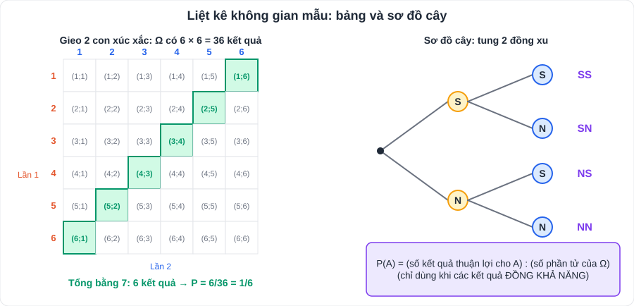

# Toán 8: Xác suất của biến cố trong một số mô hình xác suất đơn giản (Chương VIII – Tập 2)

> [Danh mục kiến thức](../README.md) · Học ở **tháng 3** · Ôn lại trước giữa HK2 và khi luyện đề vào 10 · **Mấu chốt: liệt kê không gian mẫu đầy đủ, không sót, không trùng**

## Mục tiêu

- Xác định **phép thử ngẫu nhiên** và **không gian mẫu Ω**.
- Liệt kê kết quả bằng **bảng** (2 lần thử) hoặc **sơ đồ cây**.
- Tính xác suất bằng công thức **P(A) = (số kết quả thuận lợi) : (số phần tử của Ω)** khi các kết quả đồng khả năng.

---

## 1. Kiến thức cần nhớ

| Khái niệm | Ý nghĩa | Ví dụ |
|---|---|---|
| **Phép thử ngẫu nhiên** | Hoạt động mà ta không biết trước kết quả | Gieo xúc xắc, rút thăm, chọn ngẫu nhiên một bạn |
| **Không gian mẫu Ω** | Tập hợp **tất cả** các kết quả có thể | Tung đồng xu 2 lần: Ω = {SS; SN; NS; NN} |
| **Biến cố A** | Một sự kiện liên quan đến phép thử | "Có ít nhất một mặt N" |
| **Kết quả thuận lợi** cho A | Kết quả làm A xảy ra | SN, NS, NN |
| **Đồng khả năng** | Các kết quả có khả năng xảy ra như nhau | Đồng xu cân đối, xúc xắc cân đối |

> **P(A) = n(A) / n(Ω)**, với 0 ≤ P(A) ≤ 1. Biến cố chắc chắn: P = 1; biến cố không thể: P = 0.

**Cách liệt kê không gian mẫu:**

- **Thử 2 lần / 2 đối tượng** (gieo 2 xúc xắc, tung xu rồi gieo xúc xắc): kẻ **bảng** (hàng = lần 1, cột = lần 2).
- **Nhiều bước / nhiều lựa chọn**: vẽ **sơ đồ cây**.
- **Chọn 2 người từ một nhóm** (không phân biệt thứ tự): AB và BA là **một** kết quả.
- **Lấy lần lượt không hoàn lại**: không có kết quả lặp (A; A).

---

## 2. Dạng bài và ví dụ có lời giải

**Ví dụ 1 (gieo 2 xúc xắc).** Gieo hai con xúc xắc cân đối. Tính xác suất của các biến cố:
A: "Tổng số chấm bằng 7"; B: "Tổng số chấm không nhỏ hơn 10"; C: "Hai mặt có số chấm giống nhau".

> n(Ω) = 6 · 6 = 36 (xem bảng ở hình trên).
> A = {(1;6), (2;5), (3;4), (4;3), (5;2), (6;1)} ⇒ P(A) = 6/36 = **1/6**.
> B = {(4;6), (5;5), (6;4), (5;6), (6;5), (6;6)} ⇒ P(B) = **1/6**.
> C = {(1;1), (2;2), …, (6;6)} ⇒ P(C) = **1/6**.

**Ví dụ 2 (chọn 2 người).** Chọn ngẫu nhiên 2 bạn trong 4 bạn An, Bình, Chi, Dũng để trực nhật. Tính xác suất An được chọn.

> Ω = {AB; AC; AD; BC; BD; CD} ⇒ n(Ω) = 6. Kết quả thuận lợi: AB, AC, AD ⇒ P = 3/6 = **1/2**.

**Ví dụ 3 (lấy lần lượt không hoàn lại).** Hộp có 3 viên bi: đỏ (Đ), xanh (X), vàng (V). Lấy lần lượt 2 viên, không hoàn lại. Tính xác suất viên đầu là bi đỏ.

> Ω = {ĐX; ĐV; XĐ; XV; VĐ; VX} ⇒ n(Ω) = 6. Thuận lợi: ĐX, ĐV ⇒ P = 2/6 = **1/3**.

**Ví dụ 4 (lập số).** Lập số có hai chữ số khác nhau từ các chữ số 1, 2, 3. Chọn ngẫu nhiên một số. Tính xác suất số đó chia hết cho 3.

> Ω = {12; 13; 21; 23; 31; 32}. Chia hết cho 3 (tổng chữ số chia hết cho 3): 12, 21 ⇒ P = 2/6 = **1/3**.

---

## 3. Lỗi hay gặp

| Lỗi | Cách tránh |
|---|---|
| Gieo 2 xúc xắc mà cho n(Ω) = 11 (tổng từ 2 đến 12) | Các **tổng** không đồng khả năng; phải liệt kê **36 cặp** |
| Coi (2; 5) và (5; 2) là một kết quả khi gieo 2 xúc xắc | Đây là **2 kết quả khác nhau** |
| Chọn 2 bạn mà tính AB và BA là 2 kết quả | Chọn nhóm **không** phân biệt thứ tự |
| Kết quả xác suất > 1 | Kiểm tra lại: n(A) ≤ n(Ω) |
| Không rút gọn phân số | Rút gọn: 6/36 = **1/6** |

---

## 4. Bài tập tự luyện

1. Tung một đồng xu cân đối 2 lần. Tính xác suất "có ít nhất một lần xuất hiện mặt ngửa (N)".
2. Gieo hai con xúc xắc cân đối. Tính xác suất "tổng số chấm bằng 8".
3. Gieo hai con xúc xắc. Tính xác suất "số chấm của con thứ nhất lớn hơn con thứ hai".
4. Một hộp có 20 tấm thẻ đánh số 1 đến 20. Rút ngẫu nhiên 1 thẻ. Tính xác suất rút được thẻ ghi số nguyên tố.
5. Nhóm có 3 bạn nam (N₁, N₂, N₃) và 2 bạn nữ (U₁, U₂). Chọn ngẫu nhiên 2 bạn. Tính xác suất: a) chọn được 1 nam và 1 nữ; b) chọn được 2 nữ.
6. ★ Gieo hai con xúc xắc. Tính xác suất "tích số chấm hai con là số chẵn".
7. ★ Tung một đồng xu rồi gieo một con xúc xắc. Liệt kê không gian mẫu và tính xác suất "đồng xu ra mặt sấp (S) và xúc xắc ra số chấm lẻ".

---

## 5. Đáp án

👉 Bấm để xem đáp án (tự làm xong rồi mới mở)

1. Ω = {SS; SN; NS; NN}; thuận lợi: SN, NS, NN ⇒ **3/4**.
2. (2;6), (3;5), (4;4), (5;3), (6;2) ⇒ **5/36**.
3. Có 36 − 6 = 30 cặp hai số khác nhau, một nửa có lần 1 lớn hơn ⇒ 15/36 = **5/12**.
4. Số nguyên tố: 2, 3, 5, 7, 11, 13, 17, 19 ⇒ 8/20 = **2/5**.
5. n(Ω) = 10 (N₁N₂, N₁N₃, N₂N₃, N₁U₁, N₁U₂, N₂U₁, N₂U₂, N₃U₁, N₃U₂, U₁U₂). a) 6/10 = **3/5**; b) **1/10**.
6. Tích lẻ ⇔ cả hai số lẻ: 3 · 3 = 9 cặp ⇒ tích chẵn: 36 − 9 = 27 cặp ⇒ 27/36 = **3/4**.
7. Ω có 2 · 6 = 12 kết quả: S1, S2, …, S6, N1, …, N6. Thuận lợi: S1, S3, S5 ⇒ 3/12 = **1/4**.

