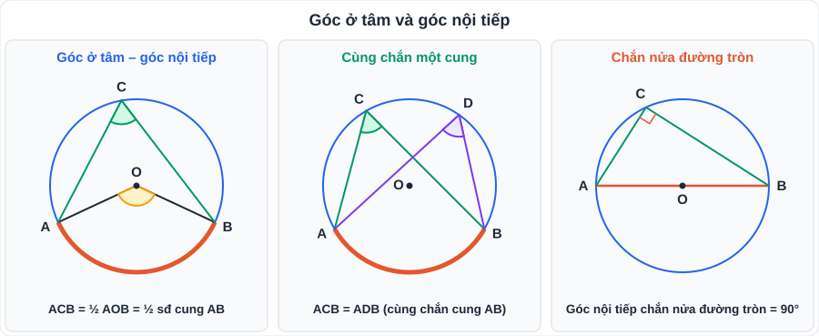
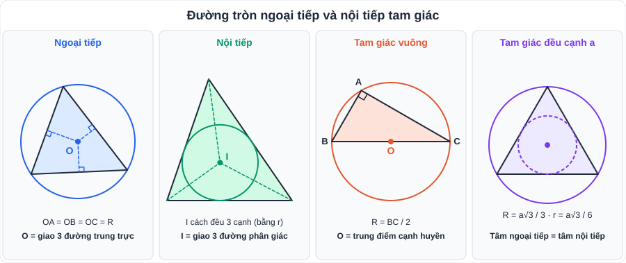
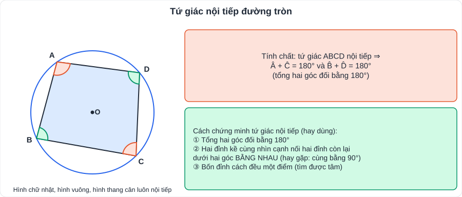
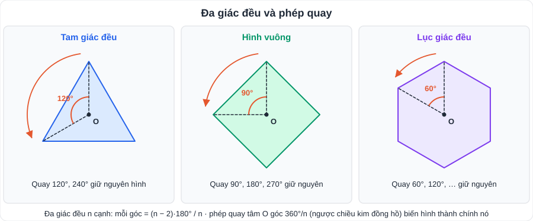
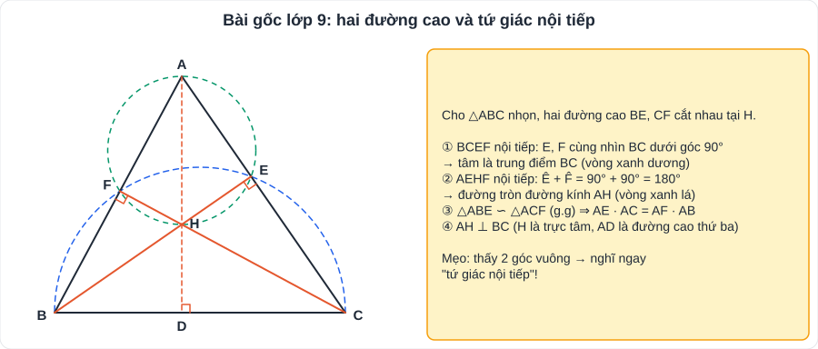

# Toán 9: Đường tròn ngoại tiếp và đường tròn nội tiếp (Chương IX – Tập 2)

> [Danh mục kiến thức](../README.md) · Học ở **tháng 3 – 4** · Ôn kỹ cùng [T05](T05-Duong-Tron.md) khi luyện đề vào 10 · **Chương quan trọng nhất của hình học lớp 9: "tứ giác nội tiếp" là câu a quen thuộc của bài hình cuối đề**

## Mục tiêu

- Dùng **góc nội tiếp** để tính góc, chứng minh hai góc bằng nhau, chứng minh góc vuông.
- Xác định tâm, bán kính **đường tròn ngoại tiếp, nội tiếp** tam giác (đặc biệt tam giác vuông, tam giác đều).
- Chứng minh **tứ giác nội tiếp** và khai thác tính chất của nó.
- Nhận biết **đa giác đều**, các **phép quay** giữ nguyên đa giác đều.

---

## 1. Kiến thức cần nhớ

### 1.1. Góc nội tiếp

- **Góc nội tiếp**: đỉnh nằm trên đường tròn, hai cạnh chứa hai dây.
- **Số đo góc nội tiếp = ½ số đo cung bị chắn** = ½ góc ở tâm cùng chắn cung đó.
- Hệ quả:
  - Các góc nội tiếp **cùng chắn một cung** (hoặc chắn các cung bằng nhau) thì **bằng nhau**.
  - Góc nội tiếp **chắn nửa đường tròn là góc vuông**.
  - Góc nội tiếp (≤ 90°) bằng **nửa góc ở tâm** cùng chắn một cung.

### 1.2. Đường tròn ngoại tiếp, nội tiếp tam giác

| | Ngoại tiếp (đi qua 3 đỉnh) | Nội tiếp (tiếp xúc 3 cạnh) |
|---|---|---|
| Tâm | Giao **3 đường trung trực** | Giao **3 đường phân giác trong** |
| Tam giác vuông | Tâm = **trung điểm cạnh huyền**, R = cạnh huyền / 2 | |
| Tam giác đều cạnh a | **R = a√3/3** | **r = a√3/6** (hai tâm trùng nhau) |

### 1.3. Tứ giác nội tiếp

- **Tứ giác nội tiếp**: có 4 đỉnh cùng nằm trên một đường tròn.
- **Tính chất**: tổng hai góc đối bằng **180°**.
- **Dấu hiệu** (dùng để chứng minh):
  1. Tổng hai góc đối bằng 180°.
  2. Hai đỉnh kề nhau **cùng nhìn** cạnh nối hai đỉnh còn lại dưới **hai góc bằng nhau** (thường là 90°).
  3. Có một điểm cách đều 4 đỉnh.
- Hình chữ nhật, hình vuông, hình thang cân **luôn** nội tiếp được; hình bình hành (không phải hình chữ nhật), hình thoi (không phải hình vuông) **không** nội tiếp được.

### 1.4. Đa giác đều và phép quay

- **Đa giác đều**: tất cả các cạnh bằng nhau **và** tất cả các góc bằng nhau. Mỗi góc của đa giác đều n cạnh: **(n − 2) · 180° / n**.
- Mọi đa giác đều đều có đường tròn ngoại tiếp và nội tiếp, cùng tâm O.
- **Phép quay** tâm O góc α° (thuận hoặc ngược chiều kim đồng hồ): biến điểm M thành M' sao cho OM' = OM và góc MOM' = α°.
- Các phép quay tâm O góc **k · 360°/n** (k = 1, 2, …, n) biến đa giác đều n cạnh **thành chính nó**.
- Thực tế: bánh xe, logo, hoa văn, bông hoa có tính "đều" → nhận diện phép quay.

---

## 2. Dạng bài và ví dụ có lời giải

### Bài gốc 1: Hai đường cao của tam giác nhọn

**Ví dụ 1.** Cho △ABC nhọn nội tiếp (O), hai đường cao BE, CF cắt nhau tại H.
a) Chứng minh tứ giác BCEF nội tiếp.
b) Chứng minh tứ giác AEHF nội tiếp.
c) Chứng minh AE · AC = AF · AB.

> a) BEC = BFC = 90° (BE, CF là đường cao) ⇒ E, F cùng nhìn BC dưới góc vuông ⇒ E, F thuộc đường tròn đường kính BC ⇒ **BCEF nội tiếp**.
> b) AEH + AFH = 90° + 90° = 180°, mà hai góc này ở vị trí đối nhau ⇒ **AEHF nội tiếp** (đường tròn đường kính AH).
> c) Xét △ABE và △ACF có: góc A chung; AEB = AFC = 90° ⇒ △ABE ∽ △ACF (g.g) ⇒ AE/AF = AB/AC ⇒ **AE · AC = AF · AB**.

### Bài gốc 2: Hai tiếp tuyến cắt nhau (tiếp nối [T05](T05-Duong-Tron.md))

**Ví dụ 2.** Từ A ngoài (O; R), vẽ hai tiếp tuyến AB, AC; H là giao điểm của OA và BC; vẽ đường kính BK.
a) Chứng minh ABOC nội tiếp. b) Chứng minh AB² = AH · AO. c) Chứng minh CK // OA.

> a) ABO + ACO = 90° + 90° = 180° ⇒ **ABOC nội tiếp** (đường tròn đường kính OA).
> b) AB = AC, OB = OC ⇒ OA là trung trực của BC ⇒ BH ⊥ OA. △ABO vuông tại B có đường cao BH ⇒ **AB² = AH · AO**.
> c) BCK = 90° (góc nội tiếp chắn nửa đường tròn) ⇒ CK ⊥ BC; mà OA ⊥ BC ⇒ **CK // OA**.

### Dạng tính toán

**Ví dụ 3.** Tứ giác ABCD nội tiếp có Â = 70°, B̂ = 105°. Tính Ĉ, D̂.

> Ĉ = 180° − 70° = **110°**; D̂ = 180° − 105° = **75°**.

**Ví dụ 4.** Tính bán kính đường tròn ngoại tiếp và nội tiếp tam giác đều cạnh 6 cm.

> R = 6√3/3 = **2√3 cm**; r = 6√3/6 = **√3 cm**.

---

## 3. Lỗi hay gặp

| Lỗi | Cách tránh |
|---|---|
| "Tổng hai góc **kề** bằng 180° ⇒ nội tiếp" | Phải là hai góc **đối** nhau |
| Dấu hiệu 2: chọn hai đỉnh **đối** nhau cùng nhìn một cạnh | Hai đỉnh phải **kề nhau** và nằm **cùng phía** với cạnh được nhìn |
| Góc nội tiếp = số đo cung (quên ½) | **Góc nội tiếp = ½ cung bị chắn**; góc ở tâm = cung bị chắn |
| Tưởng hình thoi luôn nội tiếp | Chỉ hình thoi là hình vuông mới nội tiếp |
| Trình bày "vì vẽ hình thấy" | Mọi kết luận phải có **căn cứ** trong ngoặc |

> **Thói quen làm bài hình**: vẽ hình **to, đúng tỉ lệ, bằng thước – compa**; đánh dấu ngay các góc vuông, các đoạn bằng nhau. Câu sau được dùng kết quả câu trước.

---

## 4. Bài tập tự luyện

### Nhóm A: Cơ bản

1. Góc nội tiếp ACB = 40°. Tính số đo cung AB bị chắn và góc ở tâm AOB.
2. △ABC vuông tại A có AB = 6 cm, AC = 8 cm. Tính bán kính đường tròn ngoại tiếp tam giác.
3. Tam giác đều cạnh 9 cm. Tính R và r.
4. Tứ giác ABCD nội tiếp có Â = 4Ĉ. Tính Â, Ĉ.
5. Mỗi góc của bát giác đều (8 cạnh) bằng bao nhiêu độ?
6. Những phép quay tâm O nào biến ngũ giác đều tâm O thành chính nó?

### Nhóm B: Vận dụng

7. Cho (O) đường kính AB, dây CD ⊥ AB tại H (H nằm giữa O và B). Chứng minh: a) ACB = 90°; b) CA² = AH · AB.
8. ★ Cho △ABC nhọn nội tiếp (O), hai đường cao AD, BE cắt nhau tại H. Chứng minh: a) tứ giác ABDE nội tiếp; b) tứ giác CDHE nội tiếp; c) CD · CB = CE · CA.
9. ★ Cho nửa đường tròn (O) đường kính AB, C thuộc nửa đường tròn (C ≠ A, B). Kẻ CH ⊥ AB tại H. a) Chứng minh △ACB vuông và CH² = AH · HB. b) Tính CH và bán kính R biết AH = 4 cm, HB = 9 cm.

---

## 5. Đáp án

👉 Bấm để xem đáp án (tự làm xong rồi mới mở)

1. Số đo cung AB = 2 · 40° = **80°**; AOB = **80°**.
2. BC = 10 cm ⇒ **R = 5 cm**.
3. R = 9√3/3 = **3√3 cm**; r = 9√3/6 = **1,5√3 cm** (≈ 2,6 cm).
4. Â + Ĉ = 180°, Â = 4Ĉ ⇒ 5Ĉ = 180° ⇒ **Ĉ = 36°, Â = 144°**.
5. (8 − 2) · 180° / 8 = **135°**.
6. Các phép quay góc **72°, 144°, 216°, 288°** (và 360°), thuận hoặc ngược chiều kim đồng hồ.
7. a) Góc nội tiếp chắn nửa đường tròn ⇒ **ACB = 90°**. b) △ACB vuông tại C, đường cao CH ⇒ **CA² = AH · AB**.
8. a) ADB = AEB = 90° ⇒ D, E cùng nhìn AB dưới góc vuông ⇒ **ABDE nội tiếp**. b) HDC + HEC = 90° + 90° = 180° ⇒ **CDHE nội tiếp**. c) △CDA ∽ △CEB (góc C chung, CDA = CEB = 90°) ⇒ CD/CE = CA/CB ⇒ **CD · CB = CE · CA**.
9. a) ACB = 90° (chắn nửa đường tròn); △ACB vuông tại C có đường cao CH ⇒ **CH² = AH · HB**. b) CH² = 36 ⇒ **CH = 6 cm**; AB = 13 cm ⇒ **R = 6,5 cm**.

