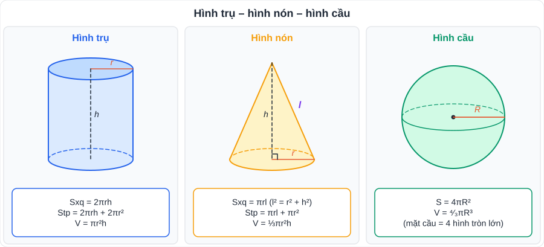

# Toán 10: Một số hình khối trong thực tiễn – hình trụ, hình nón, hình cầu (Chương X – Tập 2)

> [Danh mục kiến thức](../README.md) · Học ở **tháng 4** · Ôn lại trước thi cuối năm và khi luyện đề vào 10 · **Bài toán thực tế "bồn nước, ly kem, quả bóng" rất hay gặp**

## Mục tiêu

- Nhận biết các yếu tố: **bán kính đáy r, chiều cao h, đường sinh l, bán kính mặt cầu R**.
- Thuộc và dùng đúng công thức **diện tích xung quanh, diện tích toàn phần, thể tích**.
- Giải bài toán thực tế: **đổi đơn vị** (cm³ ↔ lít), **vật ghép** (nón + nửa cầu…), **nước dâng**.

---

## 1. Kiến thức cần nhớ

| Hình | Diện tích xung quanh | Diện tích toàn phần | Thể tích |
|---|---|---|---|
| **Hình trụ** (r, h) | Sxq = **2πrh** | Stp = 2πrh + 2πr² | V = **πr²h** |
| **Hình nón** (r, h, l) | Sxq = **πrl** | Stp = πrl + πr² | V = **⅓πr²h** |
| **Hình cầu** (R) | S = **4πR²** (diện tích mặt cầu) | | V = **⁴⁄₃πR³** |

- Hình nón: **l² = r² + h²** (tam giác vuông tạo bởi chiều cao, bán kính đáy, đường sinh).
- Cắt hình cầu bởi mặt phẳng qua tâm → **hình tròn lớn** bán kính R; nửa hình cầu có V = ⅔πR³.
- **Đổi đơn vị**: 1 dm³ = **1 lít**; 1 m³ = 1000 lít; 1 cm³ = 1 ml.
- Tạo thành bằng cách quay: quay hình chữ nhật quanh một cạnh → **hình trụ**; quay tam giác vuông quanh một cạnh góc vuông → **hình nón**; quay nửa hình tròn quanh đường kính → **hình cầu**.

---

## 2. Dạng bài và ví dụ có lời giải

**Ví dụ 1 (hình trụ).** Hình trụ có r = 3 cm, h = 10 cm. Tính Sxq và V.

> Sxq = 2π·3·10 = **60π ≈ 188,5 cm²**; V = π·9·10 = **90π ≈ 282,7 cm³**.

**Ví dụ 2 (hình nón).** Hình nón có r = 3 cm, h = 4 cm. Tính đường sinh, Sxq và V.

> l = √(9 + 16) = **5 cm**; Sxq = π·3·5 = **15π ≈ 47,1 cm²**; V = ⅓·π·9·4 = **12π ≈ 37,7 cm³**.

**Ví dụ 3 (hình cầu).** Quả cầu bán kính 6 cm: S = 4π·36 = **144π ≈ 452,4 cm²**; V = ⁴⁄₃·π·216 = **288π ≈ 904,8 cm³**.

**Ví dụ 4 (nước dâng).** Một cốc hình trụ có đường kính đáy 8 cm, đang chứa nước. Thả chìm hoàn toàn một viên bi hình cầu bán kính 2 cm. Mực nước dâng thêm bao nhiêu?

> Thể tích bi: ⁴⁄₃·π·8 = 32π/3 cm³. Diện tích đáy cốc: π·4² = 16π cm².
> Mực nước dâng: (32π/3) : (16π) = **2/3 cm ≈ 0,67 cm**.

**Ví dụ 5 (vật ghép).** Một cây kem ốc quế gồm phần nón (r = 3 cm, h = 8 cm) và phần kem nửa hình cầu bán kính 3 cm phía trên. Tính thể tích cả cây kem (coi kem đầy trong nón).

> V = ⅓·π·9·8 + ⅔·π·27 = 24π + 18π = **42π ≈ 131,9 cm³**.

---

## 3. Lỗi hay gặp

| Lỗi | Cách tránh |
|---|---|
| Thay **đường kính** vào chỗ bán kính | Gạch chân "đường kính" trong đề, chia đôi ngay |
| Dùng h thay cho l trong Sxq hình nón | Sxq nón = π·r·**l** (đường sinh), V nón dùng **h** |
| Quên ⅓ trong thể tích nón | "Nón = ⅓ trụ cùng đáy, cùng chiều cao" |
| Đổi đơn vị sai (cm³ → lít) | 1000 cm³ = 1 lít |
| Tính diện tích toàn phần của **ống** (không đáy) | Đọc kỹ: "không có nắp", "ống" → bớt mặt đáy |

---

## 4. Bài tập tự luyện

1. Hình trụ có bán kính đáy 5 cm, chiều cao 8 cm. Tính Sxq và V.
2. Một hộp sữa hình trụ có đường kính đáy 6 cm, cao 10 cm. Hộp chứa được bao nhiêu ml sữa (làm tròn đến hàng đơn vị)?
3. Hình nón có bán kính đáy 6 cm, đường sinh 10 cm. Tính chiều cao, Sxq và V.
4. Một quả bóng đá có đường kính 22 cm. Tính diện tích mặt quả bóng và thể tích của nó (làm tròn đến hàng phần mười).
5. Mặt cầu có diện tích 36π cm². Tính thể tích hình cầu.
6. ★ Một bồn nước inox hình trụ đặt đứng có đường kính 1,2 m và chiều cao 1,5 m. Bồn chứa được tối đa bao nhiêu lít nước?
7. ★ Một quả bóng hình cầu đặt khít trong một hộp hình trụ (bóng tiếp xúc hai đáy và mặt xung quanh). Tính tỉ số thể tích quả bóng và thể tích hộp.
8. ★ Chiếc nón lá có đường kính vành 40 cm, độ dài đường sinh 30 cm. Tính diện tích lá cần dùng để lợp nón (bỏ qua phần chồng mép).

---

## 5. Đáp án

👉 Bấm để xem đáp án (tự làm xong rồi mới mở)

1. Sxq = 2π·5·8 = **80π ≈ 251,3 cm²**; V = π·25·8 = **200π ≈ 628,3 cm³**.
2. V = π·3²·10 = 90π ≈ 282,7 cm³ ≈ **283 ml**.
3. h = √(100 − 36) = **8 cm**; Sxq = π·6·10 = **60π ≈ 188,5 cm²**; V = ⅓·π·36·8 = **96π ≈ 301,6 cm³**.
4. R = 11 cm: S = 4π·121 = **484π ≈ 1520,5 cm²**; V = ⁴⁄₃·π·1331 ≈ **5575,3 cm³**.
5. 4πR² = 36π ⇒ R = 3 ⇒ V = ⁴⁄₃·π·27 = **36π ≈ 113,1 cm³**.
6. V = π·0,6²·1,5 = 0,54π ≈ 1,696 m³ ≈ **1696 lít**.
7. Hộp: r = R, h = 2R ⇒ V_hộp = 2πR³; V_bóng = ⁴⁄₃πR³ ⇒ tỉ số **2/3**.
8. r = 20 cm, l = 30 cm ⇒ Sxq = π·20·30 = **600π ≈ 1885 cm²**.

