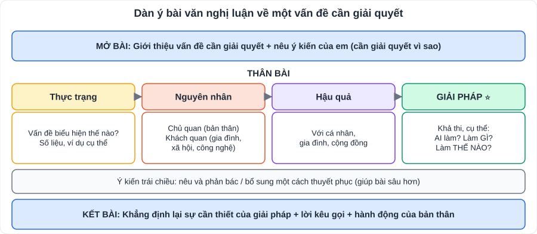
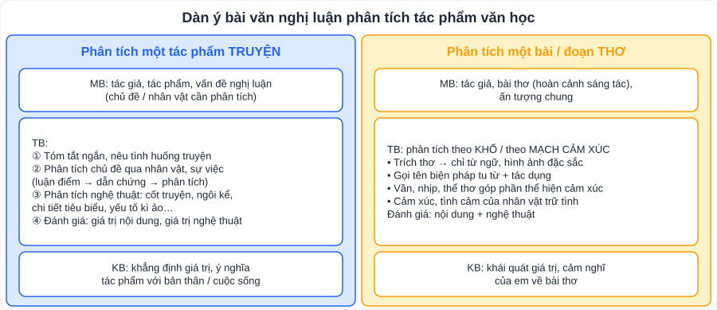

# Ngữ văn 4: Các kiểu bài viết lớp 9 (dàn ý mẫu, bảng tự chấm)

> [Danh mục kiến thức](../README.md) · Dùng cho phần **Viết** của mọi bài trong SGK · Ôn trước mỗi kì kiểm tra · **Phần Viết chiếm khoảng 60% điểm bài kiểm tra và đề thi vào 10** · Nâng cao: [Nghị luận ý kiến (PlanLop10)](../../../PlanLop10/PTNK/ChuyenDe/CD07-Van-Nghi-Luan-Y-Kien.md)

## Mục tiêu

- Viết được các kiểu bài lớp 9: **nghị luận về vấn đề cần giải quyết**, **nghị luận phân tích tác phẩm văn học**, **truyện kể sáng tạo có yếu tố kì ảo**, **văn bản giải thích một hiện tượng tự nhiên**.
- Viết **đoạn văn nghị luận khoảng 200 chữ** đúng cấu trúc.
- Tự chấm bài theo **bảng tiêu chí**.

---

## 1. Quy trình viết 4 bước (dùng cho mọi kiểu bài)

| Bước | Việc làm | Thời gian (bài 90 phút) |
|---|---|---|
| 1. Phân tích đề | Gạch chân **kiểu bài, vấn đề, phạm vi**, yêu cầu dung lượng | 3 phút |
| 2. Lập dàn ý | Gạch đầu dòng luận điểm + dẫn chứng | 7 – 10 phút |
| 3. Viết | Theo dàn ý; mỗi luận điểm một đoạn | 35 – 45 phút |
| 4. Đọc lại, sửa | Lỗi chính tả, dấu câu, lặp từ | 5 phút |

---

## 2. Nghị luận về một vấn đề cần giải quyết (nghị luận xã hội)

**Đề mẫu:** *Hiện nay, nhiều học sinh dành quá nhiều thời gian cho mạng xã hội. Hãy viết bài văn đề xuất giải pháp cho vấn đề này.*

**Dàn ý mẫu:**
- **Mở bài:** Mạng xã hội là một phần cuộc sống của học sinh; nhưng việc dùng quá nhiều đang là vấn đề cần giải quyết.
- **Thân bài:**
  - *Thực trạng:* nhiều bạn dùng mạng xã hội 3 – 5 giờ mỗi ngày; lướt điện thoại đến khuya; mất tập trung trong giờ học.
  - *Nguyên nhân:* nội dung hấp dẫn, được thiết kế để "giữ chân"; thiếu kĩ năng quản lí thời gian; thiếu hoạt động thay thế; gia đình chưa đặt quy tắc.
  - *Hậu quả:* kết quả học tập giảm, thiếu ngủ, ảnh hưởng thị lực, tâm lí so sánh, dễ tiếp xúc thông tin xấu.
  - *Giải pháp (trọng tâm):*
    - **Bản thân:** đặt giới hạn thời gian bằng tính năng có sẵn trên điện thoại; tắt thông báo khi học; không mang điện thoại vào phòng ngủ sau 21:30.
    - **Gia đình:** thống nhất "giờ không điện thoại" khi ăn tối; cùng con tham gia hoạt động ngoài trời.
    - **Nhà trường:** câu lạc bộ thể thao, đọc sách; giáo dục kĩ năng số.
  - *Ý kiến trái chiều:* "Mạng xã hội giúp học tập, giải trí" → đúng, nhưng vấn đề là **dùng quá mức**, cần dùng có kiểm soát.
- **Kết bài:** Khẳng định cần thiết; kêu gọi; cam kết hành động của bản thân.

> **Đoạn văn nghị luận xã hội khoảng 200 chữ**: câu mở đoạn nêu vấn đề → giải thích (1 câu) → phân tích/bàn luận (3 – 4 câu, có 1 dẫn chứng) → giải pháp/bài học (2 câu) → câu kết. Viết khoảng **15 – 18 dòng giấy thi**.

---

## 3. Nghị luận phân tích một tác phẩm văn học

**Nguyên tắc vàng:** mỗi luận điểm = **câu chủ đề → trích dẫn → phân tích (từ ngữ, hình ảnh, biện pháp nghệ thuật) → đánh giá**.

**Câu chuyển đoạn hay dùng:** "Không chỉ … mà …", "Đặc sắc hơn cả là …", "Bên cạnh nội dung sâu sắc, tác phẩm còn thành công ở …".

**Mở bài mẫu (phân tích thơ):** *"Nguyễn Du – đại thi hào dân tộc – đã để lại cho đời Truyện Kiều như một tiếng khóc lớn cho thân phận con người. Trong đó, tám câu thơ cuối đoạn trích Kiều ở lầu Ngưng Bích là bức tranh tâm trạng đặc sắc bậc nhất, nơi mỗi cảnh vật đều thấm đẫm nỗi buồn của nàng Kiều."*

---

## 4. Truyện kể sáng tạo (có yếu tố kì ảo)

- **Mở đầu:** giới thiệu bối cảnh, nhân vật, tình huống.
- **Diễn biến:** chuỗi sự việc có **yếu tố kì ảo** hợp lí (vật biết nói, giấc mơ, phép màu, du hành thời gian…), **cao trào**.
- **Kết thúc:** giải quyết tình huống, gửi gắm **thông điệp**.
- Yêu cầu: ngôi kể nhất quán; có **miêu tả, đối thoại, nội tâm**; yếu tố kì ảo **phục vụ chủ đề**, không lạm dụng.

---

## 5. Văn bản giải thích một hiện tượng tự nhiên

- **Mở bài:** giới thiệu hiện tượng (là gì, thường xảy ra ở đâu, khi nào).
- **Thân bài:** **nguyên nhân** và **quá trình hình thành** (theo trình tự / nhân quả); **tác động**; cách **phòng tránh, ứng phó**.
- **Kết bài:** ý nghĩa của việc hiểu hiện tượng.
- Dùng thuật ngữ chính xác, số liệu có nguồn; có thể kèm **sơ đồ, hình ảnh**. Liên hệ KHTN và Địa lí (xem [KHTN](../KHTN/) và [Địa lí](../LichSuDiaLi/)).

---

## 6. Bảng tự chấm (dùng sau mỗi bài viết)

| Tiêu chí | Điểm tối đa | Tự chấm |
|---|---|---|
| Đúng kiểu bài, đủ 3 phần, đúng vấn đề | 1,0 | |
| Luận điểm rõ ràng, sắp xếp hợp lí | 2,0 | |
| Lí lẽ sâu sắc, dẫn chứng chính xác, phân tích (không chỉ kể) | 3,0 | |
| Liên kết câu, đoạn; câu chuyển đoạn | 1,0 | |
| Diễn đạt: chính tả, ngữ pháp, dùng từ | 1,0 | |
| Sáng tạo: cách nhìn riêng, liên hệ thực tế, giọng văn | 1,0 | |
| Mở bài, kết bài ấn tượng | 1,0 | |
| **Tổng** | **10** | |

---

## 7. Lỗi hay gặp

- Bài nghị luận xã hội **chỉ nêu thực trạng** mà giải pháp sơ sài ("mọi người cần cố gắng").
- Phân tích văn học thành **kể lại / chép lại** thơ, không chỉ ra nghệ thuật.
- Đoạn văn 200 chữ viết thành **nhiều đoạn**, hoặc dài gấp đôi.
- Lặp từ "em thấy", "rất là"; câu quá dài thiếu dấu phẩy.

---

## 8. Luyện tập

1. Lập dàn ý cho đề: *Viết bài văn đề xuất giải pháp cho tình trạng học sinh thiếu ngủ.*
2. Viết đoạn văn khoảng 200 chữ trình bày suy nghĩ về ý nghĩa của **lòng biết ơn**.
3. Viết mở bài và một đoạn thân bài phân tích nhân vật Vũ Nương (*Chuyện người con gái Nam Xương*).

👉 Bấm để xem gợi ý

1. Thực trạng (ngủ dưới 7 giờ/đêm, ngủ gật trong lớp) → nguyên nhân (học thêm dày, dùng điện thoại khuya, áp lực thi cử) → hậu quả (giảm trí nhớ, sức khỏe, dễ cáu gắt) → giải pháp (lịch học có giờ ngủ cố định 22:00; tắt thiết bị trước ngủ 30 phút; gia đình cân đối lịch học thêm; trường giảm bài tập dồn ép) → ý kiến trái chiều ("học khuya mới giỏi") → phản bác: ngủ đủ giúp não ghi nhớ.
2. Gợi ý ý: biết ơn là ghi nhớ, trân trọng điều tốt người khác dành cho mình → biểu hiện (với cha mẹ, thầy cô, người đi trước) → ý nghĩa (gắn kết, sống tử tế) → phê phán vô ơn → hành động của em.
3. Luận điểm gợi ý: Vũ Nương là người vợ thủy chung, người con dâu hiếu thảo (dẫn chứng: lo liệu ma chay cho mẹ chồng như với cha mẹ đẻ; lời trăng trối của mẹ chồng ghi nhận công lao của nàng).

