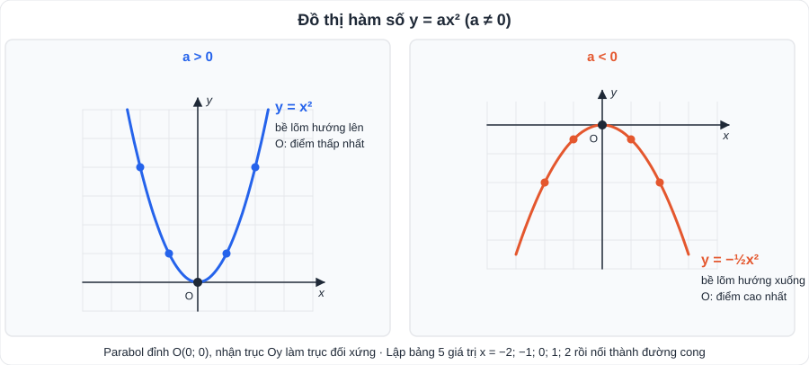
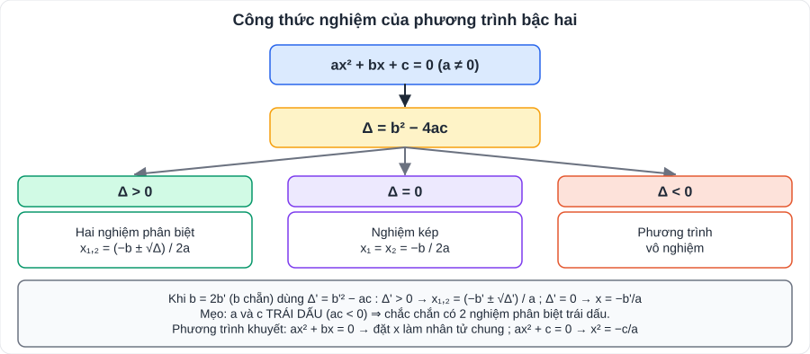
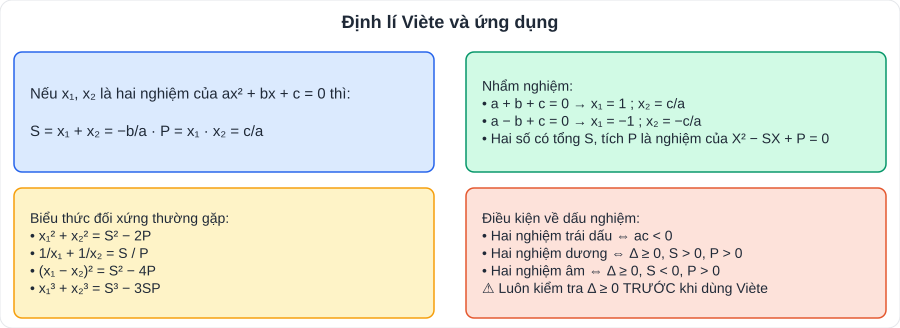

# Toán 6: Hàm số y = ax² (a ≠ 0). Phương trình bậc hai một ẩn (Chương VI – Tập 2)

> [Danh mục kiến thức](../README.md) · Học ở **tháng 1 – 2** (đầu HK2) · Ôn lại trước giữa HK2 và suốt giai đoạn luyện đề vào 10 · **Chương chiếm nhiều điểm nhất đề thi vào 10** · Nâng cao: [Viète nâng cao (PlanLop10)](../../../PlanLop10/PTNK/ChuyenDe/CD05-Toan-Vi-et-Nang-Cao.md)

## Mục tiêu

- Vẽ đồ thị y = ax²; tìm a khi biết một điểm; tìm **tọa độ giao điểm** của parabol và đường thẳng.
- Giải phương trình bậc hai bằng **công thức nghiệm, công thức nghiệm thu gọn, nhẩm nghiệm**.
- Dùng **định lí Viète**: tính biểu thức đối xứng, tìm hai số, bài toán **tham số m**.
- **Giải bài toán bằng cách lập phương trình** bậc hai.

---

## 1. Kiến thức cần nhớ

### 1.1. Hàm số y = ax² (a ≠ 0)

- Đồ thị là một **parabol** đỉnh O(0; 0), nhận **Oy làm trục đối xứng**.
- **a > 0**: parabol nằm phía trên trục Ox, bề lõm hướng lên, O là điểm thấp nhất.
- **a < 0**: parabol nằm phía dưới trục Ox, bề lõm hướng xuống, O là điểm cao nhất.
- **Vẽ**: lập bảng 5 giá trị x = −2; −1; 0; 1; 2, đánh dấu điểm, nối thành đường cong trơn (không nối gấp khúc).
- Điểm M(x₀; y₀) thuộc đồ thị ⇔ **y₀ = a·x₀²**.

### 1.2. Phương trình bậc hai ax² + bx + c = 0 (a ≠ 0)

| | Δ = b² − 4ac | Δ' = b'² − ac (b = 2b') |
|---|---|---|
| > 0 | x₁,₂ = (−b ± √Δ)/(2a) | x₁,₂ = (−b' ± √Δ')/a |
| = 0 | nghiệm kép x = −b/(2a) | x = −b'/a |
| < 0 | vô nghiệm | vô nghiệm |

- **ac < 0** ⇒ phương trình luôn có hai nghiệm phân biệt (trái dấu).
- Phương trình khuyết: ax² + bx = 0 → x(ax + b) = 0; ax² + c = 0 → x² = −c/a.

### 1.3. Định lí Viète

- Nếu phương trình có hai nghiệm x₁, x₂ thì **S = x₁ + x₂ = −b/a; P = x₁x₂ = c/a**.
- **Nhẩm nghiệm**: a + b + c = 0 ⇒ x₁ = 1, x₂ = c/a; a − b + c = 0 ⇒ x₁ = −1, x₂ = −c/a.
- **Tìm hai số** biết tổng S và tích P: chúng là nghiệm của X² − SX + P = 0 (cần S² − 4P ≥ 0).

### 1.4. Giao điểm của parabol (P): y = ax² và đường thẳng (d): y = mx + n

- **Phương trình hoành độ giao điểm**: ax² = mx + n ⇔ ax² − mx − n = 0 (*).
- (*) có 2 nghiệm phân biệt ⇔ (d) **cắt** (P) tại 2 điểm; nghiệm kép ⇔ (d) **tiếp xúc** (P); vô nghiệm ⇔ **không giao**.
- Có hoành độ x → thay vào (P) hoặc (d) để được tung độ.

---

## 2. Dạng bài và ví dụ có lời giải

### Dạng 1: Giải phương trình bậc hai

**Ví dụ 1.**
> a) 2x² − 5x + 2 = 0: Δ = 25 − 16 = 9 ⇒ x₁ = (5 + 3)/4 = **2**; x₂ = (5 − 3)/4 = **1/2**.
> b) x² − 6x + 9 = 0: Δ' = 9 − 9 = 0 ⇒ nghiệm kép **x = 3**.
> c) 3x² + 2x + 5 = 0: Δ' = 1 − 15 < 0 ⇒ **vô nghiệm**.
> d) 2x² + 3x − 5 = 0: a + b + c = 0 ⇒ **x₁ = 1; x₂ = −5/2** (nhẩm, không cần Δ).

### Dạng 2: Biểu thức đối xứng của hai nghiệm

**Ví dụ 2.** Cho x² − 3x − 1 = 0. Không giải phương trình, tính x₁² + x₂².

> ac = −1 < 0 ⇒ phương trình có hai nghiệm. S = 3; P = −1. x₁² + x₂² = S² − 2P = 9 + 2 = **11**.

### Dạng 3: Phương trình chứa tham số m (dạng đề thi)

**Ví dụ 3.** Cho x² − 2(m + 1)x + m² = 0. Tìm m để phương trình có hai nghiệm x₁, x₂ thỏa x₁² + x₂² = 10.

> Δ' = (m + 1)² − m² = 2m + 1. Có hai nghiệm ⇔ Δ' ≥ 0 ⇔ **m ≥ −1/2**.
> Viète: S = 2m + 2; P = m². x₁² + x₂² = S² − 2P = (2m + 2)² − 2m² = 2m² + 8m + 4.
> 2m² + 8m + 4 = 10 ⇔ m² + 4m − 3 = 0 ⇔ m = −2 ± √7.
> Đối chiếu m ≥ −1/2: chỉ nhận **m = −2 + √7** (≈ 0,65).

### Dạng 4: Giao điểm parabol – đường thẳng

**Ví dụ 4.** Tìm tọa độ giao điểm của (P): y = x² và (d): y = x + 2.

> x² = x + 2 ⇔ x² − x − 2 = 0 ⇔ x = −1 hoặc x = 2 (a − b + c = 0).
> x = −1 ⇒ y = 1; x = 2 ⇒ y = 4. **Giao điểm (−1; 1) và (2; 4).**

### Dạng 5: Giải bài toán bằng cách lập phương trình

**Ví dụ 5 (chuyển động).** Một xe đi từ A đến B dài 120 km. Lúc về xe đi với vận tốc lớn hơn lúc đi 10 km/h nên thời gian về ít hơn thời gian đi 36 phút. Tính vận tốc lúc đi.

> Gọi vận tốc lúc đi là x (km/h; x > 0). 36 phút = 0,6 giờ.
> 120/x − 120/(x + 10) = 0,6 ⇔ 1200 = 0,6x(x + 10) ⇔ x² + 10x − 2000 = 0.
> Δ' = 25 + 2000 = 2025 ⇒ x = −5 + 45 = 40 (nhận) hoặc x = −50 (loại). **Vận tốc lúc đi 40 km/h.**

**Ví dụ 6 (hình học).** Mảnh vườn hình chữ nhật có chu vi 34 m, diện tích 60 m². Tính các kích thước.

> Nửa chu vi 17 m. Gọi chiều dài là x (8,5 < x < 17), chiều rộng 17 − x. x(17 − x) = 60 ⇔ x² − 17x + 60 = 0 ⇔ x = 12 hoặc x = 5 (loại vì x > 8,5).
> **Chiều dài 12 m, chiều rộng 5 m.**

---

## 3. Lỗi hay gặp

| Lỗi | Cách tránh |
|---|---|
| Dùng Viète khi chưa kiểm tra phương trình có nghiệm | **Luôn xét Δ ≥ 0 (hoặc ac < 0) trước** |
| Tính sai dấu S = **−b/a** (quên dấu trừ) | Viết rõ a, b, c kèm dấu trước khi thay |
| Với Δ', dùng b thay cho b' (b' = b/2) | x² − 2(m + 1)x … ⇒ **b' = −(m + 1)** |
| Bài tham số quên đối chiếu điều kiện của m | Kết luận cuối phải là "**đối chiếu điều kiện, nhận m = …**" |
| Bài lập phương trình không loại nghiệm âm / không phù hợp | Đối chiếu điều kiện của ẩn |
| Vẽ parabol bằng các đoạn thẳng gấp khúc | Nối **đường cong trơn**, đối xứng qua Oy |

---

## 4. Bài tập tự luyện

### Nhóm A: Cơ bản

1. Tìm a biết đồ thị hàm số y = ax² đi qua A(−2; 2). Vẽ đồ thị với a vừa tìm.
2. Giải phương trình: a) x² − 5x + 6 = 0; b) 4x² − 4x + 1 = 0; c) x² + x + 1 = 0; d) 3x² − 12 = 0; e) 2x² + 7x = 0.
3. Nhẩm nghiệm: a) x² − 2026x + 2025 = 0; b) 5x² + 2x − 3 = 0.
4. Tìm hai số có tổng bằng 11 và tích bằng 28.
5. Cho x² − 4x + 1 = 0 có hai nghiệm x₁, x₂. Tính x₁² + x₂² và 1/x₁ + 1/x₂.

### Nhóm B: Vận dụng

6. Tìm tọa độ giao điểm của (P): y = −x² và (d): y = 2x − 3.
7. Cho x² − 2x + m = 0. a) Tìm m để phương trình có hai nghiệm phân biệt. b) Biết một nghiệm bằng 3, tìm m và nghiệm còn lại.
8. ★ Cho x² − (m + 2)x + m + 1 = 0. a) Chứng tỏ phương trình luôn có nghiệm với mọi m. b) Tìm m để phương trình có hai nghiệm dương phân biệt.
9. ★ Một khu vườn hình chữ nhật có chiều dài hơn chiều rộng 5 m và diện tích 150 m². Tính chu vi khu vườn.
10. ★ Một tổ dự định may 120 cái áo trong một số ngày. Thực tế mỗi ngày tổ may thêm được 2 cái nên hoàn thành sớm hơn dự định 2 ngày. Hỏi theo dự định mỗi ngày tổ may bao nhiêu áo?
11. ★ Giải phương trình x⁴ − 5x² + 4 = 0 (gợi ý: đặt t = x² ≥ 0).

---

## 5. Đáp án

👉 Bấm để xem đáp án (tự làm xong rồi mới mở)

1. 2 = a·4 ⇒ **a = 1/2**; bảng: (±2; 2), (±1; 1/2), (0; 0).
2. a) **x = 2; x = 3**. b) Δ' = 4 − 4 = 0 ⇒ **x = 1/2** (kép). c) Δ = −3 < 0 ⇒ **vô nghiệm**. d) x² = 4 ⇒ **x = ±2**. e) x(2x + 7) = 0 ⇒ **x = 0; x = −7/2**.
3. a) a + b + c = 0 ⇒ **x = 1; x = 2025**. b) a − b + c = 5 − 2 − 3 = 0 ⇒ **x = −1; x = 3/5**.
4. X² − 11X + 28 = 0 ⇒ **4 và 7**.
5. Δ' = 3 > 0; S = 4, P = 1 ⇒ x₁² + x₂² = 16 − 2 = **14**; 1/x₁ + 1/x₂ = S/P = **4**.
6. −x² = 2x − 3 ⇔ x² + 2x − 3 = 0 ⇔ x = 1 hoặc x = −3 ⇒ **(1; −1) và (−3; −9)**.
7. a) Δ' = 1 − m > 0 ⇔ **m < 1**. b) 9 − 6 + m = 0 ⇒ **m = −3**; x₂ = S − x₁ = 2 − 3 = **−1**.
8. a) a + b + c = 1 − (m + 2) + m + 1 = 0 ⇒ luôn có nghiệm **x₁ = 1, x₂ = m + 1**. b) Hai nghiệm dương phân biệt ⇔ m + 1 > 0 và m + 1 ≠ 1 ⇔ **m > −1 và m ≠ 0**.
9. x(x + 5) = 150 ⇔ x² + 5x − 150 = 0 ⇒ x = 10 (nhận), x = −15 (loại). Kích thước 10 m × 15 m ⇒ **chu vi 50 m**.
10. Gọi x là số áo may mỗi ngày theo dự định (x ∈ ℕ*). 120/x − 120/(x + 2) = 2 ⇔ x² + 2x − 120 = 0 ⇒ x = 10 (nhận), x = −12 (loại). **Mỗi ngày 10 áo** (dự định 12 ngày, thực tế 10 ngày).
11. t² − 5t + 4 = 0 ⇒ t = 1 hoặc t = 4 (đều ≥ 0) ⇒ **x ∈ {±1; ±2}**.

