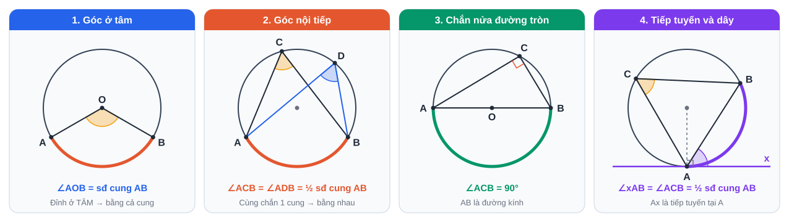

# Tuần 15 (11/01 – 17/01/2027): Câu giả định · Góc với đường tròn

> ⬅️ [Tuần 14](Tuan-14-Ke-Hoach-Hoc-Tap.md) · [Danh mục](Danh-Muc-Ke-Hoach-Tuan.md) · ➡️ [Tuần 16](Tuan-16-Ke-Hoach-Hoc-Tap.md)
> Mỗi tối thứ 2 – thứ 6, **18:30 – 19:15**: làm bài tập trên lớp. **Riêng Thứ 3, Thứ 5**: rút ngắn còn **18:30 – 19:00** (30'), vì **19:00 – 21:00** đi học thêm Tiếng Anh (xem bảng). Cách dùng và mẫu sổ: xem [Tuần 1](Tuan-01-Ke-Hoach-Hoc-Tap.md).

## Mục tiêu

1. **Câu giả định**: wish, if only, would rather, it's (high) time, as if, subjunctive.
2. Sentence transformation: 5 câu/ngày.
3. **Từ vựng *Sports & Hobbies***: 75 từ/cụm.
4. **Toán:** góc ở tâm, góc nội tiếp, góc tạo bởi tiếp tuyến và dây.
5. **Văn:** **bài nghị luận văn học hoàn chỉnh** về một truyện ngắn.

## Lịch học

| Ngày | Giờ | Môn | Việc cụ thể | Xong |
|---|---|---|---|---|
| **T2 11/01** | 19:30 – 20:30 | Toán | **Góc ở tâm, góc nội tiếp** (phần C): 10 bài | [ ] |
|  | 20:45 – 21:15 | Anh | 15 từ *Sports & Hobbies* + Anki | [ ] |
|  | 21:15 – 21:30 | Anh chuyên | 5 câu transformation (đảo ngữ) | [ ] |
| **T3 12/01** | 17:30 – 18:30 | Anh chuyên | **wish / if only** (phần B, dòng 1–3): 30 câu | [ ] |
|  | 18:30 – 19:00 | Trên lớp | Làm bài tập về nhà (rút ngắn 30' vì tối nay đi học thêm Anh) | [ ] |
|  | 19:00 – 21:00 | Học thêm Anh | **Học thêm Tiếng Anh (bên ngoài, không tính vào lịch tự học ở nhà)** | — |
|  | 21:00 – 21:30 | Văn | Đọc truyện ngắn (thầy cô / bố mẹ chọn), lập dàn ý: tình huống → nhân vật → chi tiết đặc sắc → nghệ thuật → chủ đề | [ ] |
|  | 21:30 – 21:45 | Anh | Anki + 15 từ | [ ] |
| **T4 13/01** | 19:30 – 20:30 | Văn | Viết **mở bài + phân tích tình huống, nhân vật** | [ ] |
|  | 20:45 – 21:15 | Anh | Đọc 1 bài (~400 từ) về thể thao | [ ] |
|  | 21:15 – 21:30 | Anh | Anki + 15 từ + 5 câu transformation | [ ] |
| **T5 14/01** | 17:30 – 18:30 | Toán | **Góc tạo bởi tiếp tuyến và dây**; bài chứng minh góc bằng nhau. 8 bài | [ ] |
|  | 18:30 – 19:00 | Trên lớp | Làm bài tập về nhà (rút ngắn 30' vì tối nay đi học thêm Anh) | [ ] |
|  | 19:00 – 21:00 | Học thêm Anh | **Học thêm Tiếng Anh (bên ngoài, không tính vào lịch tự học ở nhà)** | — |
|  | 21:00 – 21:20 | Anh | Nghe 1 tập | [ ] |
|  | 21:20 – 21:45 | Anh | Anki + 15 từ + 5 câu transformation | [ ] |
| **T6 15/01** | 19:30 – 20:00 | Anh chuyên | **would rather, it's time, as if, subjunctive** (phần B, dòng 4–8): 25 câu | [ ] |
|  | 20:00 – 20:30 | Văn | Viết **phần nghệ thuật + chủ đề + kết bài** | [ ] |
|  | 20:45 – 21:15 | Tổng kết | Sổ lỗi sai | [ ] |
| **T7 16/01** | 09:00 – 11:30 | Anh chuyên | **1 đề Anh chuyên đầy đủ**, bấm giờ | [ ] |
|  | 11:45 – 12:45 | Chữa | Chấm, chữa | [ ] |
|  | 14:30 – 15:15 | Anh chuyên | Bài luận ~200 từ: *"Should physical education be compulsory at school?"* | [ ] |
| **CN 17/01** | 09:30 – 10:30 | Văn | Đọc lại bài truyện ngắn, tự sửa; nộp thầy cô chấm | [ ] |
|  | 16:00 – 16:15 | Anki | Ôn thẻ | [ ] |
|  | 20:00 – 20:30 | Tổng kết | Tự đánh giá tuần | [ ] |

## Tài liệu

### A. Từ vựng *Sports & Hobbies* (30 từ khởi đầu)

| Từ/cụm | Nghĩa | Từ/cụm | Nghĩa |
|---|---|---|---|
| athlete | vận động viên (athletic) | competition | cuộc thi (compete, competitive, competitor) |
| tournament | giải đấu | championship | chức vô địch (champion) |
| referee | trọng tài | spectator | khán giả |
| opponent | đối thủ | team spirit | tinh thần đồng đội |
| win / beat | thắng (cuộc thi) / thắng (đối thủ) | draw | hòa |
| score a goal | ghi bàn | break a record | phá kỷ lục |
| stamina | sức bền | endurance | sức chịu đựng |
| take up | bắt đầu (sở thích) | be keen **on** | thích |
| be into | mê | be fond **of** | thích |
| pastime | trò tiêu khiển | leisure | thời gian rảnh (leisure activities) |
| collect | sưu tầm (collection, collector) | craft | đồ thủ công |
| amateur ↔ professional | nghiệp dư ↔ chuyên nghiệp | outdoor / indoor | ngoài trời / trong nhà |
| extreme sports | thể thao mạo hiểm | martial arts | võ thuật |
| keep fit / stay in shape | giữ dáng | warm up | khởi động |
| fair play | chơi đẹp | sportsmanship | tinh thần thể thao |

> Lưu ý: **play** + môn bóng (play football), **do** + môn không dùng bóng/võ (do yoga, do karate), **go** + V-ing (go swimming, go cycling).

### B. Câu giả định

| # | Cấu trúc | Dùng khi | Ví dụ |
|---|---|---|---|
| 1 | S + **wish / If only** + S + **QKĐ** (were) | Ước điều trái hiện tại | I wish I **were** taller. |
| 2 | S + **wish / If only** + S + **had V3** | Ước điều trái quá khứ (hối tiếc) | I wish I **had studied** harder. |
| 3 | S + **wish** + S + **would / could** + V | Mong ai đó thay đổi / phàn nàn | I wish you **would stop** talking. |
| 4 | S + **would rather** + S + **QKĐ** | Muốn người khác làm gì (hiện tại) | I'd rather you **stayed** here. |
| 5 | S + would rather + S + **had V3** | Muốn người khác đã làm gì (quá khứ) | I'd rather you **hadn't told** him. |
| 6 | **It's (high / about) time** + S + **QKĐ** = It's time **for sb to V** | Đã đến lúc | It's time we **went** home. |
| 7 | **as if / as though** + QKĐ / had V3 | Như thể (không có thật) | He talks **as if** he **knew** everything. |
| 8 | **suggest / recommend / insist / demand / request / propose** + **that** + S + **(should) V nguyên mẫu** | Subjunctive | She suggested that he **see** a doctor. · It is essential that everyone **be** on time. |

> Chú ý: *would rather + V* (chính mình) khác *would rather + S + QKĐ* (người khác). *I'd rather **stay** home.* / *I'd rather **you stayed** home.*

### C. Góc với đường tròn

| Loại góc | Số đo |
|---|---|
| Góc ở tâm | = số đo cung bị chắn |
| Góc nội tiếp | = ½ số đo cung bị chắn |
| Góc nội tiếp chắn **nửa đường tròn** | = 90° |
| Các góc nội tiếp cùng chắn một cung | bằng nhau |
| Góc tạo bởi **tia tiếp tuyến và dây cung** | = ½ số đo cung bị chắn (= góc nội tiếp cùng chắn cung đó) |
| Góc có đỉnh bên trong / bên ngoài đường tròn (nếu có trong chương trình) | = ½ tổng / ½ hiệu hai cung bị chắn |

> Bài chứng minh hình: luôn tìm **"hai góc cùng chắn một cung"**. Đây là chìa khóa của phần lớn bài hình lớp 9.
>
> **Thần chú:** "Tâm thì trọn, nội tiếp thì nửa, đường kính thì vuông." Thí nghiệm hình động và bài tập 5 phút: [CĐ13](../PTNK/ChuyenDe/CD13-Toan-Hinh-Hoc-Truc-Quan-Duong-Tron.md), mục 1 và 5.

## Tự đánh giá

| Câu hỏi | Trả lời |
|---|---|
| Số buổi đúng kế hoạch (/7) · Số ngày Anki (/7) | |
| Câu giả định: đúng ... / 55 · Đề Anh chuyên: ... điểm | |
| Số đêm ngủ đủ (/7) · Tâm trạng (1–5) | |

## 📝 Luyện đề tuần này (3 môn)

| Môn | Đề / dạng câu |
|---|---|
| Toán | Câu 7 hình (ý c) của 3 đề |
| Văn | Câu đọc hiểu văn bản văn học: 2 bài |
| Anh | Chuyên Anh Sở 2018 (cả đề, Thứ 7) |

> Dùng cho các buổi luyện đề **đã có** trong lịch tuần. Sau mỗi đề: điền [phiếu phân tích đề](../LuyenDe/Phieu-Phan-Tich-De.md). Cấu trúc đề: [xem tại đây](../LuyenDe/Cau-Truc-De-Thi.md).

## 🔷 Phổ thông Năng khiếu (ôn song song)

| Ngày | Giờ | Môn | Việc cụ thể | Xong |
|---|---|---|---|---|
| CN 17/01 | 10:00 – 11:00 | Anh | **Dạng bài riêng của đề PTNK (2)** theo bảng mục 4.3 | [ ] |

> Kỹ năng và ngân hàng đề PTNK: xem [kế hoạch PTNK](../PTNK/PTNK-Ke-Hoach-Song-Song.md).

➡️ [Tuần 16](Tuan-16-Ke-Hoach-Hoc-Tap.md)
