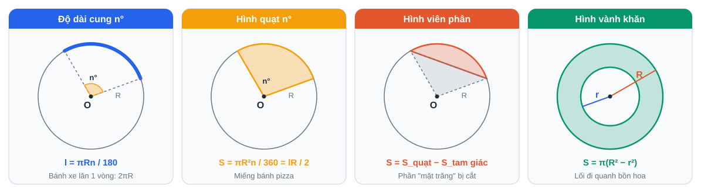

# Tuần 19 (08/02 – 14/02/2027): Trở lại nhịp học · Open cloze

> ⬅️ [Tuần 18](Tuan-18-Ke-Hoach-Hoc-Tap.md) · [Danh mục](Danh-Muc-Ke-Hoach-Tuan.md) · ➡️ [Tuần 20](Tuan-20-Ke-Hoach-Hoc-Tap.md)
> Cách dùng và mẫu sổ: xem [Tuần 1](Tuan-01-Ke-Hoach-Hoc-Tap.md).

> **Sau Tết:** nếu vẫn còn nghỉ (thường đến khoảng mùng 5–7), học **buổi sáng 2 tiếng** thay cho buổi tối. Khi đi học lại, chuyển về khung giờ tối như cũ. Tuần này **tăng dần**: 3 ngày đầu học nhẹ.

## Mục tiêu

1. **Lấy lại nhịp học** sau Tết.
2. **Open cloze** (điền từ vào đoạn văn, không có đáp án gợi ý).
3. **Từ vựng *Travel & Tourism***: 60 từ/cụm.
4. **Toán:** ôn hình học đường tròn; đa giác đều, độ dài cung, diện tích hình quạt.
5. **Văn:** đọc hiểu + NLXH.

## Lịch học

| Ngày | Giờ | Môn | Việc cụ thể | Xong |
|---|---|---|---|---|
| **T2 08/02** | 60' | Anh | Anki + 15 từ *Travel & Tourism*; đọc 1 bài nhẹ | [ ] |
| **T3 09/02** | 17:30 – 18:30 | Toán | Làm lại 5 câu sai gần nhất trong sổ (khởi động) | [ ] |
|  | 18:30 – 19:00 | Trên lớp | Làm bài tập về nhà (rút ngắn 30' vì tối nay đi học thêm Anh) | [ ] |
|  | 19:00 – 21:00 | Học thêm Anh | **Học thêm Tiếng Anh (bên ngoài, không tính vào lịch tự học ở nhà)** | — |
|  | 21:00 – 21:30 | Anh | Anki + 15 từ | [ ] |
| **T4 10/02** | 60' | Anh chuyên | **Open cloze** (phần B): học danh sách từ hay điền, làm 3 đoạn | [ ] |
|  | 30' | Anh | Anki + 15 từ | [ ] |
| **T5 11/02** | 17:30 – 18:30 | Toán | **Độ dài đường tròn, cung; diện tích hình tròn, hình quạt; đa giác đều** (phần C): 12 bài | [ ] |
|  | 18:30 – 19:00 | Trên lớp | Làm bài tập về nhà (rút ngắn 30' vì tối nay đi học thêm Anh) | [ ] |
|  | 19:00 – 21:00 | Học thêm Anh | **Học thêm Tiếng Anh (bên ngoài, không tính vào lịch tự học ở nhà)** | — |
|  | 21:00 – 21:30 | Văn | Đọc hiểu 1 văn bản thông tin / nghị luận | [ ] |
|  | 21:30 – 21:45 | Anh | Anki + 15 từ | [ ] |
| **T6 12/02** | 60' | Anh chuyên | Open cloze: 4 đoạn, bấm giờ 8 phút/đoạn | [ ] |
|  | 30' | Văn | **NLXH ~200 chữ**: *"Ý nghĩa của những ngày đoàn tụ gia đình."* | [ ] |
|  | 15' | Tổng kết | Sổ lỗi sai | [ ] |
| **T7 13/02** | 09:00 – 11:00 | Anh | 1 **đề Anh chung** TS10, bấm giờ + chữa | [ ] |
|  | 14:30 – 15:15 | Anh chuyên | Bài luận ~200 từ: *"Is tourism good or bad for local communities?"* | [ ] |
| **CN 14/02** | 09:30 – 10:30 | Toán | 1 bài hình tổng hợp (đủ 3 câu) | [ ] |
|  | 16:00 – 16:15 | Anki | Ôn thẻ | [ ] |
|  | 20:00 – 20:30 | Tổng kết | Tự đánh giá tuần | [ ] |

## Tài liệu

### A. Từ vựng *Travel & Tourism* (30 từ khởi đầu)

| Từ/cụm | Nghĩa | Từ/cụm | Nghĩa |
|---|---|---|---|
| destination | điểm đến | itinerary | lịch trình |
| sightseeing | ngắm cảnh | landmark | địa danh nổi tiếng |
| tourist attraction | điểm thu hút du lịch | breathtaking | đẹp ngoạn mục |
| accommodation | chỗ ở | book in advance | đặt trước |
| package tour | tour trọn gói | backpacker | người đi du lịch bụi |
| ecotourism | du lịch sinh thái | sustainable tourism | du lịch bền vững |
| souvenir | quà lưu niệm | local cuisine | ẩm thực địa phương |
| journey | hành trình (dài) | trip | chuyến đi (ngắn) |
| voyage | chuyến đi biển | excursion | chuyến tham quan ngắn |
| explore | khám phá | off the beaten track | nơi ít người biết |
| set off / set out | khởi hành | check in / check out | nhận phòng / trả phòng |
| get away | đi nghỉ | see sb off | tiễn ai |
| overcrowded | quá đông | commercialize | thương mại hóa |
| culture shock | sốc văn hóa | broaden your horizons | mở rộng tầm hiểu biết |
| peak season / off-season | mùa cao điểm / thấp điểm | travel agency | công ty du lịch |

### B. Open cloze: từ hay điền

Open cloze chủ yếu kiểm tra **từ chức năng**. Khi gặp chỗ trống, hỏi: **"thiếu loại từ gì?"**

| Loại | Từ hay gặp |
|---|---|
| Giới từ | in, on, at, of, for, to, with, by, from, about, into |
| Mạo từ | a, an, the |
| Đại từ quan hệ | who, which, that, whose, where, when |
| Liên từ | and, but, or, so, because, although, while, unless, if, as, than |
| Trợ động từ | do, does, did, have, has, had, is, are, was, were, be, been |
| Động từ khuyết thiếu | can, could, will, would, must, should, may, might |
| Lượng từ | some, any, many, much, few, little, all, each, every, both, either, neither |
| Đại từ | it, its, their, them, one, which, what, there |
| Cụm cố định | **as** well **as**, **such** as, in spite **of**, instead **of**, according **to**, as **long** as, as **soon** as, **no** matter, **rather** than, **even** though, **so** that |

**Quy trình 4 bước:**
1. Đọc lướt cả đoạn (1 phút) để nắm ý.
2. Xem từ đứng **trước và sau** chỗ trống: danh từ? động từ? mệnh đề?
3. Xác định loại từ cần điền, thử từng từ trong nhóm.
4. Đọc lại cả câu sau khi điền.

### C. Đường tròn: độ dài và diện tích

| Đại lượng | Công thức |
|---|---|
| Chu vi đường tròn | C = 2πR = πd |
| Độ dài cung n° | l = πRn / 180 |
| Diện tích hình tròn | S = πR² |
| Diện tích hình quạt n° | S = πR²n / 360 = l·R / 2 |
| Diện tích hình vành khuyên | S = π(R² − r²) |
| Đa giác đều n cạnh | Mỗi góc trong = (n − 2)·180° / n |

> Bài thực tế thường hỏi: diện tích bồn hoa, quãng đường bánh xe lăn, độ dài cung đường... Đọc kỹ đề có yêu cầu **làm tròn** không.
>
> **Đa giác đều và phép quay** (nội dung mới lớp 9) và ví dụ giải mẫu: [CĐ12 Hình học thực tế](../PTNK/ChuyenDe/CD12-Toan-Hinh-Hoc-Thuc-Te-Do-Luong.md), mục 2, 5.

## Tự đánh giá

| Câu hỏi | Trả lời |
|---|---|
| Đã lấy lại nhịp học chưa? (1–5) | |
| Open cloze: đúng ... / ... · Đề Anh chung: ... điểm | |
| Số đêm ngủ đủ (/7) · Tâm trạng (1–5) | |

## 📝 Luyện đề tuần này (3 môn)

| Môn | Đề / dạng câu |
|---|---|
| Toán | Câu 3 xác suất + câu 5 hình thực tế (ôn lại) · **PTNK 2022 Toán** (Chủ nhật) |
| Văn | Đọc hiểu văn bản thông tin |
| Anh | Anh Sở 2021 (cả đề, Thứ 7) |

> Dùng cho các buổi luyện đề **đã có** trong lịch tuần. Sau mỗi đề: điền [phiếu phân tích đề](../LuyenDe/Phieu-Phan-Tich-De.md). Cấu trúc đề: [xem tại đây](../LuyenDe/Cau-Truc-De-Thi.md).

## 🔷 Phổ thông Năng khiếu (ôn song song)

| Ngày | Giờ | Môn | Việc cụ thể | Xong |
|---|---|---|---|---|
| CN 14/02 | 14:00 – 16:00 | Toán | **1 đề Toán PTNK năm cũ**, bấm giờ | [ ] |
| CN 14/02 | 16:15 – 17:00 | Chữa | Chấm, chữa; ghi các dạng bài tư duy chưa làm được | [ ] |

> Kỹ năng và ngân hàng đề PTNK: xem [kế hoạch PTNK](../PTNK/PTNK-Ke-Hoach-Song-Song.md).

➡️ [Tuần 20](Tuan-20-Ke-Hoach-Hoc-Tap.md)
